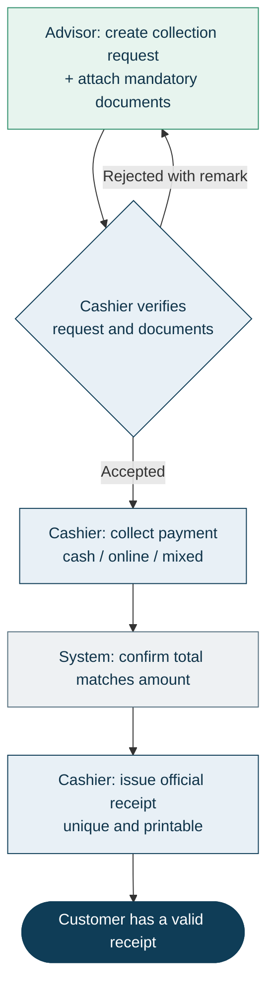
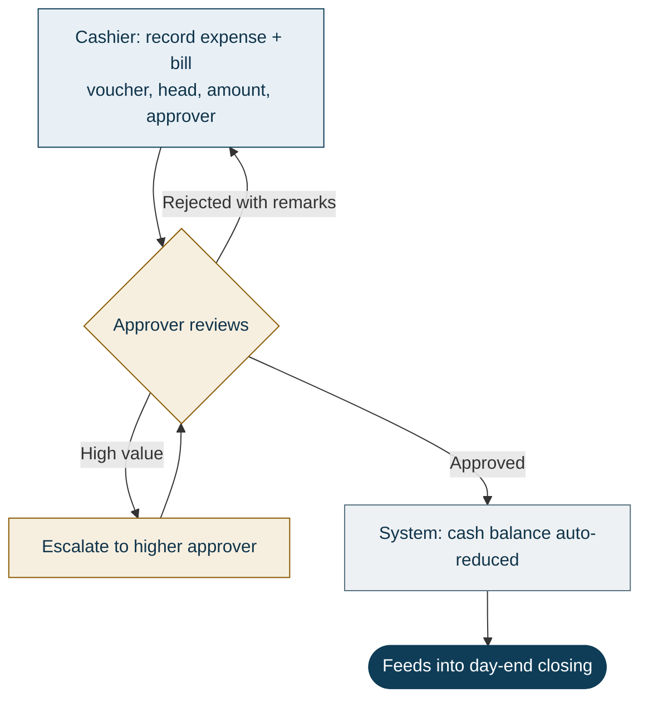
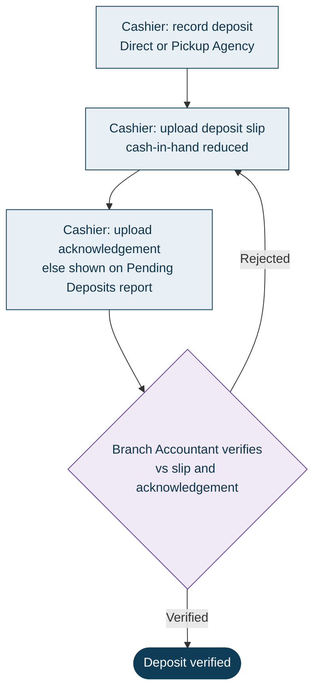
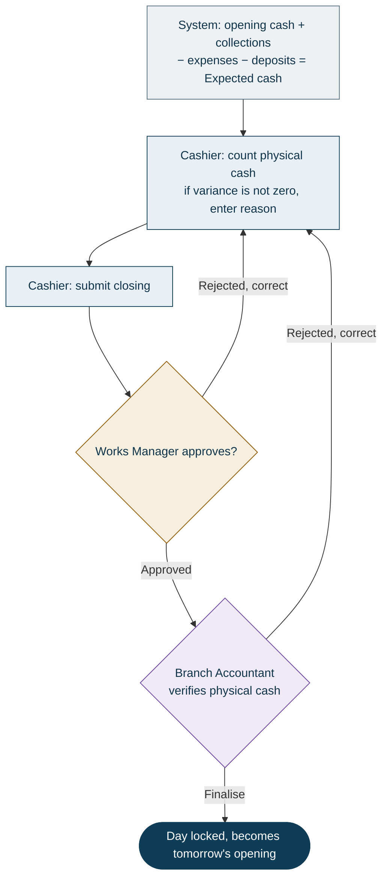
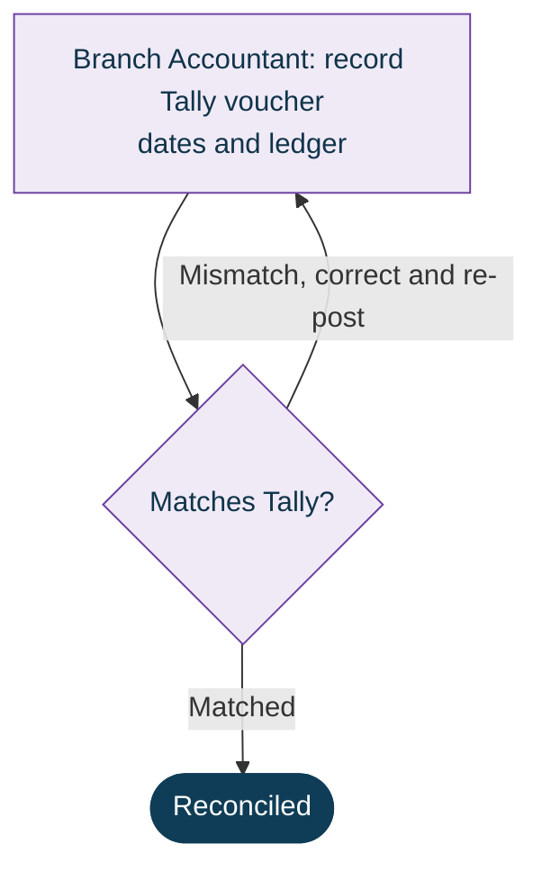

# Branch Cash Management System (BCMS)
### What we're building — an overview for Prabal Motors

**Prepared for:** Prabal Motors Private Limited (PMPL)
**Purpose:** Shared understanding of the system before we begin build
**Status:** For discussion

---

## 1. In one line

A single, digital system that tracks **every rupee** collected at a branch — from the moment a customer pays, through the cashier, the daily cash count, manager approvals, and the bank deposit, all the way to your Tally accounting — with a full record of who did what and when.

It replaces the manual cash registers and scattered paperwork used today with one controlled, auditable workflow that management can see in real time.

---

## 2. The problem we're solving today

Branch cash is handled through **manual registers and physical paperwork**, which means:

- Errors and delays that are hard to trace back
- Every branch does things a little differently (Sales vs Service)
- No live view of cash status for management
- Weak approval controls — easy for mistakes (or worse) to slip through
- Reconciling branch cash, deposits, and Tally is slow and manual
- Cash sitting in the branch when deposits are late or unverified
- No single place to see problems across all branches

BCMS is designed to remove each of these.

---

## 3. What the system will do

The system is organised into simple, connected modules. Each one matches a real step in your branch's day.

| Module | What it does |
|--------|--------------|
| **Collection Request** | The advisor raises a request when a customer wants to pay, and attaches the required documents. |
| **Cashier Verification** | The cashier checks the request and documents, then accepts or rejects it. |
| **Receipt** | On payment, the system issues an official, uniquely-numbered receipt (print / PDF). |
| **Cash Expense** | The cashier records petty cash expenses, sent for approval before the cash balance is reduced. |
| **Bank Deposit** | The cashier records deposits (direct or via pickup agency) with the slip and acknowledgement. |
| **Cash Closing** | At day-end, the system compares expected cash vs the physical count and captures any difference. |
| **Approvals** | Every closing goes through a fixed approval chain — no single person can act alone. |
| **Accounting** | The accountant records the Tally voucher and marks it reconciled. Tally stays your book of record. |
| **Dashboards & Reports** | Live dashboards and a set of ready-made reports at branch, cluster, and corporate level. |
| **Access & Audit** | Role-based access, a complete audit trail, and no permanent deletion of records. |

> **What it is not:** BCMS does not replace Tally, your billing, or your DMS. It *references* your invoices and job cards and hands clean, reconciled figures to Tally.

---

## 4. Who uses it (roles)

Each person sees only what they need, scoped to their branch, cluster, or the whole network.

| Role | What they do |
|------|--------------|
| **Sales / Service Advisor** | Raises collection requests and attaches documents. |
| **Cashier** | Verifies requests, collects payment, issues receipts, records expenses & deposits, does the daily closing. |
| **Works Manager** | First approval of the daily cash closing; approves branch expenses. |
| **Branch Accountant** | Verifies the physical cash, verifies deposits, records accounting to Tally. |
| **Cluster / Corporate Finance** | Oversight across many branches — dashboards, reports, follow-up. |
| **Internal Audit** | Read-only access to everything, including the full audit trail. |
| **CFO / Admin** | Owns the system — manages branches, users, and settings. |

A key control throughout: **the person who creates a transaction can never be the one who approves it** ("four-eyes" / maker-checker).

---

## 5. Step-by-step workflows

This is how a normal day flows through the system.

**The big picture — one day, end to end:**

### Workflow A — Collecting a payment from a customer

1. **Advisor** creates a *Collection Request* — customer, reference (invoice or job card), amount, expected payment mode.
2. Advisor **attaches the mandatory documents** and submits. The request gets a unique ID.
3. The request appears in the **Cashier's queue**.
4. **Cashier** opens it and **verifies** the details and documents.
   - If something is wrong → **reject with a remark**; it goes back to the advisor to fix and resubmit.
   - If correct → **accept**.
5. Cashier **collects the payment** and records it:
   - Cash → enters the denomination breakdown (notes/coins)
   - Online → enters the transaction reference
   - Mixed → both, and the total must match the amount
6. System confirms the total matches, and the cashier **issues an official Receipt** — uniquely numbered and printable. The receipt cannot be edited afterwards.

*Result: the customer has a valid receipt, and the collection is recorded against the branch's cash for the day.*

### Workflow B — Recording a cash expense

1. **Cashier** records the expense — voucher number, expense head, amount, approver, and an attachment (bill).
2. It goes to the **approver** as *Pending Approval*.
3. Approver **approves or rejects** (with remarks). High-value expenses can be escalated to a higher approver.
4. On approval, the **cash balance is automatically reduced** and the expense feeds into the day's closing.

### Workflow C — Recording a bank deposit

1. **Cashier** records a deposit and chooses **Direct** (to a bank account) or **Pickup Agency**.
2. Cashier **uploads the deposit slip** with amount and date. Cash-in-hand is reduced.
3. When the bank/agency **acknowledgement** is received, it's uploaded. Until then, the deposit shows on the **Pending Deposits** report.
4. **Branch Accountant verifies** the deposit against the slip and acknowledgement.

### Workflow D — End-of-day cash closing & approval

1. At day-end the system sets **opening cash** (from yesterday's verified closing) and **totals up** the day's cash collections, expenses, and deposits.
2. It calculates **Expected cash = Opening + Cash collected − Expenses − Deposits**.
3. **Cashier counts the physical cash** and enters it.
4. System shows the **variance** (physical − expected). If it isn't zero, the cashier must enter a **reason**.
5. Cashier **submits the closing** → it goes to the **Works Manager**.
6. **Works Manager approves** (or rejects back for correction).
7. **Branch Accountant verifies the physical cash** and **finalises** — the day is now **locked**, and that closing becomes tomorrow's opening balance.

### Workflow E — Accounting to Tally

1. **Branch Accountant** records the **Tally voucher number, dates, and ledger** against the transaction.
2. Once matched with Tally, it's marked **Reconciled**.
3. If there's a mismatch, it's flagged as a **discrepancy**, corrected, and re-posted.

> Every one of these steps automatically **notifies the right person** (in-app) and is **recorded in the audit trail** — no reminders or logbooks needed.

---

## 6. What makes this easy for you

- **One system, one flow.** Every branch — Sales and Service — works the same standardised way.
- **Nothing gets lost.** Documents, slips, and acknowledgements live with the transaction, not in a drawer.
- **The system does the maths.** Expected cash, variances, and running balances are calculated automatically.
- **Approvals are built in.** The right people are notified; nothing moves forward without sign-off.
- **Live visibility.** Management sees branch, cluster, and corporate cash status in real time — no waiting for end-of-month.
- **Reconciles with Tally.** Reports are designed to tie out to your Tally books.
- **Fully auditable.** Every action is stamped with who, what, and when. Records are never permanently deleted — only archived.
- **Access by role.** People only see and do what their role allows, scoped to their branch.
- **Works in the browser.** Nothing to install for users; usable on desktop and tablet.

---

## 7. Reports & dashboards

### Dashboards (live view)

- **Branch dashboard** — cash status and KPIs for a single branch.
- **State / Cluster dashboard** — rolled up across a group of branches.
- **Corporate dashboard** — the whole network at a glance.
- **Exception dashboard** — variances, pending items, and overdue deposits in one place.
- **Trend views** — collections and cash movement over time.

### Reports (with filters + export to PDF / Excel)

| # | Report | Answers the question |
|---|--------|----------------------|
| 1 | **Daily Cash Book** | What happened to cash at this branch today? |
| 2 | **Collection Register** | What did we collect, from whom, and how? |
| 3 | **Expense Register** | What was spent, under which head, approved by whom? |
| 4 | **Deposit Register** | What has been deposited to the bank? |
| 5 | **Pending Deposits** | What cash is still to be deposited or acknowledged? |
| 6 | **Pending Closings** | Which branches haven't closed their day? |
| 7 | **Cash Difference** | Where are the variances, and why? |
| 8 | **Accounting Pending** | What still needs to be posted to Tally? |
| 9 | **Compliance** | Is the audit trail complete and are controls being followed? |

All reports can be **filtered** (branch, date range, status) and **exported**.

---

## 8. Access, control & audit (peace of mind)

- **Role-based access** — every user is limited to their role and their branch/cluster/state.
- **Maker ≠ checker** — the creator of a transaction can never approve it.
- **Complete audit trail** — every significant action is logged with the user and timestamp.
- **No permanent deletion** — records are archived, never destroyed, so nothing disappears from the history.
- **Secure documents** — attachments are stored privately and only visible to people with access to that record.

---

## 9. For discussion in our meeting

A few things it would help to confirm together:

- Confirm the **roles and approval chain** above match how your branches actually operate.
- Confirm the **mandatory documents** required at collection (Sales vs Service).
- Confirm the **expense approval limits** and who escalations should go to.
- Confirm the **list of reports** covers what management and audit need day-to-day.
- Confirm expectations around **Tally** — recording voucher details manually to start, with a possible direct link later.

---

*This document is a plain-language summary for discussion. The detailed business and technical documentation is maintained separately by the project team.*
