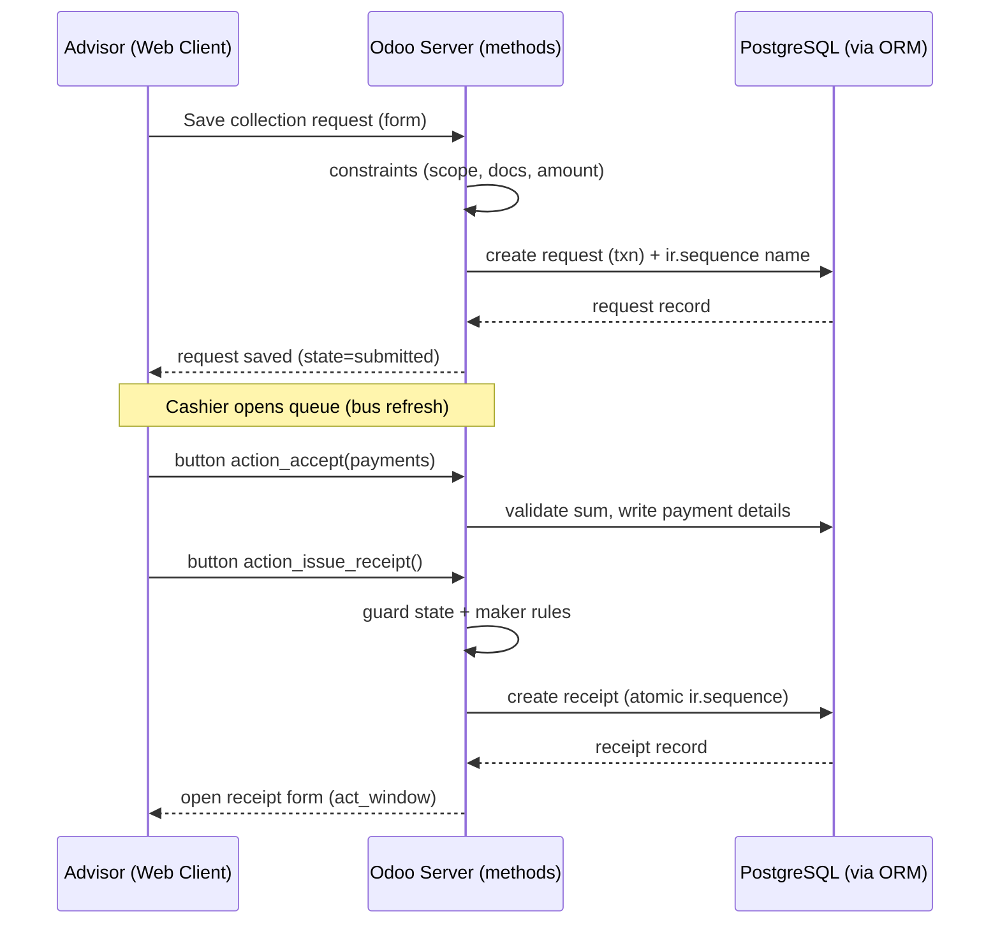

# Application Interfaces (Odoo 19 CE)

**Project:** Branch Cash Management System (BCMS) — Prabal Motors Private Limited
**Platform:** Odoo 19 Community Edition — module `branch_cash_management`
**Version:** 2.0 · **Date:** 2026-07-03 · **Status:** Draft for Client Review

> In Odoo the "API" is threefold, and this document specifies all three:
> 1. **Model methods** — the in-process business interface. Privileged, multi-step, rule-critical operations (issue receipt, finalise closing, verify deposit, post accounting) are **`action_*` methods** on the models, invoked from buttons/automations, running inside Odoo's per-request DB transaction and re-checking rules server-side.
> 2. **External API** — Odoo's **XML-RPC / JSON-RPC** (`/xmlrpc/2/object`, `/web/dataset/call_kw`) for CRUD and method calls from external systems, always filtered by access rights + record rules.
> 3. **HTTP controllers** — optional `http.Controller` routes for any custom/integration endpoint (kept minimal in v1).
>
> Conventions, the method catalogue, validation, error handling, access, reporting, and live-update channels follow.

---

## 1. Interface Conventions

| Aspect | Convention (Odoo) |
|--------|-------------------|
| Primary interface | Python **model methods** on `bcms.*` models; UI buttons call them via `type="object"`. |
| External access | **XML-RPC** `object.execute_kw(db, uid, pwd, model, method, args, kwargs)`; **JSON-RPC** `call_kw`. |
| Custom HTTP | `@http.route('/bcms/...', type='json'|'http', auth='user')` controllers, used sparingly. |
| Transport | HTTPS/TLS 1.2+ (terminated at nginx). |
| Data format | Python dicts / JSON; files as `ir.attachment` (base64 in RPC, or web upload). |
| AuthN | Odoo session (web) or API credentials/key (XML-RPC/JSON-RPC). |
| AuthZ | `ir.model.access.csv` + record rules (`ir.rule`) — enforced on every ORM call regardless of caller. |
| Idempotency | Money methods guard on `state` + unique sequence + `_sql_constraints`; re-invocation is a no-op or raises. |
| Time | Stored UTC (`Datetime`); displayed IST per user tz. |
| Money | `Monetary` (2dp, INR) via `currency_id`; never float arithmetic in UI. |
| Errors | Raise `UserError` / `ValidationError` / `AccessError` — surfaced as clean dialogs, transaction rolled back. |

### 1.1 Method result shape

Business `action_*` methods return either `True`/an updated recordset, or a **window action** dict to open the next record (e.g., the freshly issued receipt):

```python
return {
    'type': 'ir.actions.act_window',
    'res_model': 'bcms.receipt',
    'res_id': receipt.id,
    'view_mode': 'form',
    'target': 'current',
}
```

---

## 2. Authentication & Authorization

- **AuthN:** Odoo `res.users` (email/password + strong policy). Web uses the session cookie; external callers authenticate via `common.authenticate(db, login, password/api_key, {})` to get a `uid`, or an **API key** (`res.users.apikeys`). Optional **2FA** (`auth_totp`) for finance/admin; optional SSO (`auth_oauth`) later.
- **AuthZ:** every ORM operation is filtered by **model access rights** and **record rules**; every `action_*` method **re-checks** the caller's groups and the maker-checker rule — the client is never trusted.
- Full detail in [SecurityArchitecture.md](./SecurityArchitecture.md).

### 2.1 Auth surfaces

| Purpose | Odoo mechanism |
|---------|----------------|
| Web login / logout | `/web/login`, `/web/session/logout` |
| External authenticate | `xmlrpc/2/common` → `authenticate(...)` |
| API key management | Settings → Account Security → API Keys (`res.users.apikeys`) |
| 2FA enrol | `auth_totp` (My Profile → Account Security) |
| Password reset | Standard Odoo reset flow / admin-set |

---

## 3. Read / Query Pattern (ORM & External API)

Standard reads use ORM `search_read` / `read_group`; record rules guarantee a caller only sees rows in scope.

### 3.1 Pagination
```python
env['bcms.collection.request'].search_read(domain, fields, offset=50, limit=25, order='create_date desc')
```
`search_count(domain)` gives totals; list views paginate server-side automatically.

### 3.2 Filtering (domains)
```python
[('state', '=', 'submitted'), ('branch_id', '=', branch_id)]
# XML-RPC:
models.execute_kw(db, uid, key, 'bcms.collection.request', 'search_read',
                  [[['state','=','submitted']]], {'fields': ['name','amount','state'], 'limit': 25})
```

### 3.3 Sorting
`order='issued_at desc, name asc'` on `search`/`search_read`.

### 3.4 Searching (NFR-PERF-01)
Search views expose filters/group-by; `name_search` and `ilike` domains cover text (`[('partner_id.name','ilike','sharma')]`). A **global search** (`⌘K`) uses Odoo's built-in command palette over the module's models within scope; an optional `pg_trgm` index backs fuzzy matching (target ≤ 2s).

---

## 4. Business Methods (privileged operations)

All `action_*` methods: require a specific group, enforce maker≠checker, run inside the request transaction, set actor/`*_at` fields, append a `bcms.approval` row and `bcms.audit.log` entry, and raise a domain error on any breach. They are invoked from form buttons (`type="object"`) or automations — never by direct DB writes.

### 4.1 Collections & Cashier

**`bcms.collection.request.create(vals)` / form Save** *(FR-CR-01…06)* — advisor creates a request; `create()` assigns `name` from `ir.sequence` and links attachments. Constraints: mandatory documents present, amount > 0, branch in advisor's scope.

**`action_reject(reason)`** *(FR-CV-03, BR-09)* — cashier rejects → `state='rejected'`, posts an activity/message to the advisor. Requires non-empty reason (`UserError` otherwise).

**`action_accept(payments)`** *(FR-CV-04…07)* — cashier accepts, records payment capture (denominations / online ref) as `bcms.payment.detail`; validates payment sum == amount, cash needs denominations, online needs `txn_reference`; → `state='accepted'`.

**`bcms.receipt` ← `request.action_issue_receipt()`** *(FR-RCPT-01…03, BR-08)* — **money.** Issues the official receipt for an accepted request; assigns the sequential `name` (`ir.sequence`, per branch+FY) atomically; sets `issued_uid`/`issued_at`; → request `state='receipted'`. Re-invocation is a no-op (guarded on state + `_sql_constraints unique(branch_id, name)`). Raises `INVALID_STATE_TRANSITION` / `ALREADY_RECEIPTED`.

**`receipt.action_cancel(reason)`** *(FR-RCPT-05, BR-05)* — controlled reversal with mandatory reason (tracked in chatter); sets `is_cancelled`; **never deletes**.

### 4.2 Expenses

**`bcms.expense.create` / Save** *(FR-EXP-01…05)* — cashier creates a pending expense; `name` from `ir.sequence`; requires `expense_head_id`, `amount>0`, an attached bill, and an `approver_uid`.

**`action_approve()` / `action_reject(reason)`** *(FR-EXP-06/07, BR-03/06)* — **money.** Approver approves → `state='approved'`; the approved amount feeds that day's closing (reduces cash balance). Enforces `approver_uid != create_uid` (maker≠checker) and optional amount threshold (R-02). Raises `MAKER_CHECKER_VIOLATION` / `APPROVAL_THRESHOLD_EXCEEDED`.

### 4.3 Deposits

**`bcms.deposit.create` / Save** *(FR-DEP-01/02/05)* — cashier records a deposit (direct/pickup) with slip attachment; `_check_destination` constraint; reduces cash-in-hand.

**`action_verify()`** *(FR-DEP-03/04, BR-07)* — accountant verifies; requires an acknowledgement attachment present → `state='verified'`. Enforces maker≠checker. Raises `ACKNOWLEDGEMENT_MISSING` / `MAKER_CHECKER_VIOLATION`.

### 4.4 Cash Closing

**`bcms.cash.closing.action_open()`** *(FR-CLS-01…10)* — creates/opens the closing for the cashier's `business_date`; aggregates cash/online collections, expenses, deposits via `read_group`; `expected_cash` is computed/stored.

**`action_submit(physical_cash, variance_reason)`** *(FR-CLS-11, BR-04)* — cashier submits physical cash; `variance` computed; requires reason when `variance != 0` → `state='pending_wm'`; schedules a WM activity.

**`action_wm_approve()` / `action_wm_reject(reason)`** *(FR-CLS-13, BR-02/03)* — WM approves → `state='pending_accountant'` (or `rejected`). Enforces WM ≠ cashier.

**`action_finalise()`** *(FR-CLS-14, BR-02)* — **money.** Accountant verifies → `state='closed'`, locks the day, and carries forward physical cash as the next day's `opening_cash`. Enforces maker≠checker across cashier/WM/accountant (`@api.constrains`).

### 4.5 Accounting

**`bcms.accounting.status.action_set_status(vals)`** *(FR-ACC-01…05)* — records/updates Tally voucher details & state for a source record:

```python
env['bcms.accounting.status'].create({
    'res_model': 'bcms.receipt', 'res_id': receipt.id, 'branch_id': branch.id,
    'tally_voucher_no': 'RV-1201', 'voucher_date': '2026-07-01',
    'posting_date': '2026-07-01', 'ledger_id': ledger.id, 'state': 'posted',
})
```
Uniqueness enforced by `_sql_constraints unique(res_model, res_id)`. (No Odoo `account` posting — Tally is the ledger.)

### 4.6 Notifications

In-app notifications are **chatter messages + `mail.activity`**, not a custom endpoint. Workflow transitions call `activity_schedule(...)` / `message_post(...)` to notify the next actor; the Odoo systray shows unread activities; `activity_ids` are marked done on action. Optional email via `mail.template`.

### 4.7 Reports & Dashboards

Reports are **list/pivot/graph views** with saved filters plus **QWeb** PDF/print actions; there is no bespoke report endpoint:

| reportKey (FR-RPT-01…10) | Odoo delivery |
|--------------------------|---------------|
| daily-cash-book | Closing pivot + QWeb PDF (`bcms_cash_book_report`) |
| collection/expense/deposit-register | List/pivot views with filters, XLSX/CSV export |
| pending-deposits / pending-closings / accounting-pending | List views with domain filters |
| cash-difference | Closing pivot filtered `variance != 0` |
| receipt (print) | QWeb PDF `bcms_receipt_report` |

Dashboard KPIs come from `read_group` aggregates rendered in an OWL dashboard; CSV/XLSX export is built into Odoo list views (R-07).

---

## 5. Validation

- **Field & onchange:** `required`, `Selection`, `@api.onchange` give immediate client feedback; `@api.constrains` enforce invariants server-side (defense in depth) on every create/write, including via the External API.
- **Business validations** (state transitions, maker-checker, thresholds, document presence) run inside `action_*` methods and raise domain errors (§6).
- **File uploads** validated for MIME/size by `web.max_file_upload_size` and in the linking method.

```python
@api.constrains('amount')
def _check_amount_positive(self):
    for rec in self:
        if rec.amount <= 0:
            raise ValidationError(_('Amount must be greater than zero.'))
```

---

## 6. Error Semantics

Odoo maps exceptions to clean UI dialogs / RPC faults and rolls back the transaction. BCMS uses these domain messages:

| Odoo exception | BCMS condition | Meaning |
|----------------|----------------|---------|
| `AccessError` | `FORBIDDEN_SCOPE` | Outside record-rule scope / missing group |
| `ValidationError` | `MAKER_CHECKER_VIOLATION` | Same user is maker and checker (BR-03) |
| `UserError` | `INVALID_STATE_TRANSITION` | Illegal workflow transition |
| `ValidationError`/`_sql_constraints` | `ALREADY_RECEIPTED` / duplicate | Duplicate money operation (unique sequence) |
| `UserError` | `PERIOD_LOCKED` | Edit on a closed/locked period (R-03) |
| `ValidationError` | `VALIDATION_ERROR` | Field/constraint validation failed |
| `UserError` | `MANDATORY_DOCUMENT_MISSING` / `ACKNOWLEDGEMENT_MISSING` | Required attachment absent (BR-01/07) |
| `UserError` | `REMARKS_REQUIRED` / `VARIANCE_REASON_REQUIRED` | Mandatory reason missing (BR-04/09) |
| `UserError` | `APPROVAL_THRESHOLD_EXCEEDED` | Amount over approver limit (R-02) |
| `MissingError` | `NOT_FOUND` | Record not visible or deleted/archived |
| `UserError` | `UPSTREAM_UNAVAILABLE` | Downstream (Tally/bank) unavailable (Phase 4) |

Odoo never leaks stack traces/SQL to end users; messages are safe, field-level, and translatable.

---

## 7. Rate Limiting & Abuse Protection

Odoo core throttles login attempts; additional limits are applied at **nginx** (per-IP request limits, connection caps) and, for the External API, per-API-key:

| Surface | Limit (default, configurable) |
|---------|-------------------------------|
| Web login | Odoo failed-login cooldown + nginx `limit_req` per IP |
| Money methods (receipts, closings, deposits) | Guarded by state + sequence; nginx `limit_req` zone |
| Read/report calls | nginx `limit_req` (burst) per IP/key |
| External API (XML-RPC/JSON-RPC) | Per-API-key throttle at proxy |
| File upload | `web.max_file_upload_size` (~10 MB) + nginx `client_max_body_size` |

`429`/`503` returned by nginx include `Retry-After`.

---

## 8. Live-Update Channels

Odoo pushes live updates over the **bus** (longpolling, port 8072) and via activities:

| Trigger | Mechanism | Consumers |
|---------|-----------|-----------|
| New/updated request in a branch | list view refresh + `bus.bus` notification | Cashier queue (kanban/list) |
| Closing/expense/deposit awaiting action | `mail.activity` scheduled to next actor | WM / Accountant systray |
| New notification | chatter message + activity | All users |
| Dashboard KPI change | periodic OWL refresh / bus tick | Dashboards |

Channels are user/record-scoped — a client only receives data it is authorised to read (record rules apply).

---

## 9. Example End-to-End Sequence (create → receipt)



---

## 10. Interface ↔ Requirement Traceability (summary)

| Method / view group | Requirement IDs |
|---------------------|-----------------|
| Auth (`res.users`) | FR-AUTH-01/02 |
| collection request (create/accept/reject) | FR-CR-01…08, FR-CV-01…08 |
| receipt (issue/cancel) | FR-RCPT-01…05 |
| expense (create/approve/reject) | FR-EXP-01…07 |
| deposit (create/verify) | FR-DEP-01…06 |
| closing (open/submit/approve/finalise) | FR-CLS-01…14 |
| accounting status | FR-ACC-01…06 |
| notifications (activities/messages) | FR-NOTIF-01…06 |
| reports (views + QWeb) | FR-RPT-01…10 |
| dashboards (pivot/graph/OWL + bus) | FR-DASH-01…06 |

---

*End of APIDesign.md*
