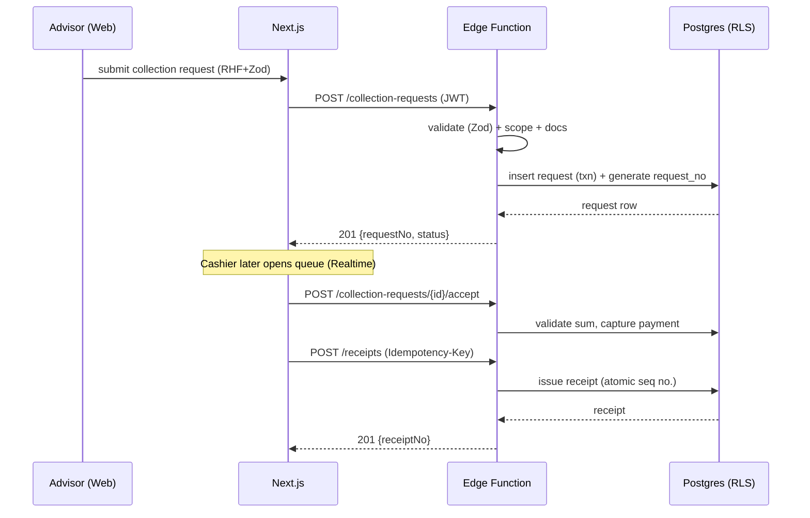

# API Design

**Project:** Branch Cash Management System (BCMS) — Prabal Motors Private Limited
**Version:** 1.0 · **Date:** 2026-07-01 · **Status:** Draft for Client Review

> Phase 11 deliverable. BCMS exposes three complementary API surfaces on Supabase:
> 1. **Auto REST (PostgREST)** for CRUD **within RLS** — used for reads and simple writes.
> 2. **Edge Functions (RPC-style HTTPS endpoints)** for privileged, multi-step, or rule-critical operations (receipt issuance, closing finalisation, deposit verification, accounting posting, notifications).
> 3. **Realtime channels** for live queues, dashboards, and notifications.
>
> This document specifies conventions, the Edge Function endpoints in detail, and the REST access pattern with pagination/filtering/sorting/search, error codes, and rate limits.

---

## 1. API Conventions

| Aspect | Convention |
|--------|-----------|
| Base URL (REST) | `https://<project>.supabase.co/rest/v1/` |
| Base URL (Functions) | `https://<project>.supabase.co/functions/v1/` |
| Transport | HTTPS/TLS 1.2+ only |
| Format | JSON (`application/json`); files via Storage signed URLs |
| Auth | `Authorization: Bearer <access_jwt>` + `apikey: <anon_key>` |
| Versioning | Functions namespaced `/v1/...`; breaking changes → `/v2/...` |
| Idempotency | `Idempotency-Key` header on all money-mutating Edge Functions |
| Time | ISO-8601 UTC in payloads; display converted to IST client-side |
| Money | Integer paise **or** string decimal `"1234.50"` (fixed 2dp) — never float |
| IDs | UUID v4 |
| Correlation | `X-Request-Id` echoed for tracing |

### 1.1 Standard envelopes

**Success**
```json
{ "data": { "...": "..." }, "meta": { "requestId": "..." } }
```
**List**
```json
{ "data": [ ... ], "meta": { "page": 1, "pageSize": 25, "total": 132, "nextCursor": "..." } }
```
**Error**
```json
{ "error": { "code": "MAKER_CHECKER_VIOLATION", "message": "Maker cannot approve their own transaction.", "details": [ ... ], "requestId": "..." } }
```

---

## 2. Authentication & Authorization

- **AuthN:** Supabase Auth (GoTrue). Login returns an **access JWT** (short-lived, ~1h) + **refresh token**. Next.js uses `@supabase/ssr` cookie sessions.
- **Claims:** a **Custom Access Token Hook** injects `app_metadata.{role, branch_id, cluster_id, state_id}` into the JWT.
- **AuthZ:** every REST call is filtered by **RLS**; every Edge Function re-validates the caller's claims and business rules server-side (never trusts the client).
- **MFA (R-08):** optional TOTP for finance/admin roles.
- Full detail in [SecurityArchitecture.md](./SecurityArchitecture.md).

### 2.1 Auth endpoints (Supabase Auth)

| Method | Endpoint | Purpose |
|--------|----------|---------|
| POST | `/auth/v1/token?grant_type=password` | Login (email/password) |
| POST | `/auth/v1/token?grant_type=refresh_token` | Refresh session |
| POST | `/auth/v1/logout` | Logout / revoke |
| POST | `/auth/v1/factors` | Enroll MFA factor |
| POST | `/auth/v1/recover` | Password reset |

---

## 3. REST Access Pattern (PostgREST, under RLS)

Standard reads and simple writes use PostgREST. RLS guarantees a caller only sees/writes rows in scope.

### 3.1 Pagination
- **Offset:** `?limit=25&offset=50` (via `Range` header or query) — for report tables.
- **Cursor (preferred for large sets):** `?order=created_at.desc&created_at=lt.<cursor>` — stable, index-friendly.
- Response includes `Content-Range: 50-74/132`; list envelope exposes `page/pageSize/total/nextCursor`.

### 3.2 Filtering
PostgREST operators: `eq, neq, gt, gte, lt, lte, like, ilike, in, is`.
```
GET /rest/v1/collection_request?status=eq.submitted&branch_id=eq.<uuid>&order=created_at.asc
```

### 3.3 Sorting
```
GET /rest/v1/receipt?order=issued_at.desc,receipt_no.asc
```

### 3.4 Searching (NFR-PERF-01)
Fuzzy search via trigram indexes:
```
GET /rest/v1/customer?name=ilike.*sharma*
GET /rest/v1/collection_request?or=(request_no.ilike.*123*,reference_no.ilike.*123*)
```
A dedicated **`search-global`** Edge Function powers the ⌘K command palette (R-05), returning ranked results across requests/receipts/customers within scope, target ≤ 2s.

---

## 4. Edge Function Endpoints (privileged operations)

All Edge Functions: `POST`, JSON body, require Bearer JWT, enforce role + maker-checker, run inside a DB transaction, are idempotent (via `Idempotency-Key`), and write to `audit_log`.

### 4.1 Collections & Cashier

#### `POST /functions/v1/collection-requests` *(FR-CR-01…06)*
Creates a collection request (advisor). *(Also available via REST insert under RLS; the function adds request-number generation + document linkage in one transaction.)*

Request:
```json
{
  "vertical": "service",
  "customerId": "uuid|null",
  "customer": { "name": "R. Sharma", "phone": "98xxxxxx" },
  "referenceType": "job_card",
  "referenceNo": "JC-2026-00891",
  "amount": "4520.00",
  "expectedMode": "cash",
  "documentIds": ["uuid"]
}
```
Response `201`:
```json
{ "data": { "id": "uuid", "requestNo": "CR/2026-27/000123", "status": "submitted" } }
```
Errors: `VALIDATION_ERROR`, `MANDATORY_DOCUMENT_MISSING`, `FORBIDDEN_SCOPE`.

#### `POST /functions/v1/collection-requests/{id}/reject` *(FR-CV-03, BR-09)*
Cashier rejects with remarks → status `rejected`, notifies advisor.
```json
{ "remarks": "Job card number mismatch" }
```
Errors: `REMARKS_REQUIRED`, `INVALID_STATE_TRANSITION`, `FORBIDDEN_SCOPE`.

#### `POST /functions/v1/collection-requests/{id}/accept` *(FR-CV-04…07)*
Cashier accepts and records payment capture (denomination/online ref); moves to `accepted`.
```json
{
  "payments": [
    { "mode": "cash", "amount": "4520.00", "denominations": {"500":9,"20":1} }
  ]
}
```
Validation: payment sum == request amount; cash requires denominations; online requires `txnReference`.

#### `POST /functions/v1/receipts` *(FR-RCPT-01…03, BR-08)* — **money, idempotent**
Issues an official receipt for an accepted request. Generates the sequential receipt number atomically.
```json
{ "requestId": "uuid" }
```
Response `201`:
```json
{ "data": { "id": "uuid", "receiptNo": "RCPT/2026-27/000456", "amount": "4520.00", "issuedAt": "2026-07-01T09:12:00Z" } }
```
Headers: `Idempotency-Key: <uuid>` (repeat returns same receipt). Errors: `INVALID_STATE_TRANSITION`, `ALREADY_RECEIPTED`, `IDEMPOTENCY_CONFLICT`.

#### `POST /functions/v1/receipts/{id}/cancel` *(FR-RCPT-05, BR-05)*
Controlled reversal with mandatory reason (audited); never deletes.

### 4.2 Expenses

#### `POST /functions/v1/expenses` *(FR-EXP-01…05)*
Creates a pending expense (cashier). Generates voucher no.
```json
{ "expenseHeadId":"uuid", "amount":"850.00", "approverId":"uuid", "documentId":"uuid", "expenseDate":"2026-07-01" }
```

#### `POST /functions/v1/expenses/{id}/approve` *(FR-EXP-06/07, BR-03/06)* — **money**
Approver approves → status `approved`, **cash balance auto-reduced**, feeds closing.
```json
{ "decision": "approve" }   // or { "decision":"reject","remarks":"..." }
```
Errors: `MAKER_CHECKER_VIOLATION`, `APPROVAL_THRESHOLD_EXCEEDED` (R-02), `FORBIDDEN_SCOPE`.

### 4.3 Deposits

#### `POST /functions/v1/deposits` *(FR-DEP-01/02/05)*
Records a deposit (direct/pickup) with slip document; reduces cash-in-hand.

#### `POST /functions/v1/deposits/{id}/verify` *(FR-DEP-03/04, BR-07)*
Accountant verifies (requires acknowledgement doc present) → status `verified`.
Errors: `ACKNOWLEDGEMENT_MISSING`, `MAKER_CHECKER_VIOLATION`.

### 4.4 Cash Closing

#### `POST /functions/v1/closings` *(FR-CLS-01…10)*
Creates/opens a closing for the cashier's business date; server aggregates collections/expenses/deposits and computes `expected_cash`.

#### `POST /functions/v1/closings/{id}/submit` *(FR-CLS-11, BR-04)*
Cashier submits physical cash; server computes variance; requires reason if variance ≠ 0 → status `pending_wm`; notifies WM.
```json
{ "physicalCash": "12500.00", "varianceReason": "Rounding on service bill" }
```

#### `POST /functions/v1/closings/{id}/approve` *(FR-CLS-13, BR-02/03)*
WM approves/rejects → `pending_accountant`/`rejected`.

#### `POST /functions/v1/closings/{id}/finalise` *(FR-CLS-14, BR-02)* — **money**
Accountant verifies physical cash → status `closed`, locks the day, sets next-day opening. Enforces maker≠checker across cashier/WM/accountant.

### 4.5 Accounting

#### `POST /functions/v1/accounting` *(FR-ACC-01…05)*
Records/updates Tally voucher details & status for an entity.
```json
{ "entityType":"receipt","entityId":"uuid","tallyVoucherNo":"RV-1201","voucherDate":"2026-07-01","postingDate":"2026-07-01","ledgerId":"uuid","status":"posted" }
```

### 4.6 Notifications

#### `GET /functions/v1/notifications?unread=true` — list (or via REST + Realtime).
#### `POST /functions/v1/notifications/{id}/read` — mark read.
System dispatch is internal (`notify-dispatch`) triggered by workflow transitions.

### 4.7 Reports & Dashboards

Reports are served by **REST reads over reporting views** (§8 of DatabaseDesign) with filters, plus export functions:

#### `GET /functions/v1/reports/{reportKey}?branchId=&from=&to=&status=&format=json|csv|pdf`
`reportKey ∈ {daily-cash-book, collection-register, expense-register, deposit-register, pending-deposits, pending-closings, cash-difference, accounting-pending, compliance}` *(FR-RPT-01…10)*.
`format=csv|pdf` streams an export (R-07). Dashboard KPIs come from materialised views + Realtime.

---

## 5. Validation

- **Shared Zod schemas** validate on the client (RHF) and again inside every Edge Function (defense in depth). A request failing schema returns `422 VALIDATION_ERROR` with a `details[]` array of `{path, message}`.
- Server-side business validations (state transitions, maker-checker, thresholds, document presence) run **after** schema validation and return domain error codes (§6).
- File uploads validated for MIME type and size at the Storage layer and in the linking function.

Example validation error `422`:
```json
{ "error": { "code": "VALIDATION_ERROR", "message": "Invalid request",
  "details": [ { "path": "amount", "message": "must be greater than 0" } ] } }
```

---

## 6. Error Codes

| HTTP | Code | Meaning |
|------|------|---------|
| 400 | `BAD_REQUEST` | Malformed request |
| 401 | `UNAUTHENTICATED` | Missing/invalid/expired JWT |
| 403 | `FORBIDDEN_SCOPE` | Authenticated but outside data scope / role |
| 403 | `MAKER_CHECKER_VIOLATION` | Same user is maker and checker (BR-03) |
| 404 | `NOT_FOUND` | Entity not visible or absent |
| 409 | `INVALID_STATE_TRANSITION` | Illegal workflow transition |
| 409 | `ALREADY_RECEIPTED` / `IDEMPOTENCY_CONFLICT` | Duplicate money operation |
| 409 | `PERIOD_LOCKED` | Edit on a closed/locked period (R-03) |
| 422 | `VALIDATION_ERROR` | Schema validation failed |
| 422 | `MANDATORY_DOCUMENT_MISSING` / `ACKNOWLEDGEMENT_MISSING` | Required document absent (BR-01/07) |
| 422 | `REMARKS_REQUIRED` / `VARIANCE_REASON_REQUIRED` | Mandatory reason missing (BR-04/09) |
| 422 | `APPROVAL_THRESHOLD_EXCEEDED` | Amount over approver limit (R-02) |
| 429 | `RATE_LIMITED` | Too many requests |
| 500 | `INTERNAL_ERROR` | Unexpected server error |
| 503 | `UPSTREAM_UNAVAILABLE` | Downstream (Tally/bank) unavailable (Phase 4) |

Error responses never leak stack traces or SQL; details are safe, field-level messages.

---

## 7. Rate Limiting & Abuse Protection

| Surface | Limit (default, configurable) |
|---------|-------------------------------|
| Auth login | 5 attempts / 15 min / IP+email, then lockout/backoff |
| Money Edge Functions (receipts, closings, deposits) | 60 req/min/user + idempotency |
| Read/report endpoints | 300 req/min/user |
| Global search | 30 req/min/user |
| File upload | 20 uploads/min/user, ≤10 MB/file |

Enforced at the API gateway / Edge Function layer; `429` returns `Retry-After`. Combined with WAF/CDN protections on Vercel/Supabase.

---

## 8. Realtime Channels

| Channel | Payload | Consumers |
|---------|---------|-----------|
| `cashier_queue:{branchId}` | request inserts/updates | Cashier queue |
| `approvals:{branchId}` | closing/expense status changes | WM/Accountant |
| `notifications:{userId}` | new notifications | All users |
| `dashboard:{scope}` | KPI deltas (throttled) | Dashboards |

Subscriptions are RLS-filtered — a client only receives rows it is authorized to read.

---

## 9. Example End-to-End Sequence (create → receipt)



---

## 10. API ↔ Requirement Traceability (summary)

| Endpoint group | Requirement IDs |
|----------------|-----------------|
| Auth | FR-AUTH-01/02 |
| collection-requests | FR-CR-01…08, FR-CV-01…08 |
| receipts | FR-RCPT-01…05 |
| expenses | FR-EXP-01…07 |
| deposits | FR-DEP-01…06 |
| closings | FR-CLS-01…14 |
| accounting | FR-ACC-01…06 |
| notifications | FR-NOTIF-01…06 |
| reports | FR-RPT-01…10 |
| dashboard channels | FR-DASH-01…06 |

---

*End of APIDesign.md*
