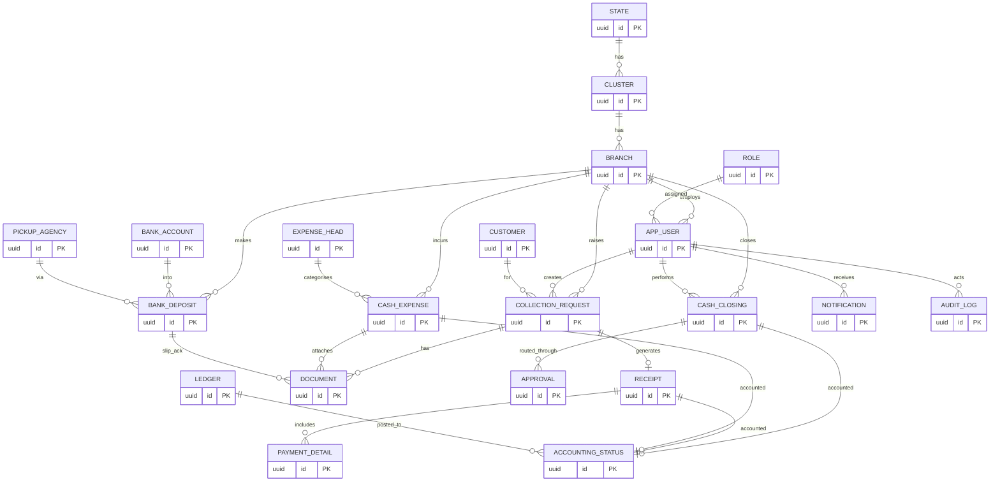

# Database Design (Supabase / PostgreSQL)

**Project:** Branch Cash Management System (BCMS) — Prabal Motors Private Limited
**Source:** `BRD_v1.0.docx` §19 (Database Entities) + full functional analysis
**Version:** 1.0 · **Date:** 2026-07-01 · **Status:** Draft for Client Review

> Phase 10 deliverable: ER model, tables, columns, relationships, indexes, constraints, triggers, views, functions, RLS policies, audit tables, and soft-delete strategy. SQL is **illustrative reference** (not executed) and targets PostgreSQL 15+ on Supabase.

---

## 1. Design Conventions

| Convention | Rule |
|-----------|------|
| Primary keys | `uuid` default `gen_random_uuid()` (pgcrypto). |
| Timestamps | `created_at timestamptz default now()`, `updated_at` maintained by trigger; stored UTC, displayed IST. |
| Money | `numeric(14,2)` (INR); never `float`. |
| Soft delete | `deleted_at timestamptz` + `is_active boolean`; **no physical delete** (BR-05). |
| Audit columns | `created_by`, `updated_by` (uuid → `app_user.id`). |
| Enums | Postgres `enum` types for stable domains (roles, statuses, modes). |
| Naming | `snake_case`; singular table names; FK `<entity>_id`. |
| Multitenancy | `branch_id` (+ derived `cluster_id`, `state_id`) on transactional tables for RLS scoping. |
| Numbering | Sequential business numbers (receipts, vouchers) via DB function + per-scope sequence, gap-safe within a transaction. |

---

## 2. Entity-Relationship Diagram



*(A dedicated copy is in [docs/diagrams/er-diagram.md](./diagrams/er-diagram.md).)*

---

## 3. Enumerated Types

```sql
create type user_role as enum (
  'sales_advisor','service_advisor','cashier','works_manager',
  'branch_accountant','cluster_finance','corporate_finance',
  'internal_audit','cfo_admin');

create type branch_type      as enum ('sales','service','both');
create type vertical_type     as enum ('sales','service');
create type payment_mode      as enum ('cash','online','mixed','cheque');
create type request_status    as enum ('draft','submitted','rejected','accepted','receipted','cancelled');
create type closing_status    as enum ('draft','pending_wm','pending_accountant','closed','rejected');
create type deposit_type      as enum ('direct','pickup_agency');
create type deposit_status    as enum ('recorded','pending_ack','verified','rejected');
create type expense_status    as enum ('draft','pending_approval','approved','rejected');
create type accounting_status_enum as enum ('pending','posted','reconciled','discrepancy');
create type approval_action   as enum ('submitted','approved','rejected','verified','finalised');
create type notification_type as enum ('request_rejected','pending_approval','pending_closing','pending_deposit','accounting_pending');
```

---

## 4. Table Definitions

### 4.1 Organisation & Identity

```sql
-- Geographic / org hierarchy: State -> Cluster -> Branch
create table state (
  id uuid primary key default gen_random_uuid(),
  code text not null unique,
  name text not null,
  is_active boolean not null default true,
  deleted_at timestamptz,
  created_at timestamptz not null default now(),
  updated_at timestamptz not null default now()
);

create table cluster (
  id uuid primary key default gen_random_uuid(),
  state_id uuid not null references state(id),
  code text not null unique,
  name text not null,
  is_active boolean not null default true,
  deleted_at timestamptz,
  created_at timestamptz not null default now(),
  updated_at timestamptz not null default now()
);

create table branch (
  id uuid primary key default gen_random_uuid(),
  cluster_id uuid not null references cluster(id),
  code text not null unique,
  name text not null,
  type branch_type not null default 'both',
  address text,
  is_active boolean not null default true,
  deleted_at timestamptz,
  created_at timestamptz not null default now(),
  updated_at timestamptz not null default now()
);

-- Application user profile; 1:1 with auth.users (Supabase Auth)
create table app_user (
  id uuid primary key references auth.users(id) on delete restrict,
  employee_code text unique,
  full_name text not null,
  email text not null unique,
  phone text,
  role user_role not null,
  branch_id uuid references branch(id),      -- home branch (null for corporate roles)
  cluster_id uuid references cluster(id),     -- scope for cluster roles
  state_id uuid references state(id),         -- scope for state roles
  is_active boolean not null default true,
  deleted_at timestamptz,
  created_at timestamptz not null default now(),
  updated_at timestamptz not null default now()
);
```

### 4.2 Master Data

```sql
create table customer (
  id uuid primary key default gen_random_uuid(),
  name text not null,
  phone text,
  email text,
  external_ref text,                          -- DMS/customer id if any
  is_active boolean not null default true,
  deleted_at timestamptz,
  created_at timestamptz not null default now(),
  updated_at timestamptz not null default now(),
  created_by uuid references app_user(id)
);

create table expense_head (
  id uuid primary key default gen_random_uuid(),
  code text not null unique,
  name text not null,
  is_active boolean not null default true,
  deleted_at timestamptz,
  created_at timestamptz not null default now()
);

create table bank_account (
  id uuid primary key default gen_random_uuid(),
  branch_id uuid references branch(id),
  bank_name text not null,
  account_no text not null,
  ifsc text,
  is_active boolean not null default true,
  deleted_at timestamptz,
  created_at timestamptz not null default now()
);

create table pickup_agency (
  id uuid primary key default gen_random_uuid(),
  name text not null,
  contact text,
  is_active boolean not null default true,
  deleted_at timestamptz,
  created_at timestamptz not null default now()
);

create table ledger (
  id uuid primary key default gen_random_uuid(),
  code text not null unique,
  name text not null,                          -- maps to Tally ledger
  is_active boolean not null default true,
  deleted_at timestamptz,
  created_at timestamptz not null default now()
);
```

### 4.3 Collection & Receipt

```sql
create table collection_request (
  id uuid primary key default gen_random_uuid(),
  request_no text not null unique,             -- generated (see fn_generate_request_no)
  branch_id uuid not null references branch(id),
  vertical vertical_type not null,             -- sales | service
  customer_id uuid not null references customer(id),
  reference_type text not null,                -- 'invoice' | 'job_card'
  reference_no text not null,
  amount numeric(14,2) not null check (amount > 0),
  expected_mode payment_mode not null,
  status request_status not null default 'submitted',
  reject_reason text,
  created_by uuid not null references app_user(id),  -- advisor (maker)
  accepted_by uuid references app_user(id),          -- cashier
  is_active boolean not null default true,
  deleted_at timestamptz,
  created_at timestamptz not null default now(),
  updated_at timestamptz not null default now()
);

create table receipt (
  id uuid primary key default gen_random_uuid(),
  receipt_no text not null,                    -- unique per branch+FY (see fn)
  request_id uuid not null references collection_request(id),
  branch_id uuid not null references branch(id),
  customer_id uuid not null references customer(id),
  amount numeric(14,2) not null check (amount > 0),
  mode payment_mode not null,
  issued_by uuid not null references app_user(id),  -- cashier
  issued_at timestamptz not null default now(),
  is_cancelled boolean not null default false,
  cancel_reason text,
  cancelled_by uuid references app_user(id),
  created_at timestamptz not null default now(),
  unique (branch_id, receipt_no)
);

-- Payment breakdown: denomination (cash) and/or online reference
create table payment_detail (
  id uuid primary key default gen_random_uuid(),
  receipt_id uuid not null references receipt(id),
  mode payment_mode not null,
  amount numeric(14,2) not null check (amount >= 0),
  -- cash denominations (nullable for online)
  denominations jsonb,                         -- {"500":10,"200":5,...}
  -- online/cheque reference (nullable for cash)
  txn_reference text,
  instrument_date date,
  created_at timestamptz not null default now()
);
```

### 4.4 Expenses, Deposits, Closing

```sql
create table cash_expense (
  id uuid primary key default gen_random_uuid(),
  voucher_no text not null,                    -- unique per branch+FY
  branch_id uuid not null references branch(id),
  expense_head_id uuid not null references expense_head(id),
  amount numeric(14,2) not null check (amount > 0),
  status expense_status not null default 'pending_approval',
  created_by uuid not null references app_user(id),  -- maker (cashier)
  approver_id uuid references app_user(id),          -- checker
  approved_at timestamptz,
  reject_reason text,
  expense_date date not null default current_date,
  is_active boolean not null default true,
  deleted_at timestamptz,
  created_at timestamptz not null default now(),
  updated_at timestamptz not null default now(),
  unique (branch_id, voucher_no)
);

create table bank_deposit (
  id uuid primary key default gen_random_uuid(),
  deposit_no text not null,
  branch_id uuid not null references branch(id),
  deposit_type deposit_type not null,
  bank_account_id uuid references bank_account(id),
  pickup_agency_id uuid references pickup_agency(id),
  amount numeric(14,2) not null check (amount > 0),
  deposit_date date not null default current_date,
  status deposit_status not null default 'recorded',
  reference_no text,
  created_by uuid not null references app_user(id),  -- maker (cashier)
  verified_by uuid references app_user(id),          -- checker (accountant)
  verified_at timestamptz,
  reject_reason text,
  is_active boolean not null default true,
  deleted_at timestamptz,
  created_at timestamptz not null default now(),
  updated_at timestamptz not null default now(),
  unique (branch_id, deposit_no),
  check ( (deposit_type='direct' and bank_account_id is not null)
       or (deposit_type='pickup_agency' and pickup_agency_id is not null) )
);

create table cash_closing (
  id uuid primary key default gen_random_uuid(),
  closing_no text not null,
  branch_id uuid not null references branch(id),
  cashier_id uuid not null references app_user(id),  -- maker
  business_date date not null,
  opening_cash numeric(14,2) not null default 0,
  cash_collections numeric(14,2) not null default 0,
  online_collections numeric(14,2) not null default 0,
  total_expenses numeric(14,2) not null default 0,
  total_deposits numeric(14,2) not null default 0,
  expected_cash numeric(14,2) generated always as
     (opening_cash + cash_collections - total_expenses - total_deposits) stored,
  physical_cash numeric(14,2),
  variance numeric(14,2),                       -- physical - expected (set on submit)
  variance_reason text,
  status closing_status not null default 'draft',
  wm_approved_by uuid references app_user(id),
  wm_approved_at timestamptz,
  accountant_verified_by uuid references app_user(id),
  accountant_verified_at timestamptz,
  is_active boolean not null default true,
  deleted_at timestamptz,
  created_at timestamptz not null default now(),
  updated_at timestamptz not null default now(),
  unique (branch_id, cashier_id, business_date)   -- one closing per cashier/day (AS-09)
);
```

### 4.5 Approvals, Accounting, Documents, Notifications

```sql
-- Generic approval trail (maker-checker), polymorphic to entity
create table approval (
  id uuid primary key default gen_random_uuid(),
  entity_type text not null,                   -- 'cash_closing' | 'cash_expense' | 'bank_deposit'
  entity_id uuid not null,
  step int not null,                           -- 1=WM, 2=Accountant ...
  action approval_action not null,
  actor_id uuid not null references app_user(id),
  remarks text,
  acted_at timestamptz not null default now()
);

create table accounting_status (
  id uuid primary key default gen_random_uuid(),
  entity_type text not null,                   -- 'receipt' | 'cash_expense' | 'cash_closing'
  entity_id uuid not null,
  branch_id uuid not null references branch(id),
  tally_voucher_no text,
  voucher_date date,
  posting_date date,
  ledger_id uuid references ledger(id),
  status accounting_status_enum not null default 'pending',
  updated_by uuid references app_user(id),
  created_at timestamptz not null default now(),
  updated_at timestamptz not null default now(),
  unique (entity_type, entity_id)
);

-- Versioned document store (metadata; bytes live in Supabase Storage)
create table document (
  id uuid primary key default gen_random_uuid(),
  entity_type text not null,                   -- 'collection_request' | 'cash_expense' | 'bank_deposit'
  entity_id uuid not null,
  doc_kind text not null,                       -- 'mandatory' | 'deposit_slip' | 'acknowledgement' | 'bill'
  storage_path text not null,                   -- Supabase Storage object key
  version int not null default 1,
  is_current boolean not null default true,
  file_name text,
  mime_type text,
  size_bytes bigint,
  uploaded_by uuid not null references app_user(id),
  created_at timestamptz not null default now()
);

create table notification (
  id uuid primary key default gen_random_uuid(),
  recipient_id uuid not null references app_user(id),
  type notification_type not null,
  entity_type text,
  entity_id uuid,
  title text not null,
  body text,
  is_read boolean not null default false,
  created_at timestamptz not null default now()
);
```

### 4.6 Audit Log (append-only)

```sql
create table audit_log (
  id bigint generated always as identity primary key,
  actor_id uuid references app_user(id),
  action text not null,                         -- INSERT | UPDATE | APPROVE | ...
  entity_type text not null,
  entity_id uuid,
  branch_id uuid,
  before_data jsonb,
  after_data jsonb,
  ip_address inet,
  user_agent text,
  created_at timestamptz not null default now()
);
-- No UPDATE/DELETE grants; append-only (enforced by policy + revoked privileges).
```

---

## 5. Indexes

```sql
-- Scoping (RLS predicates) — index every column used in policies
create index idx_cr_branch on collection_request(branch_id);
create index idx_cr_status on collection_request(status) where is_active;
create index idx_cr_created_by on collection_request(created_by);
create index idx_receipt_branch on receipt(branch_id);
create index idx_expense_branch on cash_expense(branch_id);
create index idx_deposit_branch on bank_deposit(branch_id);
create index idx_closing_branch_date on cash_closing(branch_id, business_date);
create index idx_acc_branch_status on accounting_status(branch_id, status);
create index idx_notif_recipient_unread on notification(recipient_id) where is_read = false;
create index idx_audit_entity on audit_log(entity_type, entity_id);
create index idx_audit_actor_time on audit_log(actor_id, created_at desc);

-- Fast search (NFR-PERF-01) — trigram indexes
create extension if not exists pg_trgm;
create index idx_customer_name_trgm on customer using gin (name gin_trgm_ops);
create index idx_cr_reference_trgm on collection_request using gin (reference_no gin_trgm_ops);
create index idx_cr_reqno_trgm on collection_request using gin (request_no gin_trgm_ops);
```

---

## 6. Constraints & Business Rules in the DB

| Rule | Enforcement |
|------|-------------|
| Amounts > 0 | `check` constraints on all money columns. |
| Expected cash formula (BR-10) | `expected_cash` is a **generated column**. |
| One closing per cashier/day (AS-09) | `unique(branch_id, cashier_id, business_date)`. |
| Deposit needs correct destination (BR-07 partial) | `check` on deposit_type vs. account/agency. |
| Receipt/voucher uniqueness (BR-08) | `unique(branch_id, receipt_no)`, `unique(branch_id, voucher_no)`. |
| Maker ≠ Checker (BR-03) | Trigger + Edge Function validation (see §8, §9). |
| Variance reason if variance ≠ 0 (BR-04) | Trigger `trg_require_variance_reason`. |
| No physical delete (BR-05) | No `DELETE` grants; soft-delete via `deleted_at`. |
| Accounting completeness (BR-11) | State machine on `accounting_status.status`. |

---

## 7. Triggers & Functions

```sql
-- updated_at maintenance
create or replace function fn_touch_updated_at() returns trigger as $$
begin new.updated_at = now(); return new; end; $$ language plpgsql;
-- apply to all mutable tables ...

-- Audit logging (generic)
create or replace function fn_audit() returns trigger as $$
begin
  insert into audit_log(actor_id, action, entity_type, entity_id, before_data, after_data)
  values (current_setting('app.user_id', true)::uuid, tg_op, tg_table_name,
          coalesce(new.id, old.id),
          case when tg_op<>'INSERT' then to_jsonb(old) end,
          case when tg_op<>'DELETE' then to_jsonb(new) end);
  return coalesce(new, old);
end; $$ language plpgsql security definer;
-- create trigger trg_audit_* after insert or update on <table> for each row execute fn_audit();

-- Maker != checker guard for closing approval
create or replace function fn_guard_maker_checker() returns trigger as $$
begin
  if new.status = 'pending_accountant' and new.wm_approved_by = new.cashier_id then
     raise exception 'Maker cannot be checker (BR-03)';
  end if;
  if new.status = 'closed' and new.accountant_verified_by in (new.cashier_id, new.wm_approved_by) then
     raise exception 'Verifier must differ from maker/approver (BR-03)';
  end if;
  return new;
end; $$ language plpgsql;
create trigger trg_mc_closing before update on cash_closing
  for each row execute function fn_guard_maker_checker();

-- Require variance reason (BR-04)
create or replace function fn_require_variance_reason() returns trigger as $$
begin
  if new.status in ('pending_wm') and coalesce(new.variance,0) <> 0
     and (new.variance_reason is null or length(trim(new.variance_reason))=0) then
     raise exception 'Variance reason required for non-zero variance (BR-04)';
  end if;
  return new;
end; $$ language plpgsql;
create trigger trg_variance before update on cash_closing
  for each row execute function fn_require_variance_reason();

-- Sequential business number generator (per branch + FY)
create or replace function fn_next_number(p_branch uuid, p_series text) returns text as $$
declare v_fy text; v_seq int;
begin
  v_fy := case when extract(month from now()) >= 4
               then extract(year from now())::text || '-' || (extract(year from now())+1)::text
               else (extract(year from now())-1)::text || '-' || extract(year from now())::text end;
  insert into number_sequence(branch_id, series, fy, last_value)
     values (p_branch, p_series, v_fy, 1)
     on conflict (branch_id, series, fy)
     do update set last_value = number_sequence.last_value + 1
     returning last_value into v_seq;
  return p_series || '/' || v_fy || '/' || lpad(v_seq::text, 6, '0');
end; $$ language plpgsql;
-- supporting table
create table number_sequence (
  branch_id uuid, series text, fy text, last_value int not null default 0,
  primary key (branch_id, series, fy));
```

---

## 8. Views (Reporting)

```sql
-- Daily cash book (FR-RPT-01)
create view v_daily_cash_book as
select c.branch_id, c.business_date,
       c.opening_cash, c.cash_collections, c.online_collections,
       c.total_expenses, c.total_deposits, c.expected_cash,
       c.physical_cash, c.variance, c.status
from cash_closing c where c.is_active;

-- Pending deposits (FR-RPT-05 / FR-DASH-05)
create view v_pending_deposits as
select d.* from bank_deposit d
where d.status in ('recorded','pending_ack') and d.is_active;

-- Pending closings (FR-RPT-06)
create view v_pending_closings as
select * from cash_closing
where status in ('pending_wm','pending_accountant') and is_active;

-- Accounting pending (FR-RPT-08)
create view v_accounting_pending as
select * from accounting_status where status = 'pending';

-- Cash difference (FR-RPT-07)
create view v_cash_difference as
select branch_id, business_date, expected_cash, physical_cash, variance, variance_reason
from cash_closing where variance is distinct from 0 and is_active;
```

Materialised views (refreshed by `pg_cron`) back the corporate dashboards for performance at scale (NFR-SCAL, NFR-PERF).

---

## 9. Row Level Security (RLS)

RLS is **enabled on every table**; default deny. Authorization data comes from the JWT (`role`, `branch_id`, `cluster_id`, `state_id`) set by the **Custom Access Token Hook** (see [SecurityArchitecture.md](./SecurityArchitecture.md)). Helper functions read claims:

```sql
create or replace function auth_role() returns user_role as $$
  select (auth.jwt() -> 'app_metadata' ->> 'role')::user_role $$ language sql stable;
create or replace function auth_branch() returns uuid as $$
  select nullif(auth.jwt() -> 'app_metadata' ->> 'branch_id','')::uuid $$ language sql stable;
create or replace function auth_cluster() returns uuid as $$
  select nullif(auth.jwt() -> 'app_metadata' ->> 'cluster_id','')::uuid $$ language sql stable;
create or replace function auth_is_corporate() returns boolean as $$
  select auth_role() in ('corporate_finance','internal_audit','cfo_admin') $$ language sql stable;
```

Example policies (pattern repeated per table):

```sql
alter table collection_request enable row level security;

-- READ: corporate see all; cluster see their cluster; branch roles see their branch
create policy cr_select on collection_request for select using (
  auth_is_corporate()
  or (auth_role() = 'cluster_finance'
        and branch_id in (select id from branch where cluster_id = auth_cluster()))
  or (branch_id = auth_branch())
);

-- INSERT: advisors create for their own branch, as themselves (maker)
create policy cr_insert on collection_request for insert with check (
  auth_role() in ('sales_advisor','service_advisor')
  and branch_id = auth_branch()
  and created_by = auth.uid()
);

-- UPDATE: advisor edits own not-yet-accepted request; cashier verifies branch requests
create policy cr_update on collection_request for update using (
  (created_by = auth.uid() and status in ('submitted','rejected'))
  or (auth_role() = 'cashier' and branch_id = auth_branch())
) with check ( branch_id = auth_branch() );

-- NO delete policy => physical delete impossible (BR-05)
```

Approval-sensitive tables additionally enforce **maker ≠ checker** in `with check` (e.g., cash_closing update where `wm_approved_by <> cashier_id`). Privileged multi-row operations run in Edge Functions using `SECURITY DEFINER` functions that still re-check claims.

RLS coverage summary:

| Table | SELECT scope | Write rule |
|-------|-------------|-----------|
| `collection_request` | branch/cluster/corporate | advisor insert own; cashier verify branch |
| `receipt` | branch/cluster/corporate | insert via `issue-receipt` EF only |
| `cash_expense` | branch/cluster/corporate | cashier insert; WM approve (maker≠checker) |
| `bank_deposit` | branch/cluster/corporate | cashier insert; accountant verify |
| `cash_closing` | branch/cluster/corporate | cashier create; WM/accountant approve (maker≠checker) |
| `accounting_status` | branch/cluster/corporate | accountant/finance update |
| `document` | via parent entity scope | uploader insert; no delete |
| `notification` | recipient only | system insert; recipient update `is_read` |
| `audit_log` | branch/cluster/corporate read; **audit full** | insert only (append-only) |
| masters (`branch`,`ledger`,…) | all authenticated read | `cfo_admin` write |

---

## 10. Soft-Delete & Data-Retention Strategy

- **Soft delete:** business rows use `deleted_at`/`is_active`; RLS `select` policies exclude soft-deleted rows for normal roles while Internal Audit can view them. No table grants `DELETE`.
- **Cancellation vs. delete:** receipts and financial documents are **cancelled/reversed** (with reason, audited), never removed (FR-RCPT-05, BR-05).
- **Document versioning:** new uploads insert a new `document` row (`version+1`, `is_current=true`) and set the prior row `is_current=false`; all versions retained (BR-13).
- **Period locking (recommended R-03):** once a `cash_closing` is `closed`, a lock table / trigger blocks edits to that branch/date's transactions.
- **Retention (NFR-RETAIN-01, confirm CLR-09):** financial & audit data retained ≥ 8 years; archival to cold storage after N years via scheduled job; nothing hard-deleted within retention.

---

## 11. Traceability

| BRD §19 Entity | Table(s) |
|----------------|----------|
| Branch | `branch` (+ `cluster`, `state`) |
| Employee | `app_user` |
| Customer | `customer` |
| Collection Request | `collection_request` |
| Receipt | `receipt` (+ `payment_detail`) |
| Expense | `cash_expense` |
| Deposit | `bank_deposit` |
| Approval | `approval` |
| Accounting Status | `accounting_status` |
| Audit Log | `audit_log` |
| *(derived)* Documents | `document` |
| *(derived)* Notifications | `notification` |
| *(derived)* Masters | `expense_head`, `bank_account`, `pickup_agency`, `ledger` |

All BRD §19 entities are represented; derived tables support functional requirements not listed as entities but required by the workflows.

---

*End of DatabaseDesign.md*
