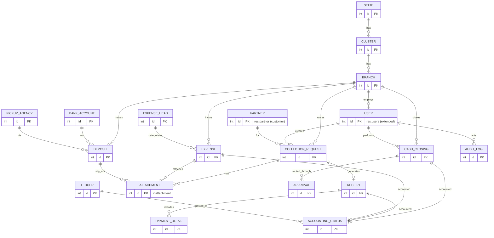

# Data Model (Odoo 19 CE ORM)

**Project:** Branch Cash Management System (BCMS) — Prabal Motors Private Limited
**Source:** `BRD_v1.0.docx` §19 (Database Entities) + full functional analysis
**Platform:** Odoo 19 Community Edition — module `branch_cash_management`
**Version:** 2.0 · **Date:** 2026-07-03 · **Status:** Draft for Client Review

> Deliverable: the ORM data model — models, fields, relations, indexes, constraints, computed fields, sequences, reporting, and the archive/retention strategy. In Odoo the **schema is derived from model definitions** (no hand-written DDL); PostgreSQL tables/columns are created/updated on module install/upgrade. Python is **illustrative reference** and targets **Odoo 19 CE on PostgreSQL 16**. Access control (groups, record rules, ACLs) lives in [SecurityArchitecture.md](./SecurityArchitecture.md).

---

## 1. Design Conventions

| Convention | Rule (Odoo) |
|-----------|-------------|
| Primary keys | Odoo `id` (auto integer PK) on every model; no manual PKs. |
| Model naming | Dotted, singular: `bcms.collection.request`; table names derived (`bcms_collection_request`). |
| Field naming | `snake_case`; relations `<name>_id` (Many2one) / `<name>_ids` (One2many/Many2many). |
| Timestamps / actors | `create_date`, `write_date`, `create_uid`, `write_uid` are automatic; stored UTC, displayed IST. |
| Money | `fields.Monetary` + `currency_id` (INR); never `Float` for amounts. |
| Soft delete | `active` boolean (Odoo archiving); **no physical delete** (no `unlink` rights) — BR-05. |
| Enums | `fields.Selection` for stable domains (statuses, modes, types). |
| Multitenancy | `branch_id` (+ related `cluster_id`, `state_id`) on transactional models for record-rule scoping. |
| Numbering | Sequential business numbers via **`ir.sequence`** (per branch + financial year). |
| Change history | `mail.thread` + `tracking=True` on key fields; security/action events in `bcms.audit.log`. |
| Documents | `ir.attachment` on the record (`res_model`/`res_id`), versioned. |

---

## 2. Entity-Relationship Diagram (domain)



*Customers reuse `res.partner`; staff reuse `res.users`. Documents and notifications reuse Odoo core (`ir.attachment`, `mail.*`). A dedicated ER copy is in [docs/diagrams/er-diagram.md](./diagrams/er-diagram.md).*

---

## 3. Selection (enumerated) Fields

```python
# roles are res.groups (see SecurityArchitecture.md), not a Selection.
BRANCH_TYPE   = [('sales', 'Sales'), ('service', 'Service'), ('both', 'Both')]
VERTICAL      = [('sales', 'Sales'), ('service', 'Service')]
PAYMENT_MODE  = [('cash', 'Cash'), ('online', 'Online'), ('mixed', 'Mixed'), ('cheque', 'Cheque')]
REQUEST_STATE = [('draft', 'Draft'), ('submitted', 'Submitted'), ('rejected', 'Rejected'),
                 ('accepted', 'Accepted'), ('receipted', 'Receipted'), ('cancelled', 'Cancelled')]
CLOSING_STATE = [('draft', 'Draft'), ('pending_wm', 'Pending Works Manager'),
                 ('pending_accountant', 'Pending Accountant'), ('closed', 'Closed'), ('rejected', 'Rejected')]
DEPOSIT_TYPE  = [('direct', 'Direct'), ('pickup_agency', 'Pickup Agency')]
DEPOSIT_STATE = [('recorded', 'Recorded'), ('pending_ack', 'Pending Acknowledgement'),
                 ('verified', 'Verified'), ('rejected', 'Rejected')]
EXPENSE_STATE = [('draft', 'Draft'), ('pending_approval', 'Pending Approval'),
                 ('approved', 'Approved'), ('rejected', 'Rejected')]
ACCT_STATE    = [('pending', 'Pending'), ('posted', 'Posted'),
                 ('reconciled', 'Reconciled'), ('discrepancy', 'Discrepancy')]
APPROVAL_ACTION = [('submitted', 'Submitted'), ('approved', 'Approved'), ('rejected', 'Rejected'),
                   ('verified', 'Verified'), ('finalised', 'Finalised')]
```

---

## 4. Model Definitions

### 4.1 Organisation & Identity

```python
class BcmsState(models.Model):
    _name = 'bcms.state'
    _description = 'BCMS State/Region'
    _order = 'name'
    code = fields.Char(required=True)
    name = fields.Char(required=True)
    active = fields.Boolean(default=True)
    _sql_constraints = [('code_uniq', 'unique(code)', 'State code must be unique.')]


class BcmsCluster(models.Model):
    _name = 'bcms.cluster'
    _description = 'BCMS Cluster'
    _order = 'name'
    state_id = fields.Many2one('bcms.state', required=True, ondelete='restrict', index=True)
    code = fields.Char(required=True)
    name = fields.Char(required=True)
    active = fields.Boolean(default=True)
    _sql_constraints = [('code_uniq', 'unique(code)', 'Cluster code must be unique.')]


class BcmsBranch(models.Model):
    _name = 'bcms.branch'
    _description = 'BCMS Branch'
    _order = 'name'
    cluster_id = fields.Many2one('bcms.cluster', required=True, ondelete='restrict', index=True)
    state_id = fields.Many2one(related='cluster_id.state_id', store=True, index=True)
    code = fields.Char(required=True)
    name = fields.Char(required=True)
    type = fields.Selection(BRANCH_TYPE, default='both', required=True)
    address = fields.Text()
    active = fields.Boolean(default=True)
    _sql_constraints = [('code_uniq', 'unique(code)', 'Branch code must be unique.')]


# Staff = res.users extended with home scope; role is expressed via security groups.
class ResUsers(models.Model):
    _inherit = 'res.users'
    bcms_employee_code = fields.Char(string='Employee Code')
    bcms_branch_id = fields.Many2one('bcms.branch', string='Home Branch', index=True)
    bcms_cluster_id = fields.Many2one('bcms.cluster', string='Cluster Scope', index=True)
    bcms_state_id = fields.Many2one('bcms.state', string='State Scope', index=True)


# Customers = res.partner extended (no login; not system users — AS-06).
class ResPartner(models.Model):
    _inherit = 'res.partner'
    is_bcms_customer = fields.Boolean(string='BCMS Customer', index=True)
    bcms_external_ref = fields.Char(string='External Ref (DMS/customer id)')
```

### 4.2 Master Data

```python
class BcmsExpenseHead(models.Model):
    _name = 'bcms.expense.head'
    _description = 'Expense Head'
    code = fields.Char(required=True)
    name = fields.Char(required=True)
    active = fields.Boolean(default=True)
    _sql_constraints = [('code_uniq', 'unique(code)', 'Expense head code must be unique.')]


class BcmsBankAccount(models.Model):
    _name = 'bcms.bank.account'
    _description = 'Deposit Bank Account'
    branch_id = fields.Many2one('bcms.branch', index=True)
    bank_name = fields.Char(required=True)
    account_no = fields.Char(required=True)
    ifsc = fields.Char()
    active = fields.Boolean(default=True)


class BcmsPickupAgency(models.Model):
    _name = 'bcms.pickup.agency'
    _description = 'Cash Pickup Agency (CIT)'
    name = fields.Char(required=True)
    contact = fields.Char()
    active = fields.Boolean(default=True)


class BcmsLedger(models.Model):
    _name = 'bcms.ledger'
    _description = 'Tally Ledger (mapping)'
    code = fields.Char(required=True)
    name = fields.Char(required=True, help='Maps to Tally ledger')
    active = fields.Boolean(default=True)
    _sql_constraints = [('code_uniq', 'unique(code)', 'Ledger code must be unique.')]
```

### 4.3 Collection & Receipt

```python
class BcmsCollectionRequest(models.Model):
    _name = 'bcms.collection.request'
    _description = 'Collection Request'
    _inherit = ['mail.thread', 'mail.activity.mixin']
    _order = 'create_date desc'

    name = fields.Char(string='Request No.', required=True, copy=False, readonly=True,
                       default=lambda self: _('New'))           # ir.sequence on create
    branch_id = fields.Many2one('bcms.branch', required=True, index=True, tracking=True)
    cluster_id = fields.Many2one(related='branch_id.cluster_id', store=True, index=True)
    state_id = fields.Many2one(related='branch_id.state_id', store=True, index=True)
    vertical = fields.Selection(VERTICAL, required=True)
    partner_id = fields.Many2one('res.partner', string='Customer', required=True,
                                 domain=[('is_bcms_customer', '=', True)])
    reference_type = fields.Selection([('invoice', 'Invoice'), ('job_card', 'Job Card')], required=True)
    reference_no = fields.Char(required=True)
    amount = fields.Monetary(required=True, currency_field='currency_id', tracking=True)
    currency_id = fields.Many2one('res.currency', default=lambda s: s.env.company.currency_id.id)
    expected_mode = fields.Selection(PAYMENT_MODE, required=True)
    state = fields.Selection(REQUEST_STATE, default='submitted', tracking=True, index=True)
    reject_reason = fields.Text()
    accepted_uid = fields.Many2one('res.users', string='Accepted By (Cashier)', readonly=True)
    active = fields.Boolean(default=True)
    # create_uid = advisor/maker (automatic)


class BcmsReceipt(models.Model):
    _name = 'bcms.receipt'
    _description = 'Official Receipt'
    _inherit = ['mail.thread']
    name = fields.Char(string='Receipt No.', required=True, copy=False, readonly=True)  # ir.sequence per branch+FY
    request_id = fields.Many2one('bcms.collection.request', required=True, ondelete='restrict', index=True)
    branch_id = fields.Many2one('bcms.branch', required=True, index=True)
    partner_id = fields.Many2one('res.partner', string='Customer', required=True)
    amount = fields.Monetary(required=True, currency_field='currency_id')
    currency_id = fields.Many2one('res.currency', default=lambda s: s.env.company.currency_id.id)
    mode = fields.Selection(PAYMENT_MODE, required=True)
    issued_uid = fields.Many2one('res.users', string='Issued By (Cashier)', readonly=True)
    issued_at = fields.Datetime(readonly=True)
    is_cancelled = fields.Boolean(default=False, tracking=True)
    cancel_reason = fields.Text()
    payment_detail_ids = fields.One2many('bcms.payment.detail', 'receipt_id')
    _sql_constraints = [('receipt_branch_uniq', 'unique(branch_id, name)',
                         'Receipt number must be unique per branch.')]


class BcmsPaymentDetail(models.Model):
    _name = 'bcms.payment.detail'
    _description = 'Receipt Payment Breakdown'
    receipt_id = fields.Many2one('bcms.receipt', required=True, ondelete='cascade', index=True)
    mode = fields.Selection(PAYMENT_MODE, required=True)
    amount = fields.Monetary(currency_field='currency_id')
    currency_id = fields.Many2one('res.currency', default=lambda s: s.env.company.currency_id.id)
    denominations = fields.Json()          # {"500": 10, "200": 5, ...} for cash
    txn_reference = fields.Char()          # online/cheque reference
    instrument_date = fields.Date()
```

### 4.4 Expenses, Deposits, Closing

```python
class BcmsExpense(models.Model):
    _name = 'bcms.expense'
    _description = 'Cash Expense Voucher'
    _inherit = ['mail.thread', 'mail.activity.mixin']
    name = fields.Char(string='Voucher No.', required=True, copy=False, readonly=True)   # ir.sequence per branch+FY
    branch_id = fields.Many2one('bcms.branch', required=True, index=True)
    expense_head_id = fields.Many2one('bcms.expense.head', required=True)
    amount = fields.Monetary(required=True, currency_field='currency_id', tracking=True)
    currency_id = fields.Many2one('res.currency', default=lambda s: s.env.company.currency_id.id)
    state = fields.Selection(EXPENSE_STATE, default='pending_approval', tracking=True, index=True)
    approver_uid = fields.Many2one('res.users', string='Approver (Checker)', readonly=True)
    approved_at = fields.Datetime(readonly=True)
    reject_reason = fields.Text()
    expense_date = fields.Date(default=fields.Date.context_today, required=True)
    active = fields.Boolean(default=True)
    _sql_constraints = [('voucher_branch_uniq', 'unique(branch_id, name)',
                         'Voucher number must be unique per branch.')]


class BcmsDeposit(models.Model):
    _name = 'bcms.deposit'
    _description = 'Bank Deposit'
    _inherit = ['mail.thread', 'mail.activity.mixin']
    name = fields.Char(string='Deposit No.', required=True, copy=False, readonly=True)   # ir.sequence
    branch_id = fields.Many2one('bcms.branch', required=True, index=True)
    deposit_type = fields.Selection(DEPOSIT_TYPE, required=True)
    bank_account_id = fields.Many2one('bcms.bank.account')
    pickup_agency_id = fields.Many2one('bcms.pickup.agency')
    amount = fields.Monetary(required=True, currency_field='currency_id')
    currency_id = fields.Many2one('res.currency', default=lambda s: s.env.company.currency_id.id)
    deposit_date = fields.Date(default=fields.Date.context_today, required=True)
    state = fields.Selection(DEPOSIT_STATE, default='recorded', tracking=True, index=True)
    reference_no = fields.Char()
    verified_uid = fields.Many2one('res.users', string='Verified By (Accountant)', readonly=True)
    verified_at = fields.Datetime(readonly=True)
    reject_reason = fields.Text()
    active = fields.Boolean(default=True)
    _sql_constraints = [('deposit_branch_uniq', 'unique(branch_id, name)',
                         'Deposit number must be unique per branch.')]

    @api.constrains('deposit_type', 'bank_account_id', 'pickup_agency_id')
    def _check_destination(self):                       # BR-07 (partial)
        for d in self:
            if d.deposit_type == 'direct' and not d.bank_account_id:
                raise ValidationError(_('Direct deposit requires a bank account.'))
            if d.deposit_type == 'pickup_agency' and not d.pickup_agency_id:
                raise ValidationError(_('Pickup deposit requires an agency.'))


class BcmsCashClosing(models.Model):
    _name = 'bcms.cash.closing'
    _description = 'End-of-Day Cash Closing'
    _inherit = ['mail.thread', 'mail.activity.mixin']
    name = fields.Char(string='Closing No.', required=True, copy=False, readonly=True)   # ir.sequence
    branch_id = fields.Many2one('bcms.branch', required=True, index=True)
    cashier_uid = fields.Many2one('res.users', string='Cashier (Maker)', required=True, index=True)
    business_date = fields.Date(required=True, index=True)
    currency_id = fields.Many2one('res.currency', default=lambda s: s.env.company.currency_id.id)
    opening_cash = fields.Monetary(default=0.0)
    cash_collections = fields.Monetary(default=0.0)
    online_collections = fields.Monetary(default=0.0)
    total_expenses = fields.Monetary(default=0.0)
    total_deposits = fields.Monetary(default=0.0)
    expected_cash = fields.Monetary(compute='_compute_expected_cash', store=True)       # BR-10
    physical_cash = fields.Monetary()
    variance = fields.Monetary(compute='_compute_variance', store=True)                 # physical - expected
    variance_reason = fields.Text()
    state = fields.Selection(CLOSING_STATE, default='draft', tracking=True, index=True)
    wm_approved_uid = fields.Many2one('res.users', string='WM Approved By', readonly=True)
    wm_approved_at = fields.Datetime(readonly=True)
    accountant_verified_uid = fields.Many2one('res.users', string='Accountant Verified By', readonly=True)
    accountant_verified_at = fields.Datetime(readonly=True)
    active = fields.Boolean(default=True)
    _sql_constraints = [('one_per_cashier_day', 'unique(branch_id, cashier_uid, business_date)',
                         'Only one closing per cashier per business day (AS-09).')]

    @api.depends('opening_cash', 'cash_collections', 'total_expenses', 'total_deposits')
    def _compute_expected_cash(self):
        for c in self:
            c.expected_cash = c.opening_cash + c.cash_collections - c.total_expenses - c.total_deposits

    @api.depends('physical_cash', 'expected_cash')
    def _compute_variance(self):
        for c in self:
            c.variance = (c.physical_cash or 0.0) - c.expected_cash
```

### 4.5 Approvals, Accounting, Audit

```python
class BcmsApproval(models.Model):
    _name = 'bcms.approval'
    _description = 'Maker-Checker Approval Trail'
    res_model = fields.Char(required=True)               # 'bcms.cash.closing' | 'bcms.expense' | 'bcms.deposit'
    res_id = fields.Integer(required=True, index=True)
    step = fields.Integer(help='1=WM, 2=Accountant ...')
    action = fields.Selection(APPROVAL_ACTION, required=True)
    actor_uid = fields.Many2one('res.users', required=True)
    remarks = fields.Text()
    acted_at = fields.Datetime(default=fields.Datetime.now)


class BcmsAccountingStatus(models.Model):
    _name = 'bcms.accounting.status'
    _description = 'Accounting / Tally Posting Status'
    res_model = fields.Char(required=True)               # 'bcms.receipt' | 'bcms.expense' | 'bcms.cash.closing'
    res_id = fields.Integer(required=True, index=True)
    branch_id = fields.Many2one('bcms.branch', required=True, index=True)
    tally_voucher_no = fields.Char()
    voucher_date = fields.Date()
    posting_date = fields.Date()
    ledger_id = fields.Many2one('bcms.ledger')
    state = fields.Selection(ACCT_STATE, default='pending', tracking=True, index=True)
    _sql_constraints = [('entity_uniq', 'unique(res_model, res_id)',
                         'One accounting status per source record.')]


class BcmsAuditLog(models.Model):
    _name = 'bcms.audit.log'
    _description = 'Append-only Security/Action Log'
    _order = 'id desc'
    actor_uid = fields.Many2one('res.users', index=True)
    action = fields.Char(required=True)                  # 'issue_receipt' | 'finalise' | 'login' ...
    res_model = fields.Char(required=True)
    res_id = fields.Integer(index=True)
    branch_id = fields.Many2one('bcms.branch', index=True)
    payload = fields.Json()                              # before/after snapshot or context
    log_ip = fields.Char()
    # ACLs grant create+read only; no write/unlink → append-only.
```

> **Documents & notifications** reuse Odoo core: files are `ir.attachment` linked by `res_model`/`res_id` (with a `doc_kind` tag via an attachment extension or a thin `bcms.document` wrapper for versioning metadata); user notifications are chatter messages and `mail.activity` "to-do" items, so no custom `notification` table is needed. Field-level change history is captured by `mail.thread` `tracking=True`.

---

## 5. Indexes

Odoo creates PK/FK indexes automatically. Additional `index=True` is set on record-rule and search columns:

- Scoping: `branch_id`, `cluster_id`, `state_id` on all transactional models; `bcms_branch_id`/`bcms_cluster_id`/`bcms_state_id` on `res.users`.
- Status/queues: `state` on request/closing/deposit/expense/accounting.
- Lookups: `cashier_uid` + `business_date` on closing; `res_id` on approval/accounting/audit; `is_bcms_customer` on partner.
- Text search (NFR-PERF-01): searchable `Char` fields (`name`, `reference_no`) are indexed; a **`pg_trgm`** GIN index can be added via a `post_init` hook / SQL for fuzzy customer/reference search if needed.

---

## 6. Constraints & Business Rules in the Model

| Rule | Enforcement (Odoo) |
|------|--------------------|
| Amounts > 0 | `@api.constrains` on money fields (raise `ValidationError`). |
| Expected-cash formula (BR-10) | **computed, stored** field `expected_cash` (`_compute_expected_cash`). |
| One closing per cashier/day (AS-09) | `_sql_constraints` `unique(branch_id, cashier_uid, business_date)`. |
| Deposit destination (BR-07 partial) | `@api.constrains` `_check_destination`. |
| Receipt/voucher uniqueness (BR-08) | `_sql_constraints` `unique(branch_id, name)` + `ir.sequence`. |
| Maker ≠ Checker (BR-03) | `@api.constrains` comparing `create_uid`/maker vs approver/verifier; enforced in `action_*` methods (see §7 and [APIDesign.md](./APIDesign.md)). |
| Variance reason if variance ≠ 0 (BR-04) | `@api.constrains` on submit: require `variance_reason` when `variance != 0`. |
| No physical delete (BR-05) | No `unlink` rights in `ir.model.access.csv`; `active` archiving + cancel/reverse. |
| Accounting completeness (BR-11) | `state` machine on `bcms.accounting.status`. |

```python
@api.constrains('state', 'variance', 'variance_reason')
def _check_variance_reason(self):                        # BR-04
    for c in self:
        if c.state in ('pending_wm', 'pending_accountant', 'closed') and c.variance and not (c.variance_reason or '').strip():
            raise ValidationError(_('A variance reason is required for a non-zero variance (BR-04).'))

@api.constrains('wm_approved_uid', 'accountant_verified_uid', 'cashier_uid')
def _check_maker_checker(self):                          # BR-03
    for c in self:
        if c.wm_approved_uid and c.wm_approved_uid == c.cashier_uid:
            raise ValidationError(_('Maker cannot be the approver (BR-03).'))
        if c.accountant_verified_uid and c.accountant_verified_uid in (c.cashier_uid | c.wm_approved_uid):
            raise ValidationError(_('Verifier must differ from maker/approver (BR-03).'))
```

---

## 7. Sequences, Computed Fields & Methods

**Numbering — `ir.sequence`** (declared in `data/ir_sequence_data.xml`), one series per document type, made per-branch + FY via subsequences or a prefix built at create time:

```python
@api.model_create_multi
def create(self, vals_list):
    for vals in vals_list:
        if vals.get('name', _('New')) == _('New'):
            branch = self.env['bcms.branch'].browse(vals['branch_id'])
            vals['name'] = self.env['ir.sequence'].next_by_code('bcms.receipt') \
                .replace('{branch}', branch.code).replace('{fy}', self._current_fy())
    return super().create(vals_list)
```

Result format matches AS-30, e.g. `BR001/2026-27/000123`. Privileged transitions (`action_issue_receipt`, `action_finalise_closing`, `action_verify_deposit`, `action_mark_accounted`) run inside the request transaction, set the actor/`*_at` fields, write the approval trail, and enforce the maker-checker and variance constraints — detailed in [APIDesign.md](./APIDesign.md).

---

## 8. Reporting (views & aggregates)

No SQL views are required — Odoo reporting uses list/pivot/graph views and `read_group` aggregates over the models:

| Report (BRD) | Odoo mechanism |
|--------------|----------------|
| Daily cash book (FR-RPT-01) | Closing list/pivot grouped by `branch_id`, `business_date`; QWeb PDF `bcms_cash_book_report`. |
| Pending deposits (FR-RPT-05 / FR-DASH-05) | Deposit list filtered `state in ('recorded','pending_ack')`. |
| Pending closings (FR-RPT-06) | Closing list filtered `state in ('pending_wm','pending_accountant')`. |
| Accounting pending (FR-RPT-08) | Accounting-status list filtered `state = 'pending'`. |
| Cash difference (FR-RPT-07) | Closing pivot filtered `variance != 0`, showing `expected/physical/variance/reason`. |

Corporate dashboards use pivot/graph views and an OWL dashboard reading pre-aggregated `read_group` results; heavy aggregates can be backed by a stored computed summary model refreshed by `ir.cron` (NFR-SCAL/PERF).

---

## 9. Access Control (summary)

Row scoping and CRUD rights are **not** RLS/SQL — they are Odoo **security groups + record rules (`ir.rule`) + `ir.model.access.csv`**, fully specified in [SecurityArchitecture.md](./SecurityArchitecture.md). Summary of intended scope:

| Model | Read scope | Write rule |
|-------|-----------|-----------|
| `bcms.collection.request` | branch / cluster / corporate | advisor creates own; cashier verifies branch |
| `bcms.receipt` | branch / cluster / corporate | created only via `action_issue_receipt` |
| `bcms.expense` | branch / cluster / corporate | cashier creates; approver approves (maker≠checker) |
| `bcms.deposit` | branch / cluster / corporate | cashier creates; accountant verifies |
| `bcms.cash.closing` | branch / cluster / corporate | cashier creates; WM/accountant approve (maker≠checker) |
| `bcms.accounting.status` | branch / cluster / corporate | accountant/finance update |
| `bcms.audit.log` | branch/cluster/corporate read; audit all | create-only (append-only) |
| masters (`bcms.branch`, `bcms.ledger`, …) | all internal users read | CFO/Admin write |

---

## 10. Archive & Data-Retention Strategy

- **Soft delete = archiving:** business models use `active`; archived rows are hidden from normal views but retained (Internal Audit can toggle "Archived"). No model grants `unlink` to business roles.
- **Cancellation vs. delete:** receipts and financial documents are **cancelled/reversed** (with reason, tracked in chatter), never removed (FR-RCPT-05, BR-05).
- **Document versioning:** a new upload adds a new `ir.attachment` (version tag `is_current=true`) and marks the prior one superseded; all versions retained (BR-13).
- **Period locking (recommended R-03):** once a closing is `closed`, an `@api.constrains`/write-guard blocks edits to that branch/date's source transactions.
- **Retention (NFR-RETAIN-01, confirm CLR-09):** financial & audit data retained ≥ 8 years; archival to cold storage after N years via `ir.cron`; nothing hard-deleted within retention.

---

## 11. Traceability

| BRD §19 Entity | Odoo model(s) |
|----------------|---------------|
| Branch | `bcms.branch` (+ `bcms.cluster`, `bcms.state`) |
| Employee | `res.users` (extended) |
| Customer | `res.partner` (`is_bcms_customer`) |
| Collection Request | `bcms.collection.request` |
| Receipt | `bcms.receipt` (+ `bcms.payment.detail`) |
| Expense | `bcms.expense` |
| Deposit | `bcms.deposit` |
| Approval | `bcms.approval` |
| Accounting Status | `bcms.accounting.status` |
| Audit Log | `bcms.audit.log` |
| *(derived)* Documents | `ir.attachment` (+ optional `bcms.document` metadata) |
| *(derived)* Notifications | `mail.message` / `mail.activity` |
| *(derived)* Masters | `bcms.expense.head`, `bcms.bank.account`, `bcms.pickup.agency`, `bcms.ledger` |

All BRD §19 entities are represented; derived items reuse Odoo core rather than new tables.

---

*End of DatabaseDesign.md*
