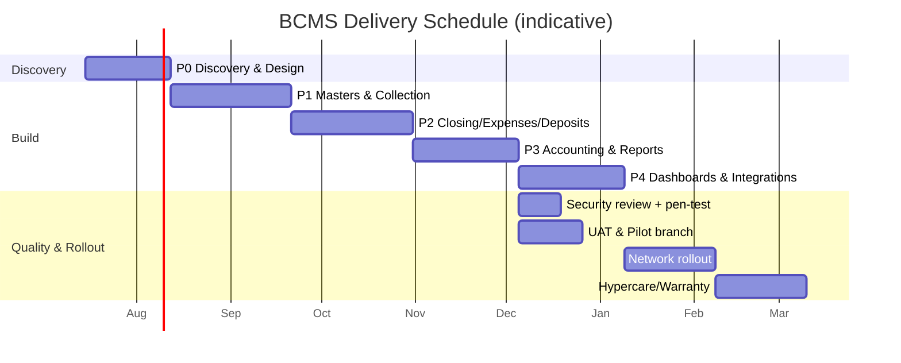

# Project Plan

**Project:** Branch Cash Management System (BCMS) — Prabal Motors Private Limited
**Source:** BRD Appendix B (Development Phases) + PRD/SOW
**Version:** 1.0 · **Date:** 2026-07-01 · **Status:** Draft for Client Review

> Delivery plan: phases, workstreams, milestones, schedule, resource plan, RACI, dependencies, and governance. Estimates are **indicative** pending Discovery and resolution of clarifications ([Assumptions.md](./Assumptions.md)).

---

## 1. Delivery Approach

- **Methodology:** Agile-iterative with fixed **phase gates** aligned to BRD Appendix B; 2-week sprints; demo + UAT each release.
- **Definition of Ready:** clarified requirement, acceptance criteria, design, and dependencies known.
- **Definition of Done:** coded, reviewed, unit+integration+RLS tested, accessible (AA), audit-logged, documented, deployed to staging, UAT-passed.
- **Cadence:** sprint planning, daily stand-up, sprint review/demo, retro; weekly steering check-in with Client PO.

---

## 2. Phases & Workstreams (BRD Appendix B)

| Phase | BRD Phase | Primary modules | Exit gate |
|-------|-----------|-----------------|-----------|
| **P0 Discovery & Design** | (pre) | Clarifications, UX, architecture, schema baseline | Requirements & design sign-off (D1, D2) |
| **P1** | Phase 1: Masters & Collection Workflow | MDM, CR, CV, RCPT, Auth/RBAC | Collection→Receipt UAT pass (M2) |
| **P2** | Phase 2: Closing, Expenses & Deposits | CLS, EXP, DEP, Approvals | Closing & deposits UAT pass (M3) |
| **P3** | Phase 3: Accounting & Reports | ACC, RPT, Notifications | Reports reconcile w/ Tally UAT pass (M4) |
| **P4** | Phase 4: Dashboards & Integrations | DASH (+ Phase-4 integrations via change order) | Dashboards + go-live (M5) |

**Parallel workstreams throughout:** Security & RLS, QA/automation, DevOps/CI-CD, Documentation, Change management/training.

---

## 3. Schedule (indicative)

Indicative build duration ~**22–26 weeks** to go-live (single small team), plus rollout and warranty. Timeline compresses/expands with team size and clarification turnaround.

---

## 4. Milestones

| ID | Milestone | Phase | Acceptance |
|----|-----------|-------|-----------|
| M0 | Mobilisation | P0 | Team on-boarded, environments provisioned |
| M1 | Requirements & Design sign-off | P0 | CLR-01…12 resolved; UX & architecture approved |
| M2 | R1: Collection → Receipt live | P1 | US-CR/CV/RCPT UAT pass; RBAC/RLS verified |
| M3 | R2: Closing & Deposits live | P2 | US-CLS/EXP/DEP + maker-checker UAT pass |
| M4 | R3: Accounting & Reports | P3 | Reports reconcile w/ Tally (SC-03); notifications |
| M5 | R4: Dashboards + Go-live | P4 | Dashboards; production; pilot success |
| M6 | Network rollout complete | Post | All targeted branches live (SC-06) |
| M7 | Warranty complete | Post | Defects within threshold; handover |

---

## 5. Resource Plan

| Role | P0 | P1 | P2 | P3 | P4 | Rollout |
|------|:--:|:--:|:--:|:--:|:--:|:------:|
| Project Manager | ◑ | ◑ | ◑ | ◑ | ◑ | ◑ |
| Business Analyst | ● | ● | ◑ | ◑ | ◑ | ◑ |
| Solution/Tech Architect | ● | ◑ | ◑ | ◑ | ◑ | ○ |
| UI/UX Designer | ● | ● | ◑ | ○ | ◑ | ○ |
| Frontend Eng (1–2) | ○ | ● | ● | ● | ● | ◑ |
| Backend Eng (1–2) | ◑ | ● | ● | ● | ● | ◑ |
| QA Engineer | ○ | ● | ● | ● | ● | ◑ |
| DevOps (shared) | ◑ | ◑ | ○ | ○ | ◑ | ◑ |

● full · ◑ partial · ○ minimal.

**Client team:** Product Owner (CFO/Admin or delegate), Finance SME, IT coordinator, pilot-branch users.

---

## 6. RACI (detailed)

| Activity | PM | Architect | BA | Eng | QA | Client PO | Finance SME |
|----------|:--:|:--------:|:--:|:---:|:--:|:---------:|:-----------:|
| Clarifications & scope baseline | A | C | R | I | I | A | C |
| Architecture & security design | C | R | C | C | I | A | I |
| UX design & approval | C | C | R | I | I | A | C |
| DB/API implementation | A | C | I | R | C | I | I |
| Feature build | A | C | C | R | C | I | I |
| Testing (unit→E2E, RLS) | A | C | I | C | R | I | I |
| UAT | C | I | C | I | C | A | R |
| Security review/pen-test | A | R | I | C | C | A | I |
| Go-live approval | C | C | C | I | C | A | C |
| Training & rollout | R | I | C | C | C | A | C |

A=Accountable · R=Responsible · C=Consulted · I=Informed.

---

## 7. Dependencies & Critical Path

- **Critical path:** Clarifications (M1) → Masters/Auth (P1) → Closing/Approvals (P2) → Accounting/Reports (P3) → Go-live (M5).
- **External:** receipt/GST format (CLR-04) blocks RCPT; volumes (CLR-03) inform sizing; org/master data & opening balances block cut-over; Tally/Bank APIs (Phase 4) gated by client access.
- **Internal:** design system before feature build; RLS foundation before any data screen; audit + numbering utilities before receipts/closings.

---

## 8. Environments & Release Management

| Env | Purpose | Promotion |
|-----|---------|-----------|
| Development | Feature work | PR → CI |
| Staging | UAT/integration | Merge to main → auto-deploy + migrations |
| Production | Live | Tagged release → CD + PITR safety |

Versioned DB migrations, Edge Function deploys, instant frontend rollback. Feature flags for phased enablement.

---

## 9. Quality Gates

Each phase gate requires: acceptance criteria met, RLS/security tests green, performance within targets, documentation updated, and Client PO UAT sign-off. Go-live additionally requires pen-test remediation and pilot-branch success.

---

## 10. Rollout Strategy

1. **Pilot** at 1–2 representative branches (one Sales, one Service or a "Both") with parallel-run against registers for a short window.
2. **Stabilise** — fix issues, refine training, confirm opening-balance cut-over.
3. **Wave rollout** by cluster/state, retiring registers on a fixed date per branch.
4. **Hypercare** support during each wave; central monitoring via Exception dashboard.

---

## 11. Communication & Governance

- **Steering committee** (Client PO + Vendor PM + Architect) — bi-weekly.
- **Status report** — weekly (progress, risks, decisions, next steps).
- **Decision log & change control** — maintained in [Assumptions.md](./Assumptions.md) and CR register.
- **Risk review** — each sprint/gate ([RiskAssessment.md](./RiskAssessment.md)).

---

## 12. Traceability

Plan phases map 1:1 to BRD Appendix B and PRD §16 releases; modules map to Requirement IDs in [TraceabilityMatrix.md](./TraceabilityMatrix.md).

---

*End of ProjectPlan.md*
