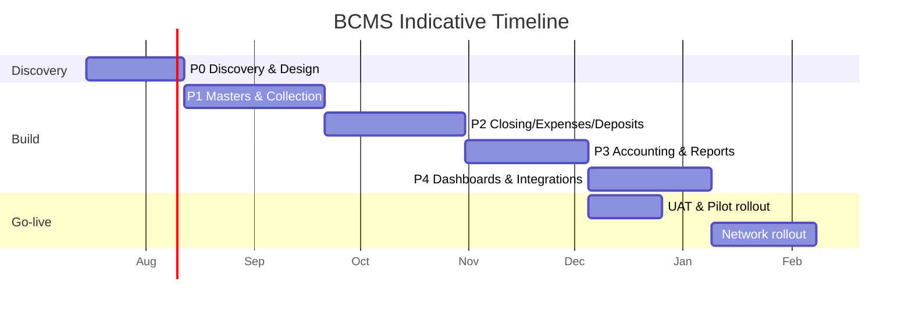

# Statement of Work (SOW)

**Project:** Branch Cash Management System (BCMS)
**Client:** Prabal Motors Private Limited (PMPL) ("Client")
**Vendor:** [Delivery Partner] ("Vendor")
**Source BRD:** `BRD_v1.0.docx` v1.0
**Platform:** Odoo 19 Community Edition — one fully custom module (`branch_cash_management`)
**Document Version:** 2.0 · **Date:** 2026-07-03 · **Status:** Draft for Sign-off

> This SOW is a **template for client sign-off**. Bracketed `[…]` items (dates, rates, names, durations) are to be finalised during contracting. Effort/timeline figures are **indicative planning estimates** pending resolution of the open clarifications ([Assumptions.md](./Assumptions.md)).

---

## 1. Project Overview

The Vendor will design, build, test, and deploy the **Branch Cash Management System (BCMS)** — **one fully custom Odoo 19 Community Edition module** (`branch_cash_management`), used through the responsive Odoo web client, that digitises PMPL's branch cash lifecycle (collection request → cashier verification → receipt → cash closing → maker-checker approval → bank deposit → Tally accounting) with role-based access, complete audit trail, dashboards, and reports — per the agreed architecture ([TechnicalArchitecture.md](./TechnicalArchitecture.md)).

---

## 2. Objectives

Per BRD §3 and PRD §3: digitise cash collection; standardise Sales & Service operations; enforce maker-checker; provide real-time dashboards; improve audit compliance; scale across branches; and establish a foundation for Tally/other integrations.

---

## 3. Scope of Work

### 3.1 In Scope (v1)
The twelve functional modules and controls listed in [PRD.md](./PRD.md) §6:
Master Data · Collection Request · Cashier Verification · Receipt · Cash Expense · Cash Closing · Approval Workflow · Bank Deposit · Accounting Update (manual Tally entry) · Dashboards · Reports (9) · Notifications (in-app) · Security & Audit (RBAC via groups + record rules, audit trail, no-delete, document versioning).

Includes: view/UX design, model & business-logic implementation, security (groups/record rules/ACLs), testing, deployment (dev/staging/prod), documentation, training, and warranty/hypercare as defined below.

### 3.2 Out of Scope (v1)
Per [PRD.md](./PRD.md) §7: live Tally API, bank API, WhatsApp/SMS, Power BI/Zoho BI, OCR, payment-gateway online collection, offline/PWA, customer portal, and full DMS/billing/inventory. These are candidates for Phase 4+ change orders.

---

## 4. Deliverables

| # | Deliverable | Acceptance artifact |
|---|-------------|---------------------|
| D1 | **Discovery & clarifications sign-off** (resolve CLR-01…12) | Signed requirements baseline |
| D2 | **UX/UI designs** (view mockups → Odoo views) | Approved designs ([UIUX.md](./UIUX.md)) |
| D3 | **Odoo data model** (models, fields, constraints, sequences) | Module installs/upgrades + record-rule tests pass ([DatabaseDesign.md](./DatabaseDesign.md)) |
| D4 | **Model methods & interfaces** (action_*, External API) | Working methods + docs ([APIDesign.md](./APIDesign.md)) |
| D5 | **Module build (R1–R4)** per release plan | Deployed, demoed, UAT-passed builds |
| D6 | **Security implementation** (groups, record rules, audit) | Security review + pen-test report ([SecurityArchitecture.md](./SecurityArchitecture.md)) |
| D7 | **Test suites & reports** | Odoo test-suite results (models/constraints/record rules/flows) |
| D8 | **Deployment & environments** | Dev/Staging/Prod operational |
| D9 | **Documentation** | This docs set + admin/user guides |
| D10 | **Training & handover** | Trained users; recorded sessions |
| D11 | **Warranty / hypercare** | Support during warranty window |

---

## 5. Assumptions

Full register in [Assumptions.md](./Assumptions.md). Key delivery assumptions:
- Client resolves clarifications (CLR-01…12) promptly; delays may affect timeline.
- v1 Tally integration is **manual entry**; online collection is **reference capture** (no gateway).
- Notifications are **in-app**; branches are **online-first** with adequate connectivity/devices.
- Client provides org/master data, opening cash balances, receipt/GST format, branding, and timely UAT.
- Delivered on **Odoo 19 Community Edition (LGPL-3)** — no Odoo Enterprise licence required; the module ships under LGPL-3.
- Self-hosted production on **Odoo 19 CE + PostgreSQL (Docker/nginx)** in an India-appropriate region, plus staging/dev.

---

## 6. Exclusions

- Procurement of hardware, POS devices, internet connectivity, or bank/CIT contracts.
- Data entry of historical transactions beyond agreed opening balances.
- Changes to Tally configuration or third-party licensing.
- Any feature in [PRD.md](./PRD.md) §7 (Out of Scope) unless added by change order.

---

## 7. Project Phases (aligned to BRD Appendix B)

| Phase | Name | Modules | Key outcomes |
|-------|------|---------|--------------|
| **P0** | Discovery & Design | — | Clarifications, backlog, UX, architecture baseline |
| **P1** | Masters & Collection Workflow | MDM, CR, CV, RCPT, Auth/RBAC | Collection-to-receipt live |
| **P2** | Closing, Expenses & Deposits | CLS, EXP, DEP, Approvals | End-of-day closing & deposits with maker-checker |
| **P3** | Accounting & Reports | ACC, RPT, Notifications | Reconcilable reports; notifications |
| **P4** | Dashboards & Integrations | DASH + Phase-4 integrations | Corporate dashboards; Tally/Bank API (change order) |

---

## 8. Indicative Timeline

> Planning estimate for a small cross-functional team; to be confirmed after Discovery. Durations in calendar weeks.

| Phase | Duration (indicative) | Cumulative |
|-------|----------------------|-----------|
| P0 Discovery & Design | 3–4 wks | ~4 wks |
| P1 Masters & Collection | 5–6 wks | ~10 wks |
| P2 Closing/Expenses/Deposits | 5–6 wks | ~16 wks |
| P3 Accounting & Reports | 4–5 wks | ~21 wks |
| P4 Dashboards (+ integrations) | 4–6 wks | ~26 wks |

---

## 9. Milestones & Payment Milestones (generic)

> Payment schedule is a **generic template**; actual commercials per the master agreement.

| Milestone | Trigger | Indicative payment % |
|-----------|---------|----------------------|
| M0 Contract & mobilisation | SOW signed | 10% |
| M1 Discovery & design sign-off | D1, D2 accepted | 15% |
| M2 Release 1 (Collection→Receipt) UAT pass | P1 accepted | 20% |
| M3 Release 2 (Closing/Deposits) UAT pass | P2 accepted | 20% |
| M4 Release 3 (Accounting/Reports) UAT pass | P3 accepted | 15% |
| M5 Release 4 (Dashboards) + Go-live | P4 + production | 15% |
| M6 Warranty completion | Warranty window ends | 5% |

---

## 10. Resource Plan & Roles

| Role | Responsibility | Allocation (indicative) |
|------|----------------|-------------------------|
| Engagement/Project Manager | Delivery, planning, risk, comms | Part-time |
| Business Analyst | Requirements, clarifications, UAT | Part→full early |
| Solution/Tech Architect | Architecture, security, reviews | Part-time |
| UI/UX Designer | View design, module theming | Front-loaded |
| Odoo Developer(s) — backend | Models, business logic, security, sequences | Full-time |
| Odoo Developer(s) — frontend | Views, OWL dashboards/widgets, QWeb reports | Full-time |
| QA Engineer | Test plans, Odoo test automation, UAT support | Full-time (from P1) |
| DevOps (shared) | CI/CD, Docker, environments | Part-time |

**Client-side:** Product Owner (CFO/Admin or delegate), Finance SME, IT coordinator, pilot-branch users for UAT.

### 10.1 RACI (summary)

| Activity | Vendor PM | Vendor Tech | Client PO | Client Finance SME |
|----------|:--------:|:-----------:|:---------:|:------------------:|
| Requirements sign-off | R | C | A | C |
| Design approval | C | R | A | C |
| Build & test | A | R | I | I |
| UAT | C | C | A | R |
| Go-live approval | C | C | A | C |

R=Responsible · A=Accountable · C=Consulted · I=Informed. Full RACI in [ProjectPlan.md](./ProjectPlan.md).

---

## 11. Technology Stack

Per [TechnicalArchitecture.md](./TechnicalArchitecture.md): **Platform** Odoo 19 Community Edition (LGPL-3) — one custom module `branch_cash_management` depending only on core `base`, `mail`, `web`. **Language** Python (models/business logic) + XML/OWL (views, dashboards) + QWeb (reports). **Database** PostgreSQL. **Security** security groups + record rules (`ir.rule`) + `ir.model.access.csv`; auth via `res.users` (+ optional `auth_totp`). **Framework services** `ir.sequence`, `ir.attachment`, `mail.thread`/activities, `ir.cron`. **Hosting** self-hosted Odoo + PostgreSQL in Docker behind nginx. **CI/CD** GitHub Actions (flake8/pylint-odoo, Odoo tests, Docker build, module upgrade).

---

## 12. Acceptance Criteria

- Each release meets the acceptance criteria in [UserStories.md](./UserStories.md) and the BRD acceptance criteria (SC-01…06): end-to-end workflow without manual register; all approvals captured; reports reconcile with Tally; complete audit trail.
- Security tests pass (record rules: no cross-branch leakage; maker-checker enforced).
- Performance targets met (search ≤ 2s; P95 ≤ 3s).
- UAT sign-off by Client Product Owner per release.

---

## 13. Testing

Per [PRD.md](./PRD.md) and the testing strategy (see [TechnicalArchitecture.md](./TechnicalArchitecture.md) §2.3 and this SOW): unit, integration, system, regression, performance, security (incl. record-rule isolation + pen-test), and UAT — using the Odoo test framework. Test evidence delivered per release (D7).

---

## 14. Deployment

Dev/Staging/Production environments; model-driven schema updates via module upgrade (`-u branch_cash_management`); Docker image tag rollback; daily backups + tested restore for data. Go-live via **pilot branch(es)** → phased network rollout ([ProjectPlan.md](./ProjectPlan.md)).

---

## 15. Training

- **Admin training** (CFO/Admin, IT): masters, users, config, monitoring.
- **Role training** (advisors, cashiers, managers, accountants, finance/audit): hands-on per role.
- **Materials:** quick-reference guides, recorded sessions, in-app help.
- Train-the-trainer option for network-wide rollout.

---

## 16. Support & Warranty

- **Hypercare:** [2–4] weeks post go-live intensive support.
- **Warranty:** [90] days covering defect fixes for delivered scope at no charge.
- **Ongoing support (optional):** separate AMS/SLA agreement (severity-based response/resolution targets).

| Severity | Example | Target response | Target resolution |
|----------|---------|-----------------|-------------------|
| S1 Critical | Cannot receipt/close; data isolation issue | [1 hr] | [same day] |
| S2 High | Major function impaired | [4 hr] | [2 days] |
| S3 Medium | Minor function/UX | [1 day] | [next release] |
| S4 Low | Cosmetic | [2 days] | [backlog] |

---

## 17. Risk Management

Managed per [RiskAssessment.md](./RiskAssessment.md); reviewed at each phase gate. Top risks (scope creep, record-rule data isolation, fraud controls, financial-calc bugs, Tally gap, adoption, connectivity) have defined mitigations and owners.

---

## 18. Dependencies

Per [PRD.md](./PRD.md) §12: timely clarifications & UAT, org/master data, opening balances, receipt/GST format, branding, connectivity/devices, and (Phase 4) Tally/bank API access.

---

## 19. Change Management

Any change to agreed scope follows a **Change Request** process: impact assessment (scope, effort, timeline, cost) → Client approval → updated baseline. Out-of-scope items (PRD §7) are handled as change orders.

---

## 20. Sign-off Criteria

The project (or each release) is accepted when: deliverables (§4) are provided; acceptance criteria (§12) are met; UAT is signed by the Client Product Owner; and outstanding defects are within agreed thresholds (0 S1/S2 open).

| Party | Name | Role | Signature | Date |
|-------|------|------|-----------|------|
| Client | ________ | CFO/Admin (or delegate) | __________ | ____ |
| Client | ________ | IT/Finance | __________ | ____ |
| Vendor | ________ | Engagement Manager | __________ | ____ |

---

*End of SOW.md*
