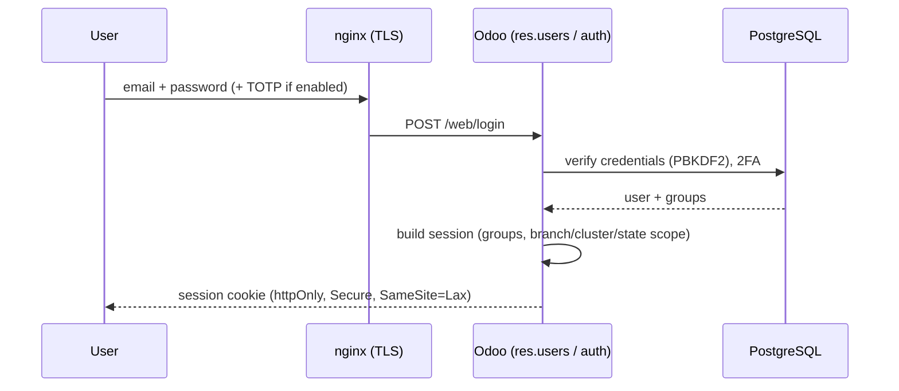
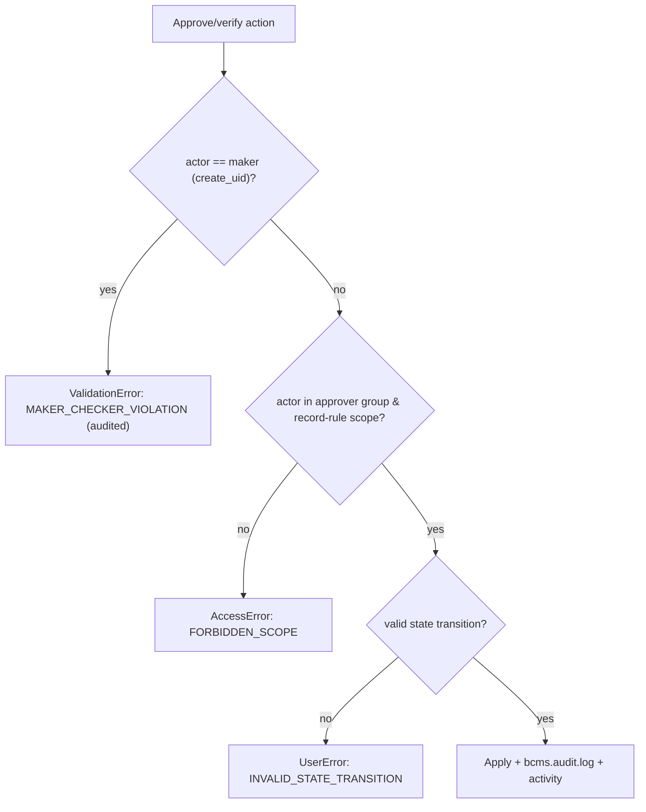

# Security Architecture

**Project:** Branch Cash Management System (BCMS) — Prabal Motors Private Limited
**Source:** `BRD_v1.0.docx` §18 (Security) + industry best practice
**Platform:** Odoo 19 Community Edition — module `branch_cash_management`
**Version:** 2.0 · **Date:** 2026-07-03 · **Status:** Draft for Client Review

> Because BCMS handles **cash and financial records**, security is a first-class requirement. This document covers authentication, authorization (Odoo groups, ACLs, record rules), session management, encryption, secrets, OWASP Top 10 (2021) alignment, input validation, file-upload security, audit logging, and monitoring — all for **Odoo 19 CE**.

---

## 1. Security Objectives (from BRD §18)

| BRD control | Requirement | Design mechanism (Odoo) |
|-------------|-------------|-------------------------|
| Role-based access | FR-AUTH-02 | RBAC via **security groups** + **record rules (`ir.rule`)** + `ir.model.access.csv` |
| Audit trail | FR-AUTH-04 | `mail.thread` field tracking + append-only **`bcms.audit.log`** |
| No physical delete | FR-AUTH-07 / BR-05 | **No `unlink` rights**; archive (`active`) + cancel/reverse |
| Maker-checker | FR-AUTH-05 / BR-03 | Server-side `@api.constrains` (maker≠checker) in `action_*` methods |
| Document version history | FR-AUTH-06 / BR-13 | Versioned `ir.attachment` (prior versions retained) |

**Guiding principles:** defense in depth · least privilege · deny by default · server-authoritative · fail closed · complete mediation (the ORM checks every access) · auditable.

---

## 2. Authentication

- **Provider:** Odoo `res.users`. Primary method **email + password**; optional **corporate SSO** (Google Workspace/Azure AD) via `auth_oauth` if required (CLR-12).
- **Password policy:** Odoo password minimum length + strength (`auth_password_policy`); passwords hashed with **PBKDF2 (passlib)**; admin can force reset.
- **2FA (R-08, recommended):** TOTP (`auth_totp`) enforced for finance/admin groups (Branch Accountant, Cluster Finance, Corporate Finance, Internal Audit, CFO/Admin).
- **Brute-force protection:** Odoo failed-login cooldown + **nginx `limit_req`** per IP; progressive backoff; optional CAPTCHA.
- **Account lifecycle:** provisioning by CFO/Admin; **archiving a user immediately blocks login** while retaining history; **no self-registration** (signup disabled).
- **Email verification & password reset:** signed, expiring reset links via Odoo's standard flow.



---

## 3. Authorization

### 3.1 Model
Two-dimensional: **role** (what actions — security groups) × **scope** (which data — record rules keyed on the user's `bcms_branch_id`/`bcms_cluster_id`/`bcms_state_id`). See [UserRoles.md](./UserRoles.md).

### 3.2 Groups & access rights
The module defines a security category and **9 `res.groups`** (one per role). CRUD rights per model are declared in **`ir.model.access.csv`** (deny-by-default; a right absent = not granted). Business roles are granted **no `unlink`** on financial models (BR-05).

```csv
id,name,model_id:id,group_id:id,perm_read,perm_write,perm_create,perm_unlink
access_bcms_receipt_cashier,bcms.receipt cashier,model_bcms_receipt,group_bcms_cashier,1,1,1,0
access_bcms_receipt_audit,bcms.receipt audit,model_bcms_receipt,group_bcms_internal_audit,1,0,0,0
```

### 3.3 Record rules (row scoping)
`ir.rule` records scope every transactional model. Corporate/audit roles see all; cluster roles see their cluster's branches; branch roles see their own branch. The user's home scope drives the domain:

```xml
<record id="rule_request_branch" model="ir.rule">
  <field name="name">Collection Request: own branch</field>
  <field name="model_id" ref="model_bcms_collection_request"/>
  <field name="domain_force">[('branch_id','=',user.bcms_branch_id.id)]</field>
  <field name="groups" eval="[(4, ref('group_bcms_cashier')), (4, ref('group_bcms_sales_advisor'))]"/>
</record>

<record id="rule_request_cluster" model="ir.rule">
  <field name="name">Collection Request: cluster scope</field>
  <field name="model_id" ref="model_bcms_collection_request"/>
  <field name="domain_force">[('branch_id.cluster_id','=',user.bcms_cluster_id.id)]</field>
  <field name="groups" eval="[(4, ref('group_bcms_cluster_finance'))]"/>
</record>
```

> **Best practice:** scope fields on `res.users` are set only by CFO/Admin; users cannot edit their own `bcms_branch_id`/scope (write-protected via ACL), preventing privilege escalation by profile edit.

### 3.4 Enforcement layers (defense in depth)
1. **View visibility** (menus/buttons hidden by group) — UX only, not a boundary.
2. **Access rights** (`ir.model.access.csv`) — model-level CRUD, deny-by-default.
3. **Record rules** (`ir.rule`) — row-level scope; the primary data boundary, enforced by the ORM on every read/write.
4. **Model methods + `@api.constrains`** — re-validate role, state transition, and maker-checker for privileged operations; `_sql_constraints` are the final backstop (uniqueness).

### 3.5 Maker-Checker enforcement (BR-03)
Enforced in the **`action_*` method** (guard) and again by **`@api.constrains`** on the record. A user can never approve/verify a transaction they created; across the closing chain cashier ≠ WM ≠ accountant.



### 3.6 Performance note
Every field used in a record rule (`bcms_branch_id`, `branch_id`, `cluster_id`, `state`, `create_uid`) is indexed (`index=True`) — unindexed rule fields are the top scoping-performance killer. Rules are tested via the **Odoo test framework with a non-admin user** (`with_user(...)`), since the admin/superuser **bypasses record rules**.

---

## 4. Session Management

| Aspect | Design (Odoo) |
|--------|---------------|
| Session | Server-side session; **`session_id` cookie** (httpOnly, Secure, SameSite=Lax) set behind nginx TLS |
| Storage | No tokens in `localStorage`; the browser holds only the opaque session cookie |
| External API | XML-RPC/JSON-RPC via **API keys** (`res.users.apikeys`), scoped per user; revocable |
| Revocation | Archiving a user / rotating the session store invalidates sessions; deleting an API key revokes it |
| CSRF | Odoo's built-in **CSRF token** on all state-changing POSTs (`http.Controller` `csrf=True` default) |
| Privilege of claims | Groups/scope are read server-side from `res.users` each request; never trusted from the client |
| Idle/absolute timeout | Session cookie lifetime configurable; re-auth (2FA) for sensitive admin actions |

---

## 5. Encryption

| Data state | Mechanism |
|-----------|-----------|
| In transit | **TLS 1.2+** terminated at nginx (client↔nginx↔Odoo on a private network); HSTS enabled |
| At rest (DB) | Disk/volume encryption on the host (LUKS / cloud-provider encrypted volumes) for the PostgreSQL data directory |
| At rest (files) | `ir.attachment` filestore on an encrypted volume; access mediated by Odoo (access token per attachment) — no public object URLs |
| Sensitive fields | App-level encryption for any PII beyond baseline, if required |
| Backups | Encrypted `pg_dump` + filestore snapshots stored offsite |
| Secrets | Odoo config file / environment with restricted file permissions; never in the DB or repo |

---

## 6. Secrets Management

- **No secrets in source control** (pre-commit secret scanning + CI check).
- **`odoo.conf`**: `admin_passwd` (master/db-management password) set to a strong value and DB-manager disabled in production (`list_db = False`); file readable only by the odoo user.
- **Database & SMTP credentials, API keys** in the Odoo config/environment with least privilege; the PostgreSQL role used by Odoo owns only its own DB.
- **Rotation policy** for the master password, DB password, and any third-party (Phase-4 Tally/bank) credentials.

---

## 7. OWASP Top 10 (2021) Alignment

| # | Risk | BCMS mitigation (Odoo) |
|---|------|------------------------|
| A01 | **Broken Access Control** | `ir.model.access.csv` deny-by-default + **record rules** on every model; server-side re-checks and maker-checker in `action_*`/constrains; scope fields write-protected; superuser confined to admin. |
| A02 | **Cryptographic Failures** | TLS 1.2+, disk encryption at rest, httpOnly session cookies, PBKDF2 password hashing, no sensitive data in URLs/logs. |
| A03 | **Injection** | ORM uses **parameterised SQL**; no string-built queries; `@api.constrains` validation; QWeb auto-escapes output. Any raw `self.env.cr.execute` uses parameters only. |
| A04 | **Insecure Design** | Threat-modelled workflows, segregation of duties (four-eyes), state machines, idempotent money methods, period locking. |
| A05 | **Security Misconfiguration** | Hardened `odoo.conf` (`list_db=False`, workers, proxy_mode), DB manager disabled, security headers at nginx (CSP, HSTS, X-Frame-Options, `X-Content-Type-Options: nosniff`), no debug/verbose errors in prod. |
| A06 | **Vulnerable/Outdated Components** | Pinned Odoo 19 CE + Python deps; minimal third-party addons; Dependabot/renovate + SCA in CI; timely Odoo security patches. |
| A07 | **Identification & Auth Failures** | Password policy, 2FA (`auth_totp`) for finance/admin, login rate-limiting/lockout, secure sessions, no self-signup. |
| A08 | **Software & Data Integrity Failures** | Signed CI images, reviewed module upgrades/migration scripts, audit trail, no untrusted deserialization (`Json`/ORM, not `pickle`). |
| A09 | **Logging & Monitoring Failures** | Append-only `bcms.audit.log` + chatter, auth/denial logging, Sentry alerts, anomaly review, retention. |
| A10 | **SSRF** | Phase-4 outbound integrations restricted to **allow-listed hosts** in server-side adapters; no user-supplied URLs. |

---

## 8. Input Validation & Output Handling

- **Every input** is validated by field definitions (`required`, `Selection`), `@api.onchange` (UX), and **`@api.constrains`** (authoritative, runs on create/write incl. via External API). Reject-by-default; whitelist enums/ranges/formats.
- **Money** stored as fixed-precision `Monetary`; constraints reject negative/zero where invalid.
- **Relations** validated by `ondelete` + domains + record-rule scope (a user cannot reference out-of-scope records).
- **Output:** QWeb auto-escapes; PDF/CSV/XLSX exports sanitise user text; CSV export neutralises **formula injection** (leading `= + - @`).
- **Mass-assignment:** `action_*` methods accept explicit arguments; sensitive fields are `readonly`/computed, not client-writable.

---

## 9. File Upload Security

| Control | Rule |
|---------|------|
| Type allow-list | PDF, JPG, PNG (validate magic bytes, not just extension) |
| Size limit | `web.max_file_upload_size` (~10 MB, configurable) + nginx `client_max_body_size` |
| Storage | `ir.attachment` filestore on a **private** volume; **no public URLs** — served via Odoo with a per-attachment access token, subject to record-rule scope of the parent record |
| Ownership/scope | Attachment linked by `res_model`/`res_id`; visibility follows the parent record's record rules |
| Malware | Optional AV scan hook on upload (recommended) before marking a version current |
| Versioning | New `ir.attachment` per version; prior versions retained (BR-13); no in-place overwrite |
| Content sniffing | Correct `Content-Type` + `X-Content-Type-Options: nosniff` at nginx |

---

## 10. Audit Logging (FR-AUTH-04, NFR-AUDIT-01)

- **What:** every create/write/approve/verify/cancel is captured — field-level changes via `mail.thread` **tracking** (chatter), and security/action events (`issue_receipt`, `finalise`, `login`, authorization denials) in **`bcms.audit.log`** with `{actor, action, model, res_id, branch, payload, ip, timestamp}`.
- **How:** `action_*` methods write audit entries with the acting `env.user`; `mail.thread` records field changes automatically.
- **Immutability:** `bcms.audit.log` ACLs grant **create + read only** (no write/unlink) → append-only. Internal Audit has full read; other roles read within scope.
- **Coverage:** authentication events, authorization denials, and money operations are all logged.
- **Tamper evidence (recommended):** periodic hash-chaining/export of audit ranges for stronger non-repudiation.

---

## 11. Monitoring & Incident Response

| Capability | Tool |
|-----------|------|
| Error monitoring | Sentry (`sentry-sdk` in Odoo) with alerting |
| Platform logs | Odoo server log (structured) + nginx access/error logs + PostgreSQL logs |
| Uptime | External uptime monitor (NFR-AVAIL-01) |
| Security alerts | Alert on spikes of auth failures / `AccessError` denials / maker-checker violations / off-hours admin actions |
| Anomaly review | Exception dashboard + (Phase 4) cash-variance anomaly detection (R-23) |
| IR process | Runbook: detect → contain (revoke sessions/API keys, archive user) → eradicate → recover (restore from backup) → post-mortem |

---

## 12. Compliance & Data Governance

- **Least-data:** collect only what workflows need; customers are not users (AS-06).
- **Retention:** financial & audit records ≥ 8 years (NFR-RETAIN-01, confirm CLR-09); nothing hard-deleted within retention.
- **Data residency:** self-host in an India region (confirm CLR-09); align with the **DPDP Act** and applicable Indian data-protection expectations.
- **Segregation of duties:** enforced by maker-checker + the role/group model (four-eyes principle).
- **Access reviews:** periodic review of users/groups/scope by CFO/Admin + Internal Audit.

---

## 13. Security Testing (see also Testing strategy)

- **SAST/SCA/secret-scanning** in CI; `pylint-odoo` security lints.
- **Record-rule test suite** (Odoo `TransactionCase` with `with_user`) asserting cross-branch isolation, cluster scoping, and maker-checker denial — remembering the superuser bypasses rules.
- **AuthZ negative tests** for every `action_*` (wrong group/scope → `AccessError`/`ValidationError`).
- **Penetration test** before go-live (recommended).

---

## 14. Traceability

| Security requirement | Requirement ID | Section |
|----------------------|----------------|---------|
| Login/auth | FR-AUTH-01 | §2, §4 |
| RBAC | FR-AUTH-02 | §3 |
| Data scoping | FR-AUTH-03, BR-12 | §3 (record rules) |
| Audit trail | FR-AUTH-04 | §10 |
| Maker-checker | FR-AUTH-05, BR-03 | §3.5 |
| Document versioning | FR-AUTH-06, BR-13 | §9 |
| No physical delete | FR-AUTH-07, BR-05 | §10, DatabaseDesign §10 |
| Encryption in transit/rest | NFR-SEC-02 | §5 |

---

*End of SecurityArchitecture.md*
