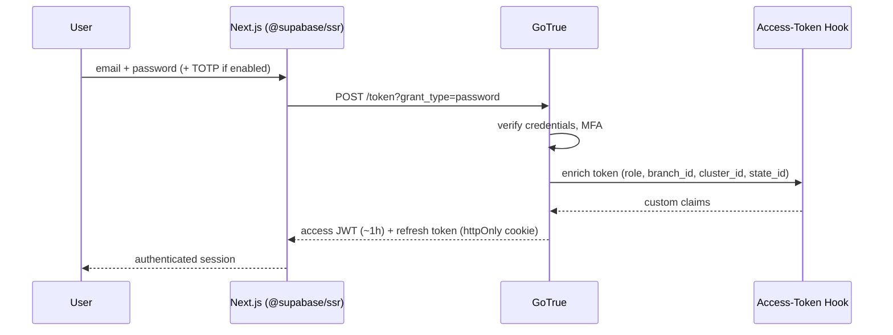
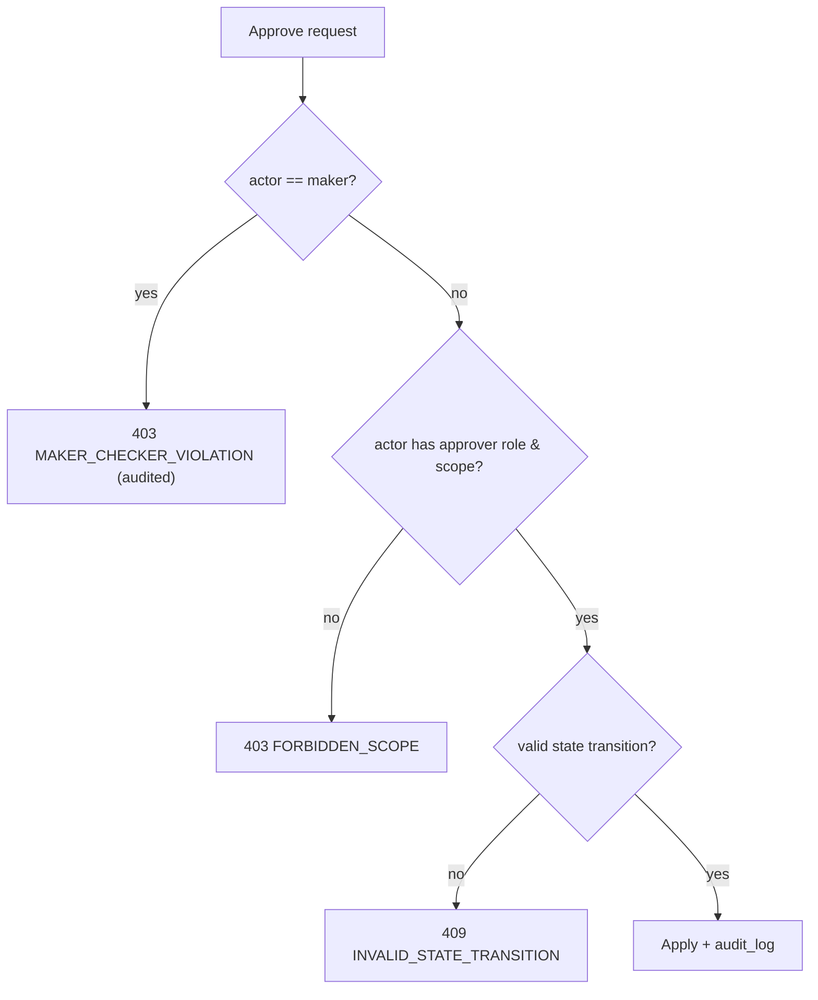

# Security Architecture

**Project:** Branch Cash Management System (BCMS) — Prabal Motors Private Limited
**Source:** `BRD_v1.0.docx` §18 (Security) + industry best practice
**Version:** 1.0 · **Date:** 2026-07-01 · **Status:** Draft for Client Review

> Phase 12 deliverable. Because BCMS handles **cash and financial records**, security is a first-class requirement, not an afterthought. This document covers authentication, authorization, JWT/session management, encryption, secrets, RLS, OWASP Top 10 (2021) alignment, input validation, file-upload security, audit logging, and monitoring.

---

## 1. Security Objectives (from BRD §18)

| BRD control | Requirement | Design mechanism |
|-------------|-------------|------------------|
| Role-based access | FR-AUTH-02 | RBAC via JWT claims + RLS |
| Audit trail | FR-AUTH-04 | Append-only `audit_log`, trigger-based |
| No physical delete | FR-AUTH-07 / BR-05 | Soft delete; no `DELETE` grants |
| Maker-checker | FR-AUTH-05 / BR-03 | Server-side maker≠checker enforcement |
| Document version history | FR-AUTH-06 / BR-13 | Versioned `document` rows |

**Guiding principles:** defense in depth · least privilege · deny by default · server-authoritative · fail closed · complete mediation (every access checked) · auditable.

---

## 2. Authentication

- **Provider:** Supabase Auth (GoTrue). Primary method **email + password**; optional **corporate SSO** (Google Workspace/Azure AD via OIDC/SAML) if required (CLR-12).
- **Password policy:** min 12 chars, complexity, breached-password check, rotation optional; hashed with bcrypt by GoTrue.
- **MFA (R-08, recommended):** TOTP enforced for finance/admin roles (`branch_accountant`, `cluster_finance`, `corporate_finance`, `internal_audit`, `cfo_admin`).
- **Brute-force protection:** login rate-limited (5/15min per IP+email), progressive lockout, CAPTCHA on repeated failure.
- **Account lifecycle:** provisioning by `cfo_admin`; deactivation immediately blocks login while retaining history; no self-registration.
- **Email verification & password reset:** signed, expiring links.



---

## 3. Authorization

### 3.1 Model
Two-dimensional: **role** (what actions) × **scope** (which data — branch/cluster/state/corporate). See [UserRoles.md](./UserRoles.md).

### 3.2 Custom Access Token Hook
On token issuance, a hook reads `app_user` and writes **non-user-editable** claims into `app_metadata`:
```json
{ "app_metadata": { "role":"cashier", "branch_id":"...", "cluster_id":"...", "state_id":"..." } }
```
> **Best practice:** authorization data lives in `app_metadata` (server-controlled), **never** in `user_metadata` (user-editable). This prevents privilege escalation by profile edits.

### 3.3 Enforcement layers (defense in depth)
1. **UI/route guards** (Next.js middleware) — UX only, not a security boundary.
2. **RLS** — the primary boundary; every table denies by default and filters rows by claims (see [DatabaseDesign.md](./DatabaseDesign.md) §9).
3. **Edge Functions** — re-validate role, scope, and maker-checker for privileged operations; use `SECURITY DEFINER` functions carefully with explicit re-checks.
4. **DB constraints/triggers** — final backstop (uniqueness, maker≠checker, variance reason).

### 3.4 Maker-Checker enforcement (BR-03)
Enforced in **three places**: application service, Edge Function guard, and DB trigger `fn_guard_maker_checker`. A user can never approve/verify a transaction they created; across the closing chain, cashier ≠ WM ≠ accountant.



### 3.5 Performance note
Every column referenced in RLS predicates is indexed (`branch_id`, `cluster_id`, `status`, `created_by`) — missing indexes are the top RLS performance killer. Policies are tested from the **client SDK**, not the SQL editor (which bypasses RLS).

---

## 4. JWT & Session Management

| Aspect | Design |
|--------|--------|
| Access token | JWT, ~60 min TTL, RS256/ES256 signed by Supabase |
| Refresh token | Rotating, stored in **httpOnly, Secure, SameSite=Lax** cookie via `@supabase/ssr` |
| Storage | **No tokens in `localStorage`** (XSS-resistant); cookie-based sessions |
| Revocation | Deactivation + refresh-token revocation; short access TTL limits blast radius |
| CSRF | SameSite cookies + double-submit token on state-changing form posts through Next.js route handlers |
| Claim tampering | Signature-verified server-side on every request; claims from `app_metadata` only |
| Idle/absolute timeout | Idle 30 min (configurable), absolute 12 h; re-auth for sensitive admin actions |

---

## 5. Encryption

| Data state | Mechanism |
|-----------|-----------|
| In transit | TLS 1.2+ everywhere (client↔Vercel↔Supabase); HSTS enabled |
| At rest (DB) | Supabase-managed encryption at rest (AES-256) |
| At rest (Storage) | Encrypted object storage; access via short-lived signed URLs |
| Sensitive fields | App-level encryption via `pgcrypto` for any PII beyond baseline (if required) |
| Backups | Encrypted backups + PITR |
| Secrets | Encrypted secret stores (never in DB/code) |

---

## 6. Secrets Management

- **No secrets in source control** (enforced by pre-commit secret scanning + CI).
- Frontend: only the **anon key** and public URL are exposed to the browser (safe by design; RLS protects data). The **service-role key is never shipped to the client**.
- Edge Functions & CI: secrets in **Supabase / Vercel encrypted env stores**; service-role key confined to trusted server contexts.
- Rotation policy for keys and any third-party (Phase-4 Tally/bank) credentials; least-privilege scoping per integration.

---

## 7. OWASP Top 10 (2021) Alignment

| # | Risk | BCMS mitigation |
|---|------|-----------------|
| A01 | **Broken Access Control** | RLS deny-by-default on every table; server-side re-checks in Edge Functions; maker-checker; scope claims; no client-trusted authorization. |
| A02 | **Cryptographic Failures** | TLS 1.2+, AES-256 at rest, httpOnly cookies, no sensitive data in URLs/logs, bcrypt passwords. |
| A03 | **Injection** | Parameterised queries (PostgREST/pg), Zod input validation, no string-built SQL; output encoding by React. |
| A04 | **Insecure Design** | Threat-modelled workflows, segregation of duties, idempotency, fail-closed, period locking. |
| A05 | **Security Misconfiguration** | Hardened defaults, RLS on (never off), least-privilege DB roles, security headers (CSP, HSTS, X-Frame-Options), no verbose errors. |
| A06 | **Vulnerable/Outdated Components** | Dependabot/renovate, SCA in CI, pinned versions, minimal deps. |
| A07 | **Identification & Auth Failures** | Strong password policy, MFA for finance/admin, rate-limiting/lockout, secure session handling, short token TTL. |
| A08 | **Software & Data Integrity Failures** | Signed CI artifacts, verified migrations, idempotency keys, audit trail, no untrusted deserialization. |
| A09 | **Security Logging & Monitoring Failures** | Append-only audit log, auth/event logging, Sentry alerts, anomaly review, retention. |
| A10 | **SSRF** | Outbound integrations (Phase 4) restricted to allow-listed hosts via Edge Function adapters; no user-controlled URLs. |

---

## 8. Input Validation & Output Handling

- **Every input** validated with **Zod** on client and server (Edge Functions). Reject-by-default; whitelist allowed values (enums, ranges, formats).
- **Money** parsed as fixed-precision decimals; reject NaN/negative/over-precision.
- **IDs** validated as UUID and existence+scope-checked.
- **Output:** React auto-escapes; PDFs/exports sanitise user text; CSV export guards against formula injection (prefix `=,+,-,@` neutralised).
- **Mass-assignment protection:** Edge Functions accept explicit DTOs, not raw row objects.

---

## 9. File Upload Security

| Control | Rule |
|---------|------|
| Type allow-list | PDF, JPG, PNG only (magic-byte checked, not just extension) |
| Size limit | ≤ 10 MB/file (configurable) |
| Storage | Private Supabase Storage bucket; **no public URLs**; access via short-lived **signed URLs** scoped to the requesting user |
| Path/ownership | Object keys namespaced by `branch_id/entity/uuid`; RLS-linked `document` metadata governs visibility |
| Malware | Optional AV scan hook on upload (recommended) before marking `is_current` |
| Versioning | New version rows; prior versions retained (BR-13); no overwrite in place |
| Content sniffing | `Content-Type` set correctly; `X-Content-Type-Options: nosniff` |

---

## 10. Audit Logging (FR-AUTH-04, NFR-AUDIT-01)

- **What:** every create/update/approve/verify/cancel writes `{actor, action, entity, before, after, timestamp, ip, user_agent}`.
- **How:** DB triggers (`fn_audit`) for data changes + Edge Function context for the acting user (`app.user_id` GUC) and request metadata.
- **Immutability:** `audit_log` has **no UPDATE/DELETE grants** (append-only). Internal Audit has full read; other roles read within scope.
- **Coverage:** authentication events, authorization denials (403s), and money operations are all logged.
- **Tamper evidence (recommended):** periodic hash-chaining/export of audit ranges for stronger non-repudiation.

---

## 11. Monitoring & Incident Response

| Capability | Tool |
|-----------|------|
| Error monitoring | Sentry (frontend + Edge Functions) with alerting |
| Platform logs | Supabase logs (auth, PostgREST, functions) |
| Uptime | External uptime monitor (NFR-AVAIL-01) |
| Security alerts | Alert on spikes of 401/403, failed logins, maker-checker violations, off-hours admin actions |
| Anomaly review | Exception dashboard + (Phase 4) cash-variance anomaly detection (R-23) |
| IR process | Documented runbook: detect → contain (revoke sessions/keys) → eradicate → recover (PITR) → post-mortem |

---

## 12. Compliance & Data Governance

- **Least-data:** collect only what workflows need; customers are not users (AS-06).
- **Retention:** financial & audit records ≥ 8 years (NFR-RETAIN-01, confirm CLR-09); nothing hard-deleted within retention.
- **Data residency:** host in an India-appropriate Supabase region (confirm CLR-09); align with applicable Indian data-protection expectations (DPDP Act).
- **Segregation of duties:** enforced by maker-checker + role model (four-eyes principle).
- **Access reviews:** periodic review of users/roles by CFO/Admin + Internal Audit.

---

## 13. Security Testing (see also Testing strategy)

- **SAST/DAST** in CI; **SCA** for dependencies; secret scanning.
- **RLS test suite** (pgTAP + client-SDK tests) asserting cross-branch isolation and maker-checker denial.
- **AuthZ negative tests** for every endpoint (wrong role/scope → 403).
- **Penetration test** before go-live (recommended).

---

## 14. Traceability

| Security requirement | Requirement ID | Section |
|----------------------|----------------|---------|
| Login/auth | FR-AUTH-01 | §2, §4 |
| RBAC | FR-AUTH-02 | §3 |
| Data scoping | FR-AUTH-03, BR-12 | §3, RLS |
| Audit trail | FR-AUTH-04 | §10 |
| Maker-checker | FR-AUTH-05, BR-03 | §3.4 |
| Document versioning | FR-AUTH-06, BR-13 | §9 |
| No physical delete | FR-AUTH-07, BR-05 | §10, DatabaseDesign §10 |
| Encryption in transit/rest | NFR-SEC-02 | §5 |

---

*End of SecurityArchitecture.md*
