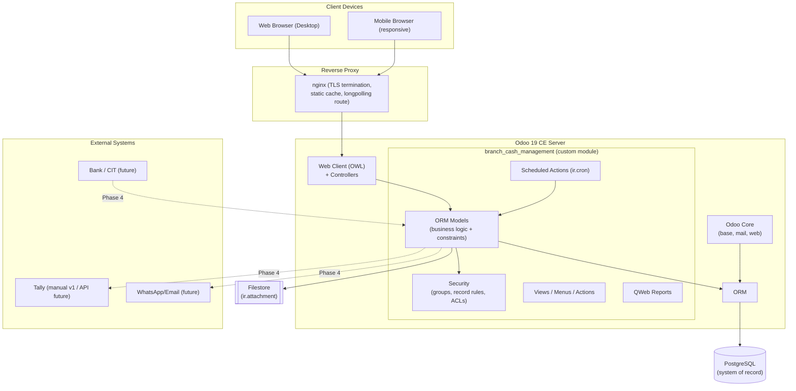
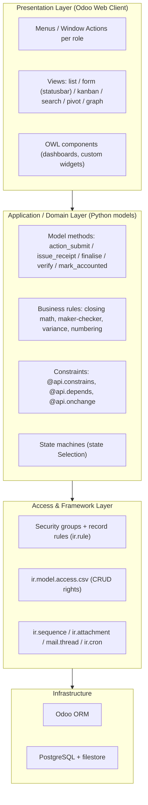
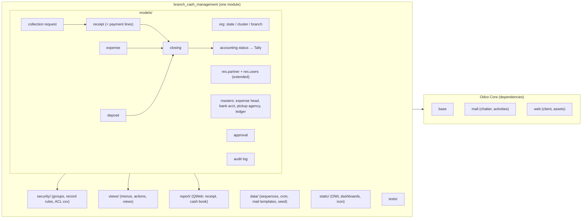
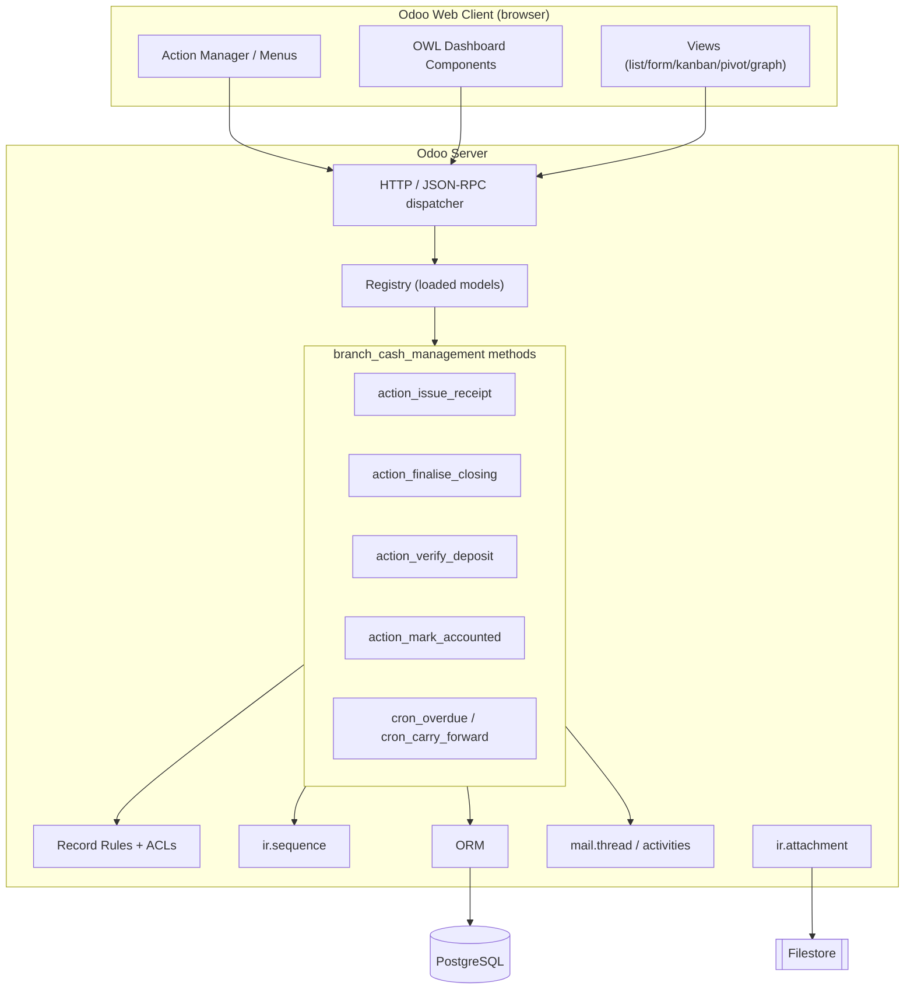
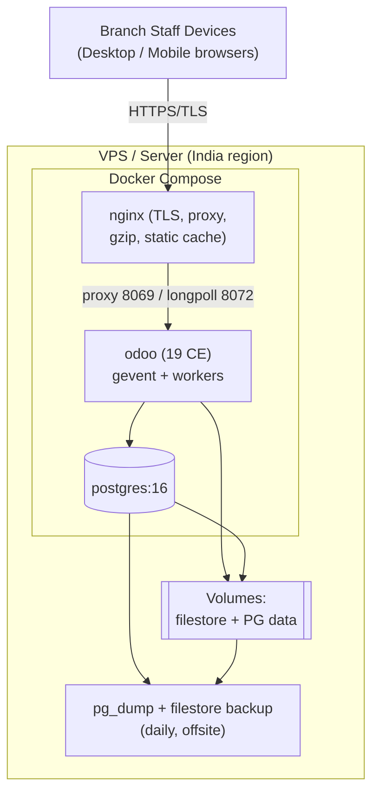
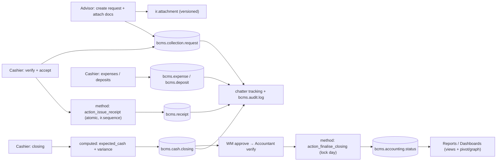
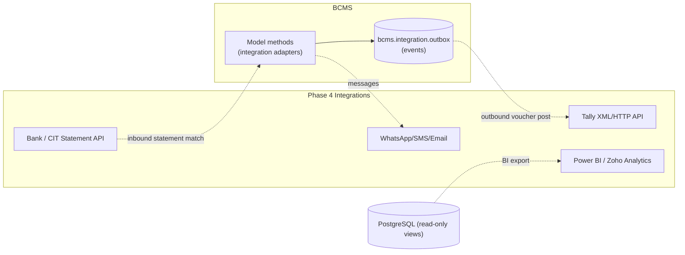
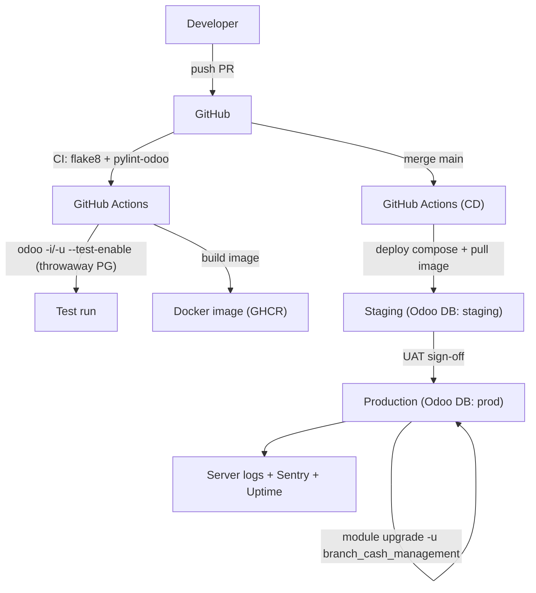

# Technical Architecture

**Project:** Branch Cash Management System (BCMS) — Prabal Motors Private Limited
**Source:** `BRD_v1.0.docx` v1.0 · Platform decision (2026-07-03)
**Platform:** Odoo 19 Community Edition — one fully custom module (`branch_cash_management`)
**Version:** 2.0 · **Date:** 2026-07-03 · **Status:** Draft for Client Review

> Deliverable: technology stack, system/logical/physical architecture, module & component views, integration and deployment architecture — all expressed for **Odoo 19 Community Edition** built as a **single custom module**. Data model detail is in [DatabaseDesign.md](./DatabaseDesign.md); application interfaces in [APIDesign.md](./APIDesign.md); security in [SecurityArchitecture.md](./SecurityArchitecture.md). Rendered diagrams also live in [docs/diagrams/](./diagrams/).

---

## 1. Architectural Principles

| # | Principle | Application in BCMS (Odoo) |
|---|-----------|----------------------------|
| 1 | **Single, cohesive Odoo module** | All BCMS logic ships as one addon (`branch_cash_management`); no split across Odoo standard apps. Depends only on core `base`, `mail`, `web`. |
| 2 | **Framework-idiomatic** | Reuse Odoo primitives — ORM models, security groups + record rules, `ir.sequence`, `ir.attachment`, `mail.thread`/activities, `ir.cron`, QWeb — instead of reinventing them. |
| 3 | **Layered within the ORM** | Views (XML/OWL) → model methods (business logic) → ORM/PostgreSQL. Presentation never holds authority. |
| 4 | **Security by default** | Deny-by-default access rights (`ir.model.access.csv`); record rules scope every transactional model by branch/cluster/state; maker-checker enforced in `@api.constrains`. |
| 5 | **Server-authoritative** | The web client is a thin renderer; all rules run server-side in model methods and constraints, inside Odoo's per-request DB transaction. |
| 6 | **Auditable & immutable** | Field tracking (chatter) + an append-only `bcms.audit.log` model; **no physical delete** (no `unlink` rights) — archive (`active`) or cancel/reverse instead. |
| 7 | **Responsive & accessible** | Odoo 19 web client is responsive/mobile-capable out of the box; cashier flows kept touch-friendly. |
| 8 | **Idempotency & consistency** | Financial mutations run as guarded model methods within a single transaction; sequences and `_sql_constraints` prevent duplicates/double-posting. |

---

## 2. Technology Stack

### 2.1 Platform

| Concern | Technology | Notes |
|---------|-----------|-------|
| Application framework | **Odoo 19 Community Edition** | LGPL-3; ORM, web client, security, reporting, scheduling all built-in. |
| Language | **Python 3.12** (server) + **XML/OWL (JS)** (views) | Business logic in Python model methods; views in XML; custom widgets/dashboards in OWL (Odoo's JS framework). |
| Database | **PostgreSQL 16** | Odoo's system of record; the module never issues raw DDL — schema is derived from model definitions. |
| Packaging | **One addon**: `branch_cash_management` | `__manifest__.py` declares `depends = ['base', 'mail', 'web']`, data files, assets, version `19.0.1.0.0`, license `LGPL-3`. |

### 2.2 What each capability maps to in Odoo

| Capability | Odoo mechanism | Usage in BCMS |
|-----------|----------------|---------------|
| Data / entities | **ORM models** (`models.Model`) | State/cluster/branch, collection request, receipt, expense, deposit, closing, approval, accounting status, audit log, masters. |
| People | **`res.partner`** (customers), **`res.users`** (staff, extended with branch/cluster/state) | Reuse core identity; no custom user table. |
| AuthN | **Odoo auth** (`res.users`) | Email/password + strong policy; optional 2FA (`auth_totp`); optional SSO (`auth_oauth`) later. |
| AuthZ | **Security groups + record rules (`ir.rule`) + `ir.model.access.csv`** | Role groups; per-branch/cluster/state row scoping; deny-by-default CRUD. |
| Business logic | **Model methods** (`action_submit`, `action_issue_receipt`, `action_finalise`, `action_verify`, `action_mark_accounted`) | Server-authoritative transitions with `@api.constrains` guards; `sudo()` only where a controlled elevation is required. |
| Workflow / state | **`state` Selection + statusbar** | Request, closing, deposit, expense, accounting lifecycles. |
| Numbering | **`ir.sequence`** | Receipt/voucher/request/closing/deposit numbers, per branch + financial year. |
| Documents | **`ir.attachment`** | Mandatory docs, deposit slips, acknowledgements, expense bills; versioned. |
| Audit | **`mail.thread` field tracking** + **`bcms.audit.log`** | Change history in chatter; append-only security/action log. |
| Notifications | **`mail.thread` messages + `mail.activity`** | In-app "to-do" activities and messages; optional email templates. |
| Scheduling | **`ir.cron`** | Overdue-deposit checks, daily digests, opening-cash carry-forward. |
| Reporting | **List/pivot/graph views + QWeb** | Registers, dashboards, and PDF receipts / daily cash book. |
| Files/assets | **`web` assets bundles** | OWL dashboard JS/SCSS, custom widgets. |
| External API | **XML-RPC / JSON-RPC** (+ optional `http.Controller`) | Integrations and automation; no direct DB access from clients. |

### 2.3 Cross-cutting

| Concern | Choice |
|---------|--------|
| Currency / locale | INR (₹), IST, DD-MM-YYYY — via `res.company`/language config. |
| API style | Odoo ORM in-process; **External API** (XML-RPC/JSON-RPC) for automation; controllers only for any custom web/portal endpoint. |
| Testing | Odoo test framework (`TransactionCase`/`HttpCase`) for models, constraints, record rules, and flows; `tagged` post-install tests. |
| CI/CD | GitHub Actions → lint (`flake8`, `pylint-odoo`) → Odoo tests on a throwaway PG → build Docker image → deploy → module upgrade (`-u branch_cash_management`). |
| Observability | Odoo server logs (structured) + reverse-proxy/access logs + optional Sentry (`sentry-sdk`) + uptime monitor. |

---

## 3. System Architecture (Context)



**Narrative.** Browsers reach a single **Odoo 19 CE server** through **nginx** (TLS, static caching, longpolling). The custom **`branch_cash_management`** module contributes ORM models (business logic + constraints), security definitions, views/menus, QWeb reports and scheduled actions on top of Odoo core (`base`, `mail`, `web`). All persistence is **PostgreSQL**; document bytes live in the **filestore** via `ir.attachment`. External systems (Tally, bank, messaging) are **Phase-4** and are reached only from server-side model methods.

---

## 4. Logical Architecture (Layers)



**Layer rules.** Presentation (views/OWL) only renders and dispatches actions; **all authority lives in Python model methods and constraints**. Access is enforced declaratively (groups, record rules, ACLs) and cannot be bypassed by the UI or the External API. Business-critical logic (closing arithmetic, maker≠checker, receipt numbering) is enforced in model methods + `@api.constrains` and, where duplicates must be impossible, `_sql_constraints`.

---

## 5. Module Architecture (inside the single addon)



The module owns models, security, views, data, reports, OWL assets and tests in one addon. Business dependencies flow along the workflow (collection → receipt → closing → accounting), and everything sits on Odoo core (`base`, `mail`, `web`).

---

## 6. Component Diagram (Runtime Components)



**Why model methods for money operations?** Receipt issuance, closing finalisation, deposit verification and accounting posting must be **atomic, sequential and rule-checked** beyond what access rights alone express (maker ≠ checker across records, gap-controlled receipt numbers, cash-balance recomputation). These run as **model methods within Odoo's per-request DB transaction**, re-validating the caller's groups/record-rule scope and raising `UserError`/`ValidationError` on any breach, so a partial or out-of-order posting can never commit.

---

## 7. Physical Architecture



- **Hosting:** self-hosted **Odoo 19 CE + PostgreSQL in Docker** behind **nginx**, on a VPS in an India region for latency and data residency (confirm CLR-09).
- **Scaling:** Odoo multi-**worker** processes (sized to CPU/RAM) + `--limit-*` tuning; PostgreSQL vertical scaling and read tuning (indexes, `work_mem`); nginx caches static assets. A separate **longpolling** worker (port 8072) serves chatter/activity live updates.
- **Backups:** daily `pg_dump` + filestore snapshot to offsite storage; documented restore drill; RPO ≤ 24h, RTO ≤ 4h (NFR-BACKUP-01).

---

## 8. Data Flow — Collection to Accounting (high level)



Detailed per-process flows are in [Workflows.md](./Workflows.md) and [docs/diagrams/](./diagrams/).

---

## 9. Integration Architecture



**Integration principles.**
- **Isolation & adapter pattern:** every external system is reached only from a dedicated server-side method/service; the web client never calls external systems directly.
- **Outbox pattern:** state changes destined for Tally/bank are written to an `bcms.integration.outbox` model and dispatched by an `ir.cron` (retry, dead-letter) — resilient to downstream outages.
- **v1 reality (CON-02/03):** Tally is **manual entry**; bank acknowledgements are **uploaded attachments**; notifications are **in-app** (activities). Adapters and outbox are stubbed/optional in v1 and activated in Phase 4 **without schema redesign**.
- **Idempotency:** outbound posts carry idempotency keys so retries never double-post to Tally.
- **No `account` dependency:** BCMS keeps its own accounting-status model; Odoo's `account` app is **not** required (Tally is the ledger).

---

## 10. Deployment Architecture & Environments



| Environment | Runtime | Database | Purpose |
|-------------|---------|----------|---------|
| **Development** | Local Odoo (source or Docker) | Local PostgreSQL DB | Feature work, `--dev` reload |
| **Staging** | Same Docker image as prod | Odoo DB `staging` (prod copy) | UAT, upgrade rehearsal |
| **Production** | Odoo 19 CE (Docker + nginx) | Odoo DB `prod` | Live |

- **Schema changes** are **model-driven**: adding/altering fields updates the DB on module upgrade (`-u branch_cash_management`); no hand-written migrations except occasional `pre/post` migration scripts under `migrations/` for data reshaping.
- **Config/secrets** live in the Odoo config file / environment (never in the repo) — see [SecurityArchitecture.md](./SecurityArchitecture.md).
- **Rollback:** redeploy the previous Docker image tag; restore DB from `pg_dump` + filestore snapshot (PITR optional via WAL archiving) for data.

---

## 11. Non-Functional Design Decisions

| NFR | Design response (Odoo) |
|-----|------------------------|
| Availability ≥ 99.5% (NFR-AVAIL-01) | Docker restart policies, nginx health checks, daily backups + tested restore; graceful degradation (activities still work if longpolling drops). |
| Fast search ≤ 2s (NFR-PERF-01) | `index=True` on scoped/searched fields; search views with filters/group-by; server-side pagination in list views. |
| Performance ≤ 3s P95 (NFR-PERF-02) | Tuned Odoo workers, `read_group` for aggregates, stored computed fields, avoided N+1 via `@api.depends`/prefetch. |
| Scalability (NFR-SCAL) | Branch-scoped record rules with indexed keys; more Odoo workers + PostgreSQL tuning; pivot/graph over aggregates. |
| Responsive/mobile (NFR-USE) | Odoo 19 responsive web client; concise cashier forms; kanban queues. |
| Auditability (NFR-AUDIT) | `mail.thread` field tracking + append-only `bcms.audit.log`; no `unlink` rights. |
| Maintainability (NFR-MAINT) | One idiomatic module; declarative security; typed Selection states; Odoo test suite. |

---

## 12. Module Structure (folder layout)

```
branch_cash_management/
├── __init__.py
├── __manifest__.py                # name, version 19.0.1.0.0, depends: base, mail, web; data files; license LGPL-3
├── models/
│   ├── __init__.py
│   ├── bcms_org.py                # bcms.state, bcms.cluster, bcms.branch
│   ├── res_users.py               # extend res.users: branch_id/cluster_id/state_id, role helpers
│   ├── res_partner.py             # extend res.partner: is_bcms_customer, external_ref
│   ├── bcms_masters.py            # bcms.expense.head, bcms.bank.account, bcms.pickup.agency, bcms.ledger
│   ├── bcms_collection_request.py
│   ├── bcms_receipt.py            # bcms.receipt + bcms.payment.detail (lines)
│   ├── bcms_expense.py
│   ├── bcms_deposit.py
│   ├── bcms_closing.py            # expected_cash computed/stored, maker-checker constrains
│   ├── bcms_approval.py           # generic approval trail
│   ├── bcms_accounting.py         # bcms.accounting.status (→ Tally) + integration outbox
│   └── bcms_audit_log.py          # append-only
├── security/
│   ├── bcms_security.xml          # module category + 9 res.groups
│   ├── bcms_record_rules.xml      # ir.rule: branch/cluster/state scope + maker≠checker
│   └── ir.model.access.csv        # per-model CRUD rights (no unlink for business roles)
├── data/
│   ├── ir_sequence_data.xml       # receipt/voucher/request/closing/deposit sequences
│   ├── bcms_expense_head_data.xml # seed expense heads
│   ├── mail_activity_data.xml     # activity types + mail templates
│   └── ir_cron_data.xml           # overdue-deposit, daily digest, opening-cash carry-forward
├── views/
│   ├── bcms_menus.xml
│   ├── bcms_org_views.xml
│   ├── bcms_collection_request_views.xml
│   ├── bcms_receipt_views.xml
│   ├── bcms_expense_views.xml
│   ├── bcms_deposit_views.xml
│   ├── bcms_closing_views.xml
│   ├── bcms_accounting_views.xml
│   ├── bcms_masters_views.xml
│   └── bcms_dashboard_views.xml   # pivot/graph + OWL dashboard action
├── report/
│   ├── bcms_receipt_report.xml    # QWeb PDF
│   ├── bcms_cash_book_report.xml
│   └── bcms_report_templates.xml
├── wizard/
│   └── bcms_deposit_verify_wizard.py   # optional bulk/guided actions
├── controllers/
│   └── main.py                    # optional external/custom endpoints
├── static/
│   ├── description/{icon.png,index.html}
│   └── src/                       # OWL dashboard js/xml/scss (registered as web assets)
├── tests/
│   └── test_*.py                  # models, constraints, record rules, flows
└── i18n/
```

See [DatabaseDesign.md](./DatabaseDesign.md), [APIDesign.md](./APIDesign.md), and [SecurityArchitecture.md](./SecurityArchitecture.md) for the corresponding model, interface, and security detail.

---

*End of TechnicalArchitecture.md*
