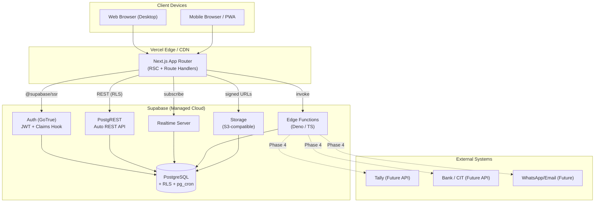
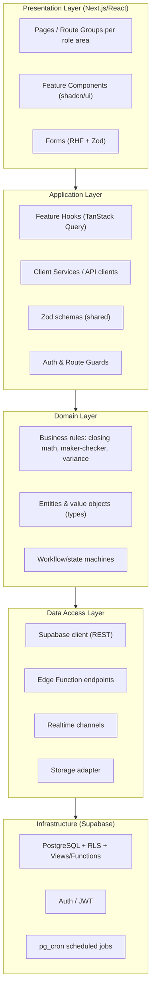
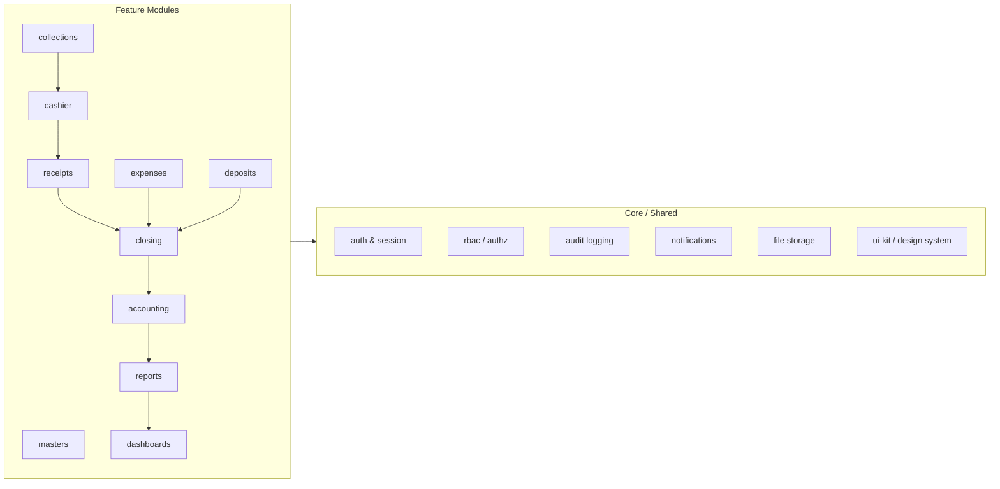
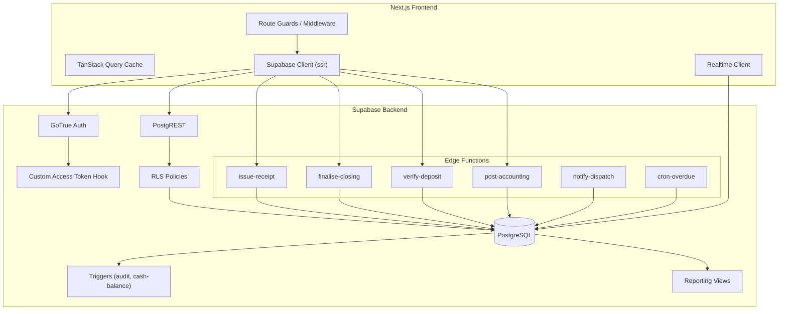
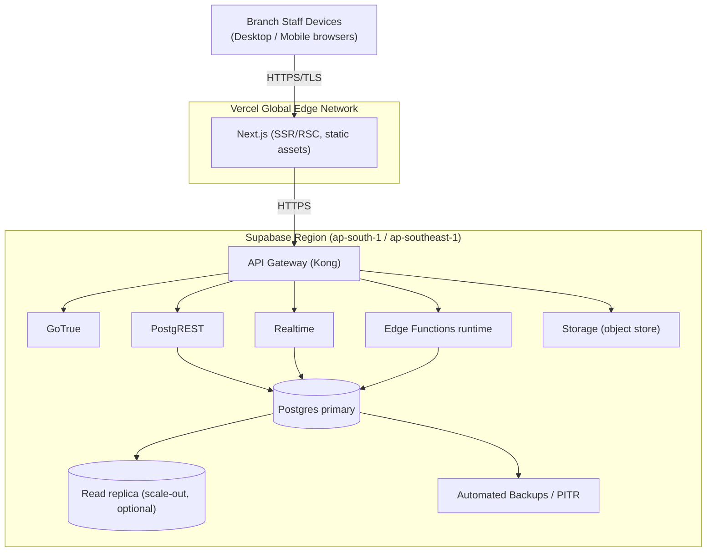
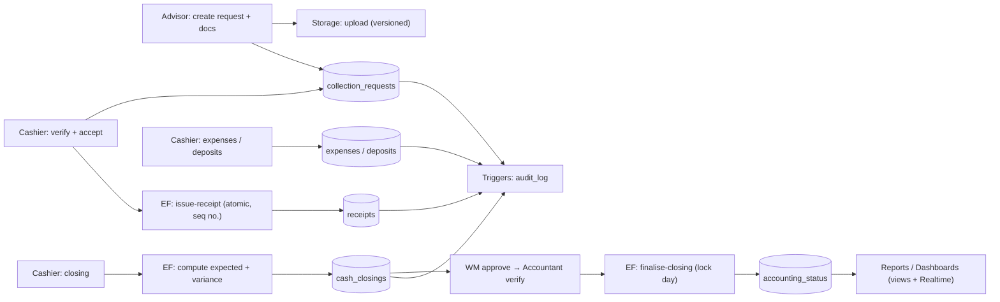
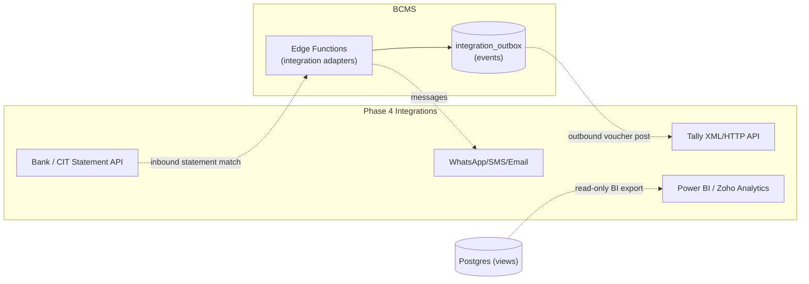
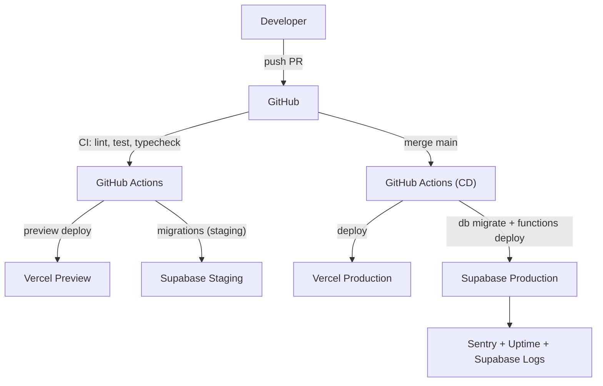

# Technical Architecture

**Project:** Branch Cash Management System (BCMS) — Prabal Motors Private Limited
**Source:** `BRD_v1.0.docx` v1.0 · Stack directive (Phase 3)
**Version:** 1.0 · **Date:** 2026-07-01 · **Status:** Draft for Client Review

> Phases 3 & 4 deliverable: technology stack, system/logical/physical architecture, component & module views, integration and deployment architecture. Database detail is in [DatabaseDesign.md](./DatabaseDesign.md); APIs in [APIDesign.md](./APIDesign.md); security in [SecurityArchitecture.md](./SecurityArchitecture.md). Rendered diagrams also live in [docs/diagrams/](./diagrams/).

---

## 1. Architectural Principles

| # | Principle | Application in BCMS |
|---|-----------|---------------------|
| 1 | **Clean / layered architecture** | UI → application (hooks/services) → domain → data access; dependencies point inward. |
| 2 | **Feature-based modularity** | Code organised by business feature (collections, cashier, closing, deposits…), not by technical type. |
| 3 | **SOLID** | Single-responsibility services, interface-driven data access, dependency inversion via provider/DI at module boundaries. |
| 4 | **Security by default** | RLS on every table; deny-by-default; least privilege; maker-checker enforced server-side. |
| 5 | **Server-authoritative** | The client never holds authority; RLS + Edge Functions enforce all rules regardless of UI. |
| 6 | **Auditable & immutable** | Append-only audit log; soft delete; document versioning. |
| 7 | **Progressive enhancement** | Realtime where valuable; graceful fallback to refetch; responsive/mobile-first. |
| 8 | **Idempotency & consistency** | Financial mutations use idempotency keys and DB transactions/constraints. |

---

## 2. Technology Stack

### 2.1 Frontend

| Concern | Technology | Notes |
|---------|-----------|-------|
| Framework | **Next.js (App Router)** | SSR/RSC for fast, secure pages; route groups per role area. |
| UI library | **React + TypeScript** | Strict TS; typed end-to-end. |
| Styling | **Tailwind CSS** | Design tokens map to the design system ([UIUX.md](./UIUX.md)). |
| Components | **shadcn/ui** (Radix) | Accessible primitives; consistent components. |
| Forms | **React Hook Form** | Performant, controlled forms. |
| Validation | **Zod** | Single schema reused for client + server (Edge Functions) validation. |
| Server state | **TanStack Query** | Caching, background refetch, optimistic updates. |
| Client state | React context / Zustand (light) | UI-only state; server state stays in TanStack Query. |
| Tables | TanStack Table | Sorting/filtering/pagination for registers & queues. |
| Charts | Recharts / visx | Dashboard KPIs & trends. |
| Auth client | `@supabase/ssr` | Cookie-based sessions in Next.js (SSR-safe). |

### 2.2 Backend (Supabase)

| Capability | Supabase Feature | Usage |
|-----------|------------------|-------|
| Database | **PostgreSQL** | System of record; all business entities. |
| AuthN | **Supabase Auth (GoTrue)** | Email/password (+ optional MFA/SSO); JWT issuance. |
| AuthZ | **Row Level Security** + custom JWT claims | Per-row scoping by role/branch/cluster/state. |
| Business logic | **Edge Functions (Deno/TypeScript)** | Server-authoritative operations: receipt issuance, closing finalise, deposit verify, accounting post, notification fan-out. |
| Realtime | **Realtime** | Live queues, dashboards, notifications. |
| Files | **Storage** | Documents, deposit slips, acknowledgements, expense bills (versioned). |
| Scheduling | **Scheduled Jobs (pg_cron / Edge Function cron)** | Overdue-deposit checks, daily digests, opening-cash carry-forward. |
| DB extensions | `pgcrypto`, `pg_cron`, `uuid-ossp`, `pg_trgm` | UUIDs, crypto, cron, fuzzy search. |

### 2.3 Cross-cutting

| Concern | Choice |
|---------|--------|
| Language | TypeScript everywhere (app + Edge Functions). |
| Package/monorepo | Single Next.js app + `supabase/` project; optional pnpm workspace. |
| API style | Supabase auto REST (PostgREST) for CRUD **within RLS**; **Edge Functions** for privileged/complex operations; Realtime subscriptions for live data. |
| Testing | Vitest/Jest (unit), Testing Library (component), Playwright (E2E), pgTAP (RLS/DB). See [Testing](#) in project docs. |
| CI/CD | GitHub Actions → Vercel (frontend) + Supabase CLI migrations. |
| Observability | Supabase logs + Sentry (frontend/functions) + uptime monitor. |

---

## 3. System Architecture (Context)



**Narrative.** The Next.js app is the only client-facing tier. It authenticates users via Supabase Auth and thereafter talks to Postgres through PostgREST **under RLS** for standard reads/writes, subscribes to Realtime for live queues/dashboards, invokes Edge Functions for privileged operations (which run with elevated rights but re-validate every business rule), and uses Storage (via signed URLs) for documents. External integrations (Tally, bank, messaging) are **Phase-4** and isolated behind Edge Functions.

---

## 4. Logical Architecture (Layers)



**Layer rules:** Presentation depends on Application; Application depends on Domain; Domain is pure (no framework/IO); Data implements Domain-defined interfaces. Business-critical logic (closing arithmetic, maker-checker, receipt numbering) exists in **both** shared domain code (for UX) and is **authoritatively enforced** in the Data/Infra tier (Edge Functions + DB constraints/triggers).

---

## 5. Module Architecture



Each feature module owns its routes, components, hooks, Zod schemas, and Edge Functions, and consumes cross-cutting **Core** services (auth, rbac, audit, notifications, files, ui-kit). Inter-module dependencies flow along the business workflow (collections → cashier → receipts → closing → accounting → reports → dashboards).

---

## 6. Component Diagram (Runtime Components)



**Why Edge Functions for money operations?** Receipt issuance, closing finalisation, deposit verification, and accounting posting must be **atomic, idempotent, and rule-checked** beyond what RLS alone expresses (e.g., maker ≠ checker across rows, sequential receipt numbers, cash-balance recomputation). These run as Edge Functions inside a DB transaction, using `SECURITY DEFINER` functions where appropriate, and re-validate the caller's claims.

---

## 7. Physical Architecture



- **Hosting region:** choose the Supabase region closest to India (e.g., `ap-south-1` Mumbai or `ap-southeast-1` Singapore) for latency & data residency (confirm data-residency requirement, CLR-09).
- **Scaling:** Postgres vertical scaling + optional read replicas for reporting; PostgREST/Realtime/Edge Functions scale within the managed platform; Vercel scales the frontend globally.
- **Backups:** automated daily backups + point-in-time recovery; RPO ≤ 24h, RTO ≤ 4h (NFR-BACKUP-01).

---

## 8. Data Flow — Collection to Accounting (high level)



Detailed per-process data-flow diagrams are in [Workflows.md](./Workflows.md) and [docs/diagrams/](./diagrams/).

---

## 9. Integration Architecture



**Integration principles.**
- **Isolation & adapter pattern:** every external system is behind a dedicated Edge Function adapter; no external calls from the client.
- **Outbox pattern:** state changes that must reach Tally/bank are written to an `integration_outbox` table and dispatched asynchronously (retry, dead-letter) — resilient to downstream outages.
- **v1 reality (CON-02/03):** Tally is **manual entry**; bank acknowledgements are **uploaded files**; notifications are **in-app**. The adapters and outbox are stubbed/optional in v1 and activated in Phase 4 without schema redesign.
- **Idempotency:** outbound posts carry idempotency keys so retries never double-post to Tally.

---

## 10. Deployment Architecture & Environments



| Environment | Frontend | Backend | Purpose |
|-------------|----------|---------|---------|
| **Development** | Local Next.js | Local Supabase (Docker) / dev project | Feature work |
| **Staging** | Vercel preview | Supabase staging project | UAT, integration testing |
| **Production** | Vercel prod | Supabase prod project | Live |

- **DB migrations** are versioned SQL under `supabase/migrations/` and applied via Supabase CLI in CI/CD.
- **Edge Functions** deployed via Supabase CLI.
- **Secrets** in Vercel/Supabase env stores (never in repo) — see [SecurityArchitecture.md](./SecurityArchitecture.md) §Secrets.
- **Rollback:** Vercel instant rollback; DB migrations are forward-only with tested down-paths for reversible changes; PITR for data.

---

## 11. Non-Functional Design Decisions

| NFR | Design response |
|-----|-----------------|
| Availability ≥ 99.5% (NFR-AVAIL-01) | Managed Supabase + Vercel SLAs; health checks; PITR; graceful degradation (Realtime → polling fallback). |
| Fast search ≤ 2s (NFR-PERF-01) | Indexed columns, `pg_trgm` for fuzzy text, server-side pagination, TanStack Query caching. |
| Performance ≤ 3s P95 (NFR-PERF-02) | RSC streaming, cursor pagination, denormalised reporting views/materialised views. |
| Scalability (NFR-SCAL) | Multi-tenant-by-branch data model, indexed RLS predicates, read replicas for reporting. |
| Responsive/mobile (NFR-USE) | Mobile-first Tailwind, touch-friendly cashier flows. |
| Auditability (NFR-AUDIT) | Trigger-based append-only audit log + Edge Function context. |
| Maintainability (NFR-MAINT) | Feature modules, SOLID, shared Zod schemas, typed DB (generated types). |

---

## 12. Recommended Project / Folder Structure (Phase 14)

```
branch-cash-management/
├── app/                          # Next.js App Router
│   ├── (auth)/                   # login, mfa
│   ├── (advisor)/                # collection requests, my-requests
│   ├── (cashier)/                # queue, receipt, closing, expenses, deposits
│   ├── (finance)/                # accounting, reports
│   ├── (admin)/                  # masters, users, config
│   ├── (dashboard)/              # branch/state/corporate dashboards
│   └── api/                      # route handlers (thin; delegate to Edge Fns)
├── src/
│   ├── features/
│   │   ├── masters/              # components, hooks, schemas, services
│   │   ├── collections/
│   │   ├── cashier/
│   │   ├── receipts/
│   │   ├── closing/
│   │   ├── expenses/
│   │   ├── deposits/
│   │   ├── accounting/
│   │   ├── reports/
│   │   └── dashboards/
│   ├── core/
│   │   ├── auth/                 # session, guards
│   │   ├── authz/                # rbac helpers, can()
│   │   ├── audit/
│   │   ├── notifications/
│   │   ├── storage/
│   │   └── supabase/             # clients (server/browser)
│   ├── domain/                   # pure business logic (closing math, state machines)
│   ├── ui/                       # shadcn components, design tokens
│   └── lib/                      # utils, formatting (INR, dates)
├── supabase/
│   ├── migrations/               # versioned SQL
│   ├── functions/                # edge functions (issue-receipt, ...)
│   ├── seed/                     # seed data
│   └── config.toml
├── tests/                        # unit, integration, e2e (playwright), db (pgTAP)
├── docs/                         # this documentation set
│   └── diagrams/
├── public/                       # assets
└── package.json
```

See also the [DatabaseDesign.md](./DatabaseDesign.md), [APIDesign.md](./APIDesign.md), and [SecurityArchitecture.md](./SecurityArchitecture.md) for the corresponding backend detail.

---

*End of TechnicalArchitecture.md*
