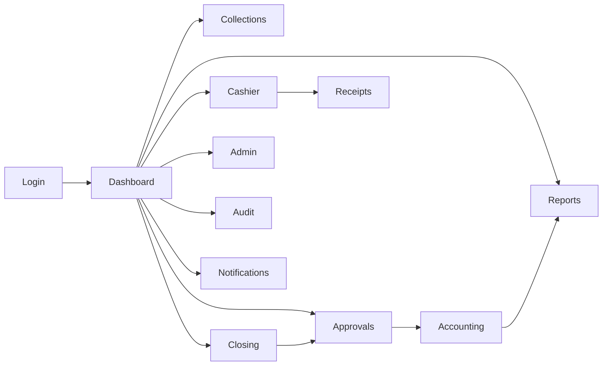

# UI/UX Design Documentation

**Project:** Branch Cash Management System (BCMS) — Prabal Motors Private Limited
**Source:** `BRD_v1.0.docx` Appendix A (Screen List), §16 (Dashboards), §20 (Responsive)
**Version:** 1.0 · **Date:** 2026-07-01 · **Status:** Draft for Client Review

> Phase 9 deliverable: sitemap, navigation, screen list, wireframe descriptions, dashboard layouts, responsive/mobile behaviour, accessibility, and a complete design system (color, typography, spacing, icons, components, forms, tables, modals, notifications, and empty/loading/error states). Built on **Tailwind CSS + shadcn/ui**.

---

## 1. UX Principles

| # | Principle | Application |
|---|-----------|-------------|
| 1 | **Task-first, queue-driven** | Cashier/approver screens are work queues; the next action is always obvious. |
| 2 | **Speed** | Fast search (⌘K), keyboard-first cashier flow, optimistic UI, ≤2s search. |
| 3 | **Trust & clarity for money** | Amounts prominent, totals reconciled visibly, destructive actions confirmed, immutability communicated. |
| 4 | **Progressive disclosure** | Show essentials; reveal detail on demand (drill-down dashboards). |
| 5 | **Consistency** | One design system; identical patterns for tables, forms, statuses across modules. |
| 6 | **Accessible & responsive** | WCAG 2.1 AA target; mobile-first for advisor/cashier on the floor. |
| 7 | **Forgiving** | Clear validation, undo where safe, controlled reversal (never silent delete). |

---

## 2. Application Sitemap

```
/
├── /login                              (public)
├── /forgot-password, /reset-password
├── /mfa                                (challenge)
│
├── /dashboard                          (role-aware landing)
│   ├── /dashboard/branch
│   ├── /dashboard/state
│   ├── /dashboard/corporate
│   └── /dashboard/exceptions
│
├── /collections                        (Advisor)
│   ├── /collections/new
│   ├── /collections/mine
│   └── /collections/:id
│
├── /cashier                            (Cashier)
│   ├── /cashier/queue
│   ├── /cashier/requests/:id/verify
│   └── /cashier/receipts/:id
│
├── /receipts
│   └── /receipts/:id                   (view/print)
│
├── /closing                            (Cashier / WM / Accountant)
│   ├── /closing/new
│   ├── /closing/:id
│   └── /closing/history
│
├── /expenses
│   ├── /expenses/new
│   └── /expenses/:id
│
├── /deposits
│   ├── /deposits/new
│   └── /deposits/:id
│
├── /approvals                          (WM / Accountant)
│   ├── /approvals/closings
│   └── /approvals/expenses
│
├── /accounting                         (Accountant / Finance)
│   ├── /accounting/pending
│   └── /accounting/:entity/:id
│
├── /reports                            (Finance / Mgmt / Audit)
│   ├── /reports/daily-cash-book
│   ├── /reports/collection-register
│   ├── /reports/expense-register
│   ├── /reports/deposit-register
│   ├── /reports/pending-deposits
│   ├── /reports/pending-closings
│   ├── /reports/cash-difference
│   ├── /reports/accounting-pending
│   └── /reports/compliance
│
├── /admin                              (CFO/Admin)
│   ├── /admin/branches
│   ├── /admin/users
│   ├── /admin/customers
│   ├── /admin/expense-heads
│   ├── /admin/banks
│   ├── /admin/pickup-agencies
│   ├── /admin/ledgers
│   └── /admin/config
│
├── /audit                              (Internal Audit)
│   └── /audit/log
│
├── /notifications
└── /profile  (self-service: password, MFA)
```

Navigation map & sitemap are also captured as a diagram concept in [diagrams/](./diagrams/) (see module diagram). Route groups map to the folder structure in [TechnicalArchitecture.md](./TechnicalArchitecture.md) §12.

---

## 3. Navigation Model

- **Primary nav:** left sidebar, role-filtered (a Cashier never sees Admin). Collapsible; icon-only on tablet.
- **Top bar:** branch/scope switcher (for multi-branch roles), global search (⌘K), notifications bell, user menu.
- **Breadcrumbs:** on detail pages.
- **Contextual actions:** primary action button top-right of each screen (e.g., "New Request", "Submit Closing").
- **Mobile:** sidebar collapses to a bottom tab bar (Home, Queue/Collections, Approvals, Notifications, More).



---

## 4. Screen List (BRD Appendix A + derived)

| # | Screen | Primary Role(s) | Key elements | Requirement |
|---|--------|-----------------|--------------|-------------|
| 1 | Login | All | Email, password, MFA, forgot-password | FR-AUTH-01 |
| 2 | Dashboard (role landing) | All | KPI cards, exceptions, quick actions | FR-DASH-* |
| 3 | Collection Request (new/edit) | Advisor | Form + document upload | FR-CR-* |
| 4 | My Requests | Advisor | Table, status chips, search | FR-CR-07 |
| 5 | Cashier Queue | Cashier | Searchable queue, actions | FR-CV-01 |
| 6 | Verify & Collect | Cashier | Doc preview, accept/reject, payment capture | FR-CV-02…07 |
| 7 | Receipt | Cashier/Advisor | Receipt view, print/PDF | FR-RCPT-* |
| 8 | Cash Closing | Cashier | Computed totals, physical cash, variance | FR-CLS-01…11 |
| 9 | Approvals (Closings/Expenses) | WM/Accountant | Approve/reject with remarks | FR-CLS-13/14, FR-EXP-07 |
| 10 | Expenses (new/list) | Cashier/WM | Voucher form, attachment, approval | FR-EXP-* |
| 11 | Deposits (new/verify) | Cashier/Accountant | Type, slip/ack upload, verify | FR-DEP-* |
| 12 | Accounting | Accountant/Finance | Tally voucher, ledger, status | FR-ACC-* |
| 13 | Reports | Finance/Mgmt/Audit | Filters, table, export | FR-RPT-* |
| 14 | Admin Masters | CFO/Admin | CRUD tables for masters | FR-MDM-* |
| 15 | User Management | CFO/Admin | Users, roles, scope | FR-MDM-02 |
| 16 | Audit Log | Internal Audit | Filterable immutable log | FR-AUTH-04 |
| 17 | Notifications | All | List, mark read | FR-NOTIF-* |
| 18 | Profile / Security | All | Password, MFA enrol | FR-AUTH-01 |

---

## 5. Wireframe Descriptions (key screens)

### 5.1 Cashier Queue (`/cashier/queue`)
- **Layout:** full-width table; top row = search + filters (status, vertical, date); primary chip counts (Pending N, Rejected N).
- **Columns:** Request No · Customer · Reference (Invoice/JobCard) · Amount (₹, right-aligned) · Mode · Age · Status · Action.
- **Row action:** "Verify" opens the Verify & Collect screen (drawer or full page on mobile).
- **Realtime:** new requests appear live; a subtle highlight animates new rows.
- **Empty state:** "No pending requests — you're all caught up ✅".

```
┌───────────────────────────────────────────────────────────┐
│  Cashier Queue           [🔍 search]   [Filters ▾]  [⌘K]   │
│  ● Pending 6   ● Rejected 1                                │
├────────────┬──────────┬──────────┬────────┬──────┬────────┤
│ Req No     │ Customer │ Ref      │ Amount │ Mode │ Action │
├────────────┼──────────┼──────────┼────────┼──────┼────────┤
│ CR/…/000123│ R.Sharma │ JC-00891 │ ₹4,520 │ Cash │ Verify │
│ …          │          │          │        │      │        │
└────────────┴──────────┴──────────┴────────┴──────┴────────┘
```

### 5.2 Verify & Collect (`/cashier/requests/:id/verify`)
- **Two-pane:** left = request details + document previews; right = payment capture.
- **Payment capture:** mode toggle (Cash/Online/Mixed). Cash → denomination grid with live total vs. amount; Online → reference field. A running "Captured ₹X / Required ₹Y" bar turns green on match.
- **Actions:** Reject (opens remarks modal), Accept & Generate Receipt (disabled until totals match).

### 5.3 Cash Closing (`/closing/new`)
- **Summary card:** Opening, Cash Collections, Online Collections, Expenses, Deposits, **Expected Cash** (computed, emphasised).
- **Physical cash:** denomination counter with auto-total; **Variance** badge (green = 0, amber/red = non-zero) with a required reason field appearing when variance ≠ 0.
- **Submit** → confirmation modal summarising figures → routes to WM.

### 5.4 Approvals (`/approvals/closings`)
- **Queue** of pending closings with variance highlighted; open to a read-only closing detail + Approve/Reject (remarks).
- Maker-checker guard: if the item was created by the current user, actions are disabled with a tooltip "You cannot approve your own closing."

### 5.5 Reports (`/reports/:key`)
- **Filter bar:** branch (scope-limited), date range, status; **Run**; **Export (PDF / Excel)**.
- **Table** with sticky header, totals row, pagination; server-side sort/filter.

---

## 6. Dashboard Layouts (BRD §16)

| Dashboard | Audience | Widgets |
|-----------|----------|---------|
| **Branch** | Cashier/WM/Accountant | Cash-in-hand, today's cash/online collections, expenses, deposits, pending approvals, variance, mini trend |
| **State/Cluster** | Cluster Finance | Branch leaderboard, aggregate collections/deposits, exceptions by branch, pending closings/deposits |
| **Corporate** | Corporate Finance/CFO | Network KPIs, state comparison, accounting-pending totals, deposit-risk (cash-in-transit), trend analysis |
| **Exception** | All finance/mgmt | Variances > tolerance, overdue deposits, overdue closings, accounting-pending — each row links to source |

**Layout pattern:** responsive KPI card grid (1 col mobile → 2 → 4 desktop), followed by charts (trend line, bar by branch) and an exception table. Cards show value, delta vs. yesterday, and a sparkline.

---

## 7. Responsive & Mobile Behaviour (NFR-USE-01/02)

| Breakpoint | Behaviour |
|-----------|-----------|
| `< 640px` (mobile) | Single column; sidebar → bottom tabs; tables → stacked cards; sticky action button; denomination counter optimised for touch. |
| `640–1024px` (tablet) | Icon sidebar; 2-col cards; condensed tables. |
| `≥ 1024px` (desktop) | Full sidebar; multi-column dashboards; two-pane verify screen. |

**Mobile priorities:** Advisor (raise request + upload from phone camera) and Cashier (verify, receipt, closing) flows are fully mobile-usable. Heavy admin/reporting screens are desktop-optimised but remain accessible.

---

## 8. Accessibility Guidelines (NFR-A11Y-01, WCAG 2.1 AA)

- **Semantic HTML** + shadcn/Radix primitives (accessible dialogs, menus, tabs) with correct ARIA.
- **Keyboard:** full keyboard operability; visible focus rings; ⌘K palette; logical tab order in forms.
- **Contrast:** text ≥ 4.5:1, large text ≥ 3:1; status never conveyed by color alone (icon + label).
- **Forms:** labels tied to inputs, inline error text with `aria-describedby`, required fields marked.
- **Motion:** respect `prefers-reduced-motion`.
- **Screen readers:** live regions for Realtime updates and toasts; meaningful alt text.
- **Targets:** touch targets ≥ 44×44px.

---

## 9. Design System

### 9.1 Color Palette (Tailwind tokens)

| Token | Use | Value (suggested) |
|-------|-----|-------------------|
| `primary` | Brand / primary actions | Indigo 600 `#4F46E5` |
| `primary-foreground` | Text on primary | White |
| `success` | Verified / balanced / positive | Emerald 600 `#059669` |
| `warning` | Pending / attention | Amber 500 `#F59E0B` |
| `destructive` | Reject / variance / error | Red 600 `#DC2626` |
| `info` | Informational | Sky 600 `#0284C7` |
| `muted` | Secondary surfaces/text | Slate 100/500 |
| `background` / `foreground` | Base | White / Slate 900 |
| `border` | Dividers | Slate 200 |

> Final brand palette to align with PMPL brand guidelines (confirm). Provide light and dark themes via CSS variables (shadcn theming).

**Status semantics (consistent across app):**

| Status | Color | Icon |
|--------|-------|------|
| Submitted / Pending | Amber | ⏳ |
| Accepted / Approved / Verified / Closed | Emerald | ✓ |
| Rejected / Discrepancy / Variance | Red | ✕ / ⚠ |
| Draft | Slate | ✎ |
| Reconciled | Emerald (solid) | ✓✓ |

### 9.2 Typography

- **Font:** Inter (UI) + tabular numerals for money/amount columns; system fallback.
- **Scale:** `text-xs` 12 · `sm` 14 · `base` 16 · `lg` 18 · `xl` 20 · `2xl` 24 · `3xl` 30.
- **Weights:** 400 body, 500 labels, 600 headings, 700 KPI values.
- **Money:** always right-aligned, tabular-nums, `₹` prefix, thousands separators (Indian grouping e.g., ₹1,00,000).

### 9.3 Spacing & Layout
- 4px base grid (`space-1`=4px … `space-6`=24px). Page padding 24px desktop / 16px mobile. Card radius `rounded-2xl`, subtle shadow. Max content width 1280px; tables full-width.

### 9.4 Icons
- **Lucide** icon set (ships with shadcn). Consistent 20px inline / 24px nav. Money = `banknote`, deposit = `landmark`, receipt = `receipt`, approval = `check-circle`, exception = `alert-triangle`.

### 9.5 Core Components (shadcn/ui)
Button, Input, Select, Combobox, DatePicker, Checkbox/Radio/Switch, Textarea, Dialog/Sheet (modal/drawer), DropdownMenu, Tabs, Table (TanStack), Card, Badge (status), Toast/Sonner (notifications), Tooltip, Skeleton (loading), Alert, Pagination, Command (⌘K), Avatar, Breadcrumb.

### 9.6 Forms (RHF + Zod)
- Single-column forms; grouped sections; inline validation on blur + on submit.
- Currency input masks; denomination sub-form with live total.
- File upload dropzone with type/size hints, preview thumbnails, and version note ("uploading replaces current; previous versions kept").
- Disabled submit until valid; loading spinner on submit; success toast + redirect.

### 9.7 Tables
- Sticky header, zebra rows, right-aligned money, sortable columns, column visibility, server-side pagination, row-level actions, totals/footer row, CSV/PDF export, saved filters.

### 9.8 Modals & Confirmations
- Destructive/irreversible actions (cancel receipt, reject) use a confirm dialog stating consequences and requiring a reason where applicable.
- Approvals use a summary modal before commit.

### 9.9 Notifications (in-app)
- Bell with unread badge; dropdown list grouped by type; toast for real-time events; deep-link to the source record; "mark all read".

### 9.10 UI States (required for every data view)

| State | Pattern |
|-------|---------|
| **Loading** | Skeleton rows/cards; never a blank screen; optimistic updates where safe. |
| **Empty** | Friendly illustration + one-line explanation + primary CTA (e.g., "No requests yet — Create Request"). |
| **Error** | Inline error card with retry; toast for transient errors; field-level messages for validation; never expose raw errors. |
| **Success** | Toast + state transition (chip changes color); receipt/closing confirmation screens. |
| **No access** | 403 screen: "You don't have permission to view this" (no data leakage). |
| **Offline/degraded** | Banner if Realtime disconnects; fall back to manual refresh. |

---

## 10. Content & Localisation
- Currency **INR (₹)** with Indian digit grouping; dates **DD-MM-YYYY**; times IST. Microcopy is plain, action-oriented. English UI (Hindi/regional optional future).

---

## 11. Traceability

| UI area | Requirement IDs |
|---------|-----------------|
| Login/Profile | FR-AUTH-01 |
| Collection screens | FR-CR-01…08 |
| Cashier screens | FR-CV-01…08, FR-RCPT-* |
| Closing/Approvals | FR-CLS-01…14 |
| Expenses/Deposits | FR-EXP-*, FR-DEP-* |
| Accounting | FR-ACC-* |
| Dashboards | FR-DASH-01…06 |
| Reports | FR-RPT-01…10 |
| Admin/Users | FR-MDM-*, FR-AUTH-02 |
| Notifications | FR-NOTIF-* |
| Responsive/A11y | NFR-USE-*, NFR-A11Y-01 |

---

*End of UIUX.md*
