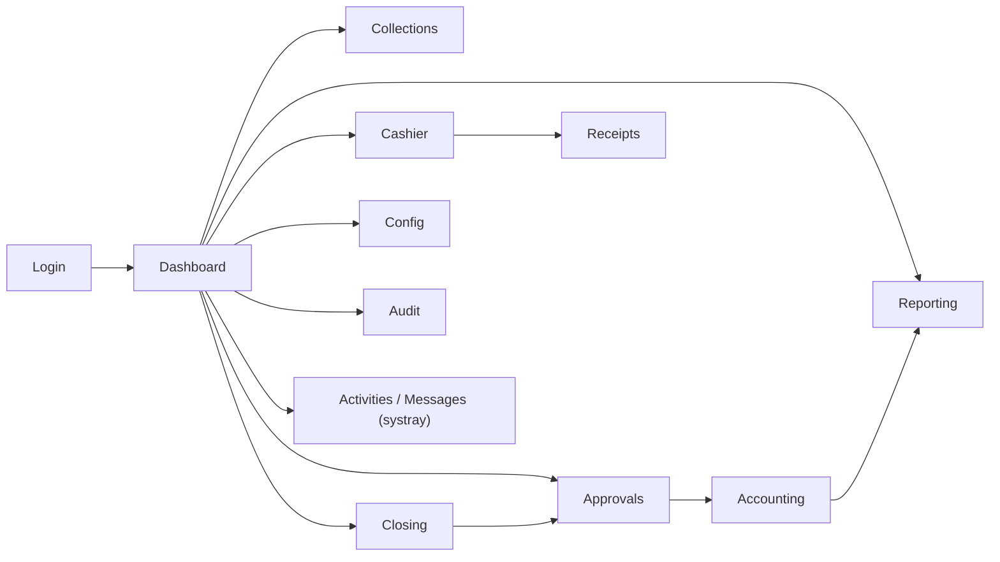

# UI/UX Design Documentation

**Project:** Branch Cash Management System (BCMS) — Prabal Motors Private Limited
**Source:** `BRD_v1.0.docx` Appendix A (Screen List), §16 (Dashboards), §20 (Responsive)
**Platform:** Odoo 19 Community Edition — module `branch_cash_management`
**Version:** 2.0 · **Date:** 2026-07-03 · **Status:** Draft for Client Review

> Deliverable: menu/navigation map, screen (view) list, view-layout descriptions, dashboard layouts, responsive/mobile behaviour, accessibility, and the visual design approach — expressed for the **Odoo 19 web client** (backend). Screens are Odoo **views** (list / form / kanban / search / pivot / graph) with menus, actions, statusbars, chatter, and activities. The HTML files under [`ui-mockups/`](../ui-mockups/) are **target-screen references** that these Odoo views implement.

---

## 1. UX Principles

| # | Principle | Application |
|---|-----------|-------------|
| 1 | **Task-first, queue-driven** | Cashier/approver screens are **kanban/list queues** with a clear statusbar and buttons for the next action. |
| 2 | **Speed** | Odoo command palette (⌘K), keyboard-first forms, saved filters, ≤2s search. |
| 3 | **Trust & clarity for money** | Monetary widgets, computed totals shown read-only, destructive actions via confirm wizard, immutability communicated. |
| 4 | **Progressive disclosure** | Form notebooks/tabs; drill-down from dashboards to source records. |
| 5 | **Consistency** | One Odoo look; identical patterns for lists, forms, statusbars, decorations across models. |
| 6 | **Accessible & responsive** | WCAG 2.1 AA target; the Odoo web client is responsive for advisor/cashier on the floor. |
| 7 | **Forgiving** | Field/constraint validation, controlled reversal/cancel (never silent delete), archive not delete. |

---

## 2. Menu Map (navigation structure)

The app installs a top-level **Branch Cash** menu; sub-menus are group-filtered (a Cashier never sees Configuration).

```
Branch Cash (root menu)
├── Dashboard                         (role-aware OWL dashboard action)
│   ├── Branch / Cluster / Corporate  (pivot & graph views by scope)
│   └── Exceptions
├── Collections                       (Advisor)
│   ├── New Request                   (form action)
│   └── My Requests                   (list/kanban, default filter: created by me)
├── Cashier
│   ├── Verification Queue            (kanban/list: state=submitted, my branch)
│   └── Receipts                      (list; print QWeb PDF)
├── Cash Closing                      (Cashier / WM / Accountant)
│   ├── Closings                      (list/form with statusbar)
│   └── History
├── Expenses                          (new / list, statusbar approval)
├── Deposits                          (new / verify, statusbar)
├── Approvals                         (WM / Accountant)
│   ├── Closings to Approve           (list filtered by state + activity)
│   └── Expenses to Approve
├── Accounting                        (Accountant / Finance)
│   ├── Pending Accounting
│   └── Accounting Status
├── Reporting                         (Finance / Mgmt / Audit)
│   ├── Daily Cash Book / Registers / Cash Difference / Accounting Pending …
├── Audit                             (Internal Audit)
│   └── Audit Log
└── Configuration                     (CFO/Admin)
    ├── Branches / Clusters / States
    ├── Users & Scope   (res.users)
    ├── Customers       (res.partner, BCMS filter)
    ├── Expense Heads / Banks / Pickup Agencies / Ledgers
    └── Settings
```

Notifications and profile/2FA use Odoo's standard **systray** (activities/messages) and **My Profile → Account Security**. The menu maps to the module structure in [TechnicalArchitecture.md](./TechnicalArchitecture.md) §12.

---

## 3. Navigation Model

- **Top menu bar (Odoo):** the **Branch Cash** app menu with the sub-menus above; group-filtered per role.
- **Breadcrumbs:** Odoo shows action → record breadcrumbs on every form.
- **Search view:** each list/kanban has filters, group-by, and favourites (saved searches); global search via ⌘K command palette.
- **Contextual actions:** statusbar buttons (top-left of form) drive the workflow ("Submit", "Approve", "Finalise"); the cog/action menu holds print (QWeb) and archive.
- **Systray:** activity (clock) and messaging icons show pending to-dos and unread messages; the user/company menu on the right.
- **Multi-scope roles:** company/branch context and search filters replace a bespoke branch switcher; record rules keep data in scope automatically.



---

## 4. Screen (View) List — BRD Appendix A + derived

| # | Screen | View type | Primary Role(s) | Key elements | Requirement |
|---|--------|-----------|-----------------|--------------|-------------|
| 1 | Login | web login | All | Email, password, 2FA | FR-AUTH-01 |
| 2 | Dashboard | OWL + pivot/graph | All | KPI tiles, exceptions, quick links | FR-DASH-* |
| 3 | Collection Request | form (+ attachments, chatter) | Advisor | Fields + document upload | FR-CR-* |
| 4 | My Requests | list / kanban | Advisor | Status decorations, filters, search | FR-CR-07 |
| 5 | Verification Queue | kanban / list | Cashier | Grouped by state, quick open | FR-CV-01 |
| 6 | Verify & Collect | form (statusbar + buttons) | Cashier | Doc preview, accept/reject, payment lines | FR-CV-02…07 |
| 7 | Receipt | form + QWeb print | Cashier/Advisor | Receipt view, print PDF | FR-RCPT-* |
| 8 | Cash Closing | form (statusbar) | Cashier | Computed totals, physical cash, variance | FR-CLS-01…11 |
| 9 | Approvals | list + form buttons | WM/Accountant | Approve/reject with remarks | FR-CLS-13/14, FR-EXP-07 |
| 10 | Expenses | list / form (statusbar) | Cashier/WM | Voucher form, bill attachment, approval | FR-EXP-* |
| 11 | Deposits | list / form (statusbar) | Cashier/Accountant | Type, slip/ack upload, verify | FR-DEP-* |
| 12 | Accounting Status | list / form | Accountant/Finance | Tally voucher, ledger, state | FR-ACC-* |
| 13 | Reports | list / pivot / graph + QWeb | Finance/Mgmt/Audit | Filters, group-by, export | FR-RPT-* |
| 14 | Configuration — Masters | list / form | CFO/Admin | CRUD for masters | FR-MDM-* |
| 15 | Users & Scope | res.users form | CFO/Admin | Groups, branch/cluster/state scope | FR-MDM-02 |
| 16 | Audit Log | list (read-only) | Internal Audit | Filterable, append-only | FR-AUTH-04 |
| 17 | Activities / Messages | systray | All | To-dos, mark done, deep-link | FR-NOTIF-* |
| 18 | My Profile / Security | res.users | All | Password, 2FA enrol | FR-AUTH-01 |

---

## 5. View-Layout Descriptions (key screens)

### 5.1 Cashier Verification Queue
- **View:** kanban grouped by `state` (Submitted / Rejected), or a list with decorations; search filters (status, vertical, date), group-by branch/vertical.
- **Columns (list):** Request No · Customer · Reference (Invoice/Job Card) · Amount (Monetary, right-aligned) · Mode · Created · Status (`decoration-warning`/`decoration-danger`).
- **Open** a record → the Verify & Collect form. New records surface via list refresh / bus.
- **Empty state:** the action's `help` text — "No pending requests — you're all caught up ✅".

```
┌───────────────────────────────────────────────────────────┐
│  Verification Queue        [Filters ▾] [Group By ▾] [⌘K]   │
│  Submitted 6   Rejected 1                                  │
├────────────┬──────────┬──────────┬────────┬──────┬────────┤
│ Req No     │ Customer │ Ref      │ Amount │ Mode │ Status │
├────────────┼──────────┼──────────┼────────┼──────┼────────┤
│ CR/…/000123│ R.Sharma │ JC-00891 │ ₹4,520 │ Cash │ ⏳     │
│ …          │          │          │        │      │        │
└────────────┴──────────┴──────────┴────────┴──────┴────────┘
```

### 5.2 Verify & Collect (form)
- **Layout:** header **statusbar** (Submitted → Accepted → Receipted); top buttons **Reject** / **Accept** / **Issue Receipt**. Left: request fields + document preview (attachment widget). Right/notebook tab: **payment lines** (`bcms.payment.detail`) — mode, amount, denominations (Json/cash grid), or online reference.
- **Onchange:** a computed "Captured vs Required" helper; **Accept** disabled (via `attrs`) until captured == amount. Chatter records the action and notifies the advisor on reject.

### 5.3 Cash Closing (form)
- **Statusbar:** Draft → Pending WM → Pending Accountant → Closed.
- **Summary group (read-only computed):** Opening, Cash Collections, Online Collections, Expenses, Deposits, **Expected Cash** (highlighted). **Physical Cash** input; **Variance** shown with a decoration badge (success = 0, warning/danger otherwise); **Variance Reason** required (`attrs`) when variance ≠ 0.
- **Submit** button → moves to Pending WM and schedules a WM activity.

### 5.4 Approvals
- **List** of pending closings/expenses filtered by state + assigned activity; open to a read-only form with **Approve/Reject** buttons.
- **Maker-checker guard:** if `create_uid == uid`, the approve button is hidden via `attrs`/group and the server-side constraint blocks it regardless ("You cannot approve your own record").

### 5.5 Reports
- **Views:** list/pivot/graph with a **search view** (branch — scope-limited by record rules, date range, status), group-by, and **favourites**. **Export** to XLSX/CSV from the list; **QWeb PDF** print for the daily cash book and receipts.

---

## 6. Dashboard Layouts (BRD §16)

| Dashboard | Audience | Widgets |
|-----------|----------|---------|
| **Branch** | Cashier/WM/Accountant | Cash-in-hand, today's cash/online collections, expenses, deposits, pending approvals, variance, mini trend |
| **Cluster/State** | Cluster Finance | Branch leaderboard, aggregate collections/deposits, exceptions by branch, pending closings/deposits |
| **Corporate** | Corporate Finance/CFO | Network KPIs, state comparison, accounting-pending totals, deposit-risk (cash-in-transit), trends |
| **Exception** | All finance/mgmt | Variances > tolerance, overdue deposits/closings, accounting-pending — each row opens the source record |

**Implementation:** an **OWL dashboard** (client action) renders KPI tiles from `read_group` aggregates and embeds Odoo **pivot** and **graph** views; each tile/row links to a filtered list action. (Odoo CE — no Enterprise Spreadsheet.) A stored summary model refreshed by `ir.cron` backs heavy corporate aggregates (NFR-PERF/SCAL).

---

## 7. Responsive & Mobile Behaviour (NFR-USE-01/02)

The Odoo 19 web client is responsive out of the box:

| Breakpoint | Behaviour |
|-----------|-----------|
| Mobile | Top menu collapses to a burger; list views become mobile cards; forms single-column; sticky statusbar buttons; attachment upload uses the phone camera. |
| Tablet | Condensed menus and lists; two-column form groups. |
| Desktop | Full menu, multi-column dashboards, side-by-side form groups + chatter. |

**Mobile priorities:** Advisor (raise request + upload from camera) and Cashier (verify, receipt, closing) flows are fully usable on phones; heavy configuration/reporting is desktop-optimised but reachable.

---

## 8. Accessibility Guidelines (NFR-A11Y-01, WCAG 2.1 AA)

- **Odoo web semantics** + ARIA on standard widgets (dialogs, dropdowns, notebooks).
- **Keyboard:** full operability, visible focus, ⌘K palette, logical tab order; status never conveyed by colour alone (decoration + label/icon).
- **Contrast:** meet AA in both light and (where used) dark; verify custom SCSS tokens.
- **Forms:** labels bound to fields, inline errors on invalid save, required indicators.
- **Custom OWL widgets:** add ARIA roles/labels and honour `prefers-reduced-motion`.
- **Targets:** touch targets ≥ 44×44px on mobile.

---

## 9. Visual Design Approach (Odoo web)

BCMS uses the **standard Odoo backend look** with a light module theme layer (SCSS variables in `static/src`), not a bespoke framework. Brand alignment to PMPL is applied via theme variables.

### 9.1 Status decorations (consistent across models)

Odoo list/kanban decorations map status to colour + label:

| Status | Decoration | Reads as |
|--------|-----------|----------|
| Submitted / Pending | `decoration-warning` (amber) | ⏳ attention |
| Accepted / Approved / Verified / Closed | `decoration-success` (green) | ✓ done |
| Rejected / Discrepancy / non-zero variance | `decoration-danger` (red) | ✕ / ⚠ |
| Draft | `decoration-muted` (grey) | ✎ draft |
| Reconciled | `decoration-success` (bold) | ✓✓ |

The `state` field renders as a **statusbar** on forms and a **badge** in lists.

### 9.2 Typography & money
- Odoo's default UI font; **Monetary** fields render right-aligned with the company currency. Amounts use **INR (₹)** with Indian digit grouping (e.g., ₹1,00,000) via the `res.currency`/locale format.

### 9.3 Layout
- Standard Odoo form (header statusbar + button box + groups + notebook + chatter); list views full-width with optional group-by; kanban for queues. Module theme tweaks spacing/brand colour only.

### 9.4 Icons
- Odoo/FontAwesome icons on menus and buttons (e.g., money `fa-money`, deposit `fa-bank`, receipt `fa-file-text`, approval `fa-check-circle`, exception `fa-exclamation-triangle`); custom module icon in `static/description/icon.png`.

### 9.5 Core widgets (Odoo)
`statusbar`, `badge`, `monetary`, `many2one`, `many2many_tags`, `selection`, `date`/`datetime`, `boolean_toggle`, `binary`/attachment preview, `Json`/custom denomination widget (OWL), notebook/tabs, chatter (`mail.thread`), activities.

### 9.6 Forms
- Odoo form views with `attrs` for conditional required/readonly/visibility; `@api.onchange` for live helpers (captured-vs-required, variance); attachment upload with the standard preview; a custom OWL **denomination counter** widget for cash with a live total.

### 9.7 Lists
- Sortable columns, right-aligned Monetary, decorations, group-by, optional totals, server-side pagination, saved filters, and XLSX/CSV export.

### 9.8 Wizards & confirmations
- Destructive/irreversible actions (cancel receipt, reject) open a **`TransientModel` wizard** stating consequences and capturing the mandatory reason; approvals can use a confirm wizard summarising figures before commit.

### 9.9 Notifications (in-app)
- **Activities** (`mail.activity`) create systray to-dos assigned to the next actor; **chatter messages** log events and deep-link to the record; unread badges in the systray; optional email via `mail.template`.

### 9.10 UI states (per data view)

| State | Odoo pattern |
|-------|--------------|
| **Loading** | Framework skeleton/spinner; no blank screen. |
| **Empty** | Action `help` text with a one-line explanation + primary button (e.g., "No requests yet — New Request"). |
| **Error** | Field-level validation messages on save; `UserError`/`ValidationError` dialogs; never raw tracebacks (debug off in prod). |
| **Success** | Toast/notification + statusbar advances (badge colour changes); receipt/closing confirmation. |
| **No access** | `AccessError` — "You are not allowed to access this document" (no data leakage). |
| **Degraded** | If longpolling drops, activities still work; manual refresh. |

---

## 10. Content & Localisation
- Currency **INR (₹)** with Indian grouping; dates **DD-MM-YYYY**; times IST — via `res.company`/language settings. Microcopy is plain and action-oriented; English UI with Hindi/regional as optional future translations (`i18n/`).

---

## 11. Traceability

| UI area | Requirement IDs |
|---------|-----------------|
| Login/Profile | FR-AUTH-01 |
| Collection screens | FR-CR-01…08 |
| Cashier screens | FR-CV-01…08, FR-RCPT-* |
| Closing/Approvals | FR-CLS-01…14 |
| Expenses/Deposits | FR-EXP-*, FR-DEP-* |
| Accounting | FR-ACC-* |
| Dashboards | FR-DASH-01…06 |
| Reports | FR-RPT-01…10 |
| Configuration/Users | FR-MDM-*, FR-AUTH-02 |
| Notifications | FR-NOTIF-* |
| Responsive/A11y | NFR-USE-*, NFR-A11Y-01 |

---

*End of UIUX.md*
