# Workflows & Process Diagrams

**Project:** Branch Cash Management System (BCMS) — Prabal Motors Private Limited
**Source:** `BRD_v1.0.docx` §6, §9–§14, §17
**Platform:** Odoo 19 Community Edition — module `branch_cash_management`
**Version:** 2.0 · **Date:** 2026-07-03 · **Status:** Draft for Client Review

> Every business process from the BRD is documented here with narrative + Mermaid diagrams. The **canonical single-diagram files** live in [docs/diagrams/](./diagrams/) and are indexed in [MermaidDiagrams.md](./MermaidDiagrams.md). Diagram types used: flowchart, sequence, activity, state, decision tree, approval, escalation, exception/error, swimlane, data-flow, and user-journey.

**Module coverage:** Collection Request · Cashier Verification · Receipt · Cash Closing · Approval · Expense · Deposit · Accounting · Notifications · Auth/Access · Dashboards/Reports (data flow).

---

## 1. End-to-End Process (BRD §6)

The complete cash lifecycle from advisor collection request to Tally accounting.

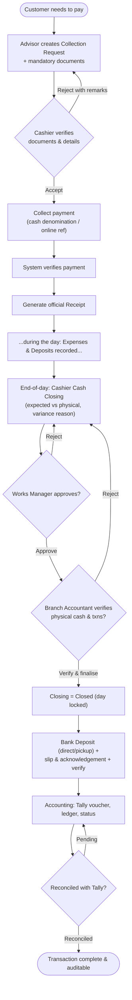

Canonical: [diagrams/e2e-flowchart.md](./diagrams/e2e-flowchart.md) · Swimlane view: [diagrams/e2e-swimlane.md](./diagrams/e2e-swimlane.md).

**Swimlane (role responsibilities across the lifecycle):**

```mermaid
flowchart LR
    subgraph Advisor
        A1[Create request] --> A2[Upload docs] --> A3[Correct if rejected]
    end
    subgraph Cashier
        C1[Verify] --> C2[Accept/Reject] --> C3[Collect + Receipt] --> C4[Record expenses/deposits] --> C5[Cash closing]
    end
    subgraph WorksManager
        W1[Approve closing]
    end
    subgraph BranchAccountant
        B1[Verify physical cash] --> B2[Verify deposit] --> B3[Record accounting]
    end
    A3 --> C1
    C5 --> W1 --> B1 --> B2 --> B3
```

---

## 2. Collection Request (BRD §8)

**Actors:** Sales/Service Advisor (maker). **Trigger:** customer intends to pay against an invoice/job card. **Outcome:** a `submitted` request with a unique Request ID and mandatory documents.

**Business rules:** BR-01 (mandatory docs), BR-09 (rejection loop). **Requirements:** FR-CR-01…08.

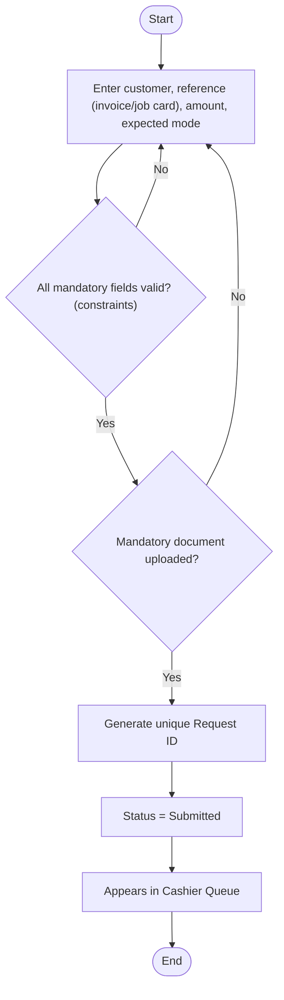

**Request state machine:** [diagrams/request-state-diagram.md](./diagrams/request-state-diagram.md)

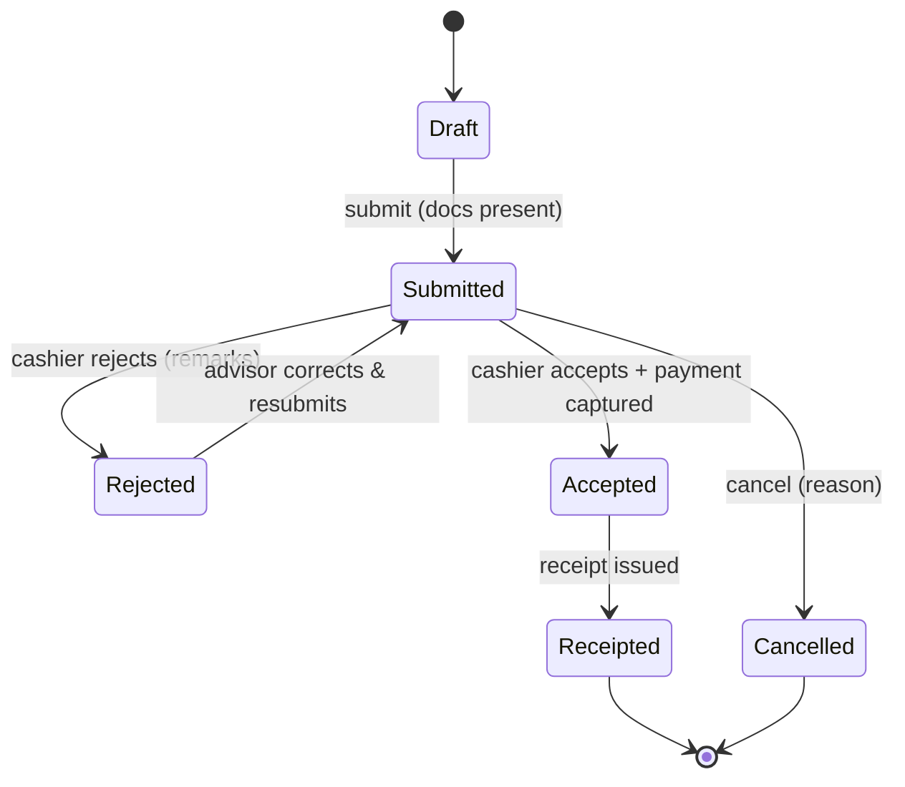

---

## 3. Cashier Verification & Payment (BRD §9)

**Actors:** Cashier (maker). **Requirements:** FR-CV-01…08.

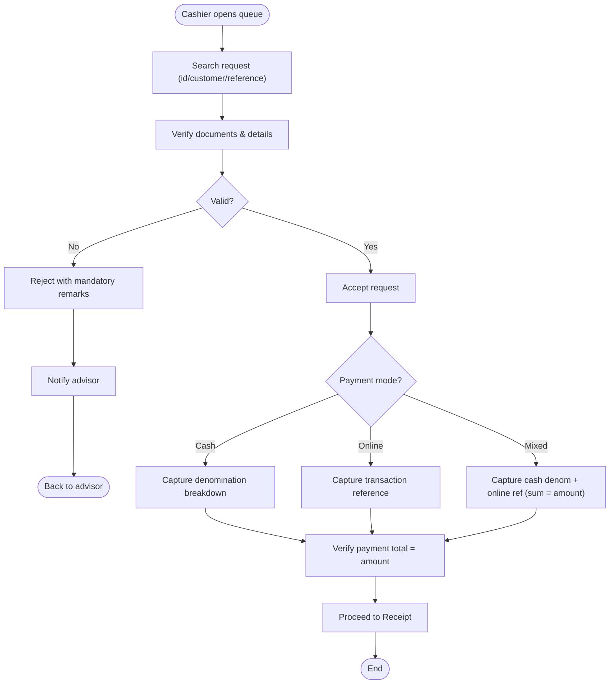

**Payment-mode decision tree:** [diagrams/payment-decision-tree.md](./diagrams/payment-decision-tree.md)

---

## 4. Receipt Generation (BRD §9)

**Actors:** Cashier. **Rules:** BR-08 (unique sequential immutable), FR-RCPT-01…05. Issued atomically via the `action_issue_receipt` model method (state-guarded).

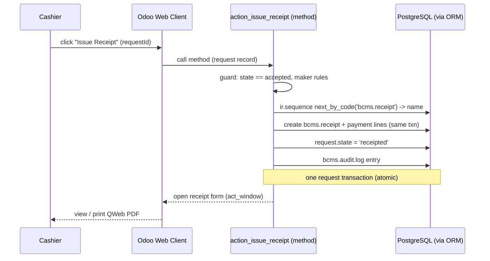

Canonical: [diagrams/receipt-sequence.md](./diagrams/receipt-sequence.md)

---

## 5. Cash Closing (BRD §10)

**Actors:** Cashier (maker). **Rules:** BR-04 (variance reason), BR-10 (formula), AS-14 (opening carry-forward). **Requirements:** FR-CLS-01…11.

**Activity diagram:**

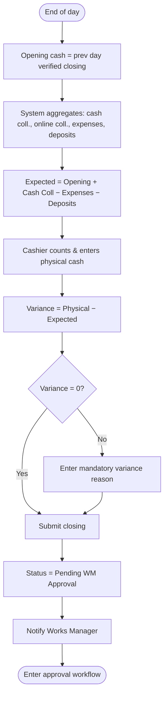

Canonical: [diagrams/cash-closing-activity.md](./diagrams/cash-closing-activity.md) · State: [diagrams/closing-state-diagram.md](./diagrams/closing-state-diagram.md)

---

## 6. Approval Workflow — Closing (BRD §11)

**Chain (fixed, BR-02):** Cashier → Works Manager → Branch Accountant → Closed. **Maker ≠ Checker (BR-03).**

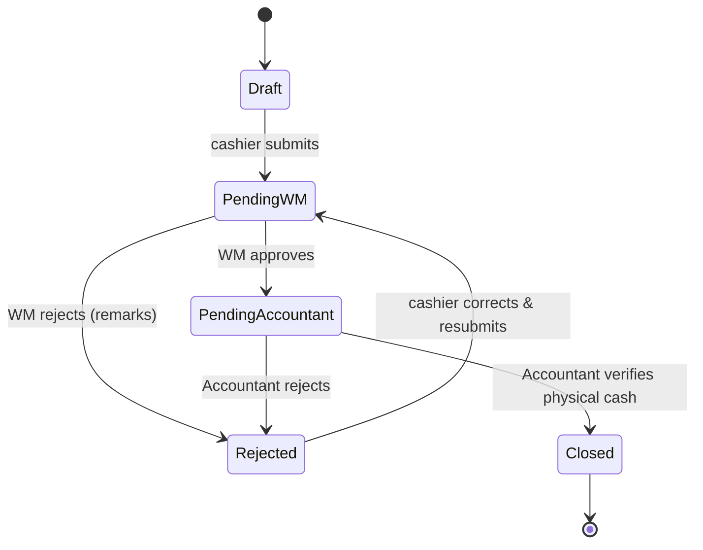

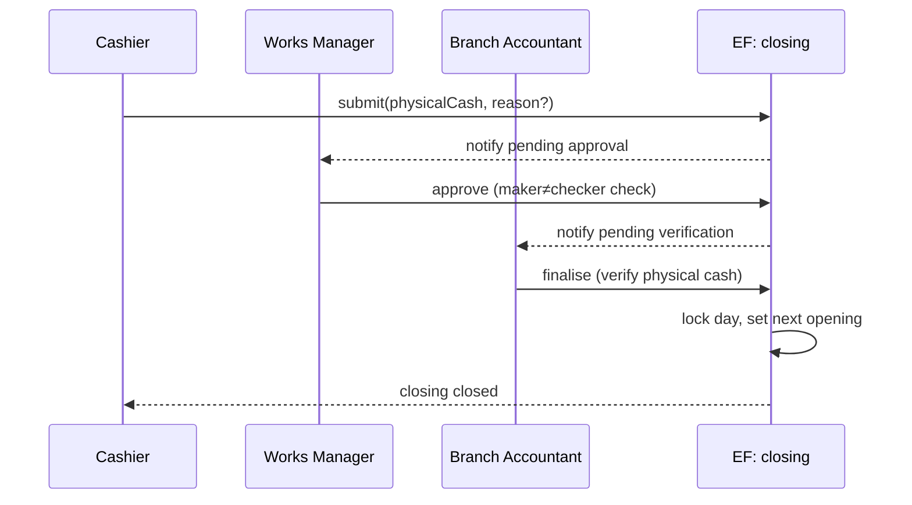

Canonical: [diagrams/approval-workflow.md](./diagrams/approval-workflow.md)

---

## 7. Cash Expense (BRD §12)

**Actors:** Cashier (maker) → Approver (checker). **Rules:** BR-06 (auto-reduce), BR-03. **Requirements:** FR-EXP-01…07.

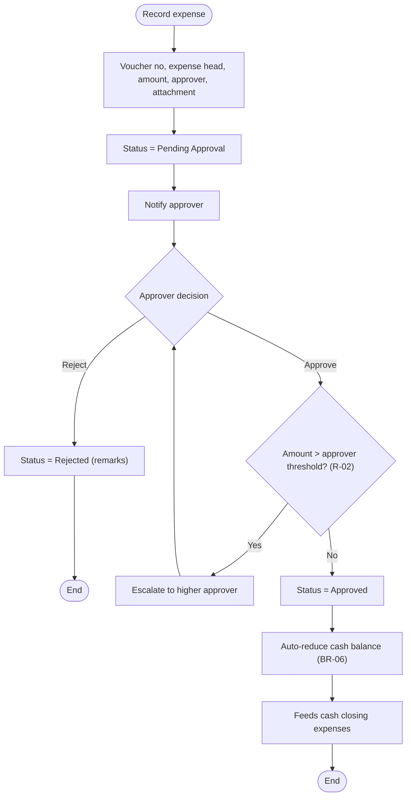

Canonical: [diagrams/expense-flow.md](./diagrams/expense-flow.md)

---

## 8. Bank Deposit (BRD §13)

**Actors:** Cashier (maker) → Branch Accountant (verify). **Rules:** BR-07 (slip + acknowledgement), FR-DEP-01…06.

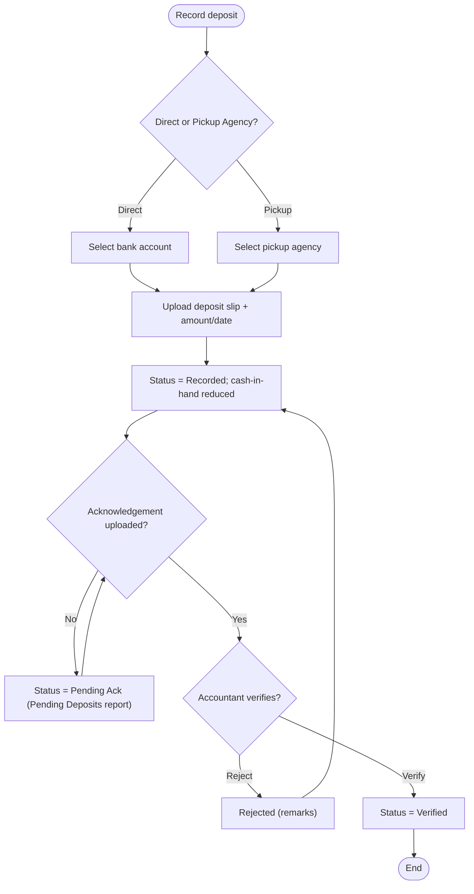

Canonical: [diagrams/deposit-flow.md](./diagrams/deposit-flow.md) · State: [diagrams/deposit-state-diagram.md](./diagrams/deposit-state-diagram.md)

---

## 9. Accounting Update (BRD §14)

**Actors:** Branch Accountant / Finance. **Rules:** BR-11. **Requirements:** FR-ACC-01…06.

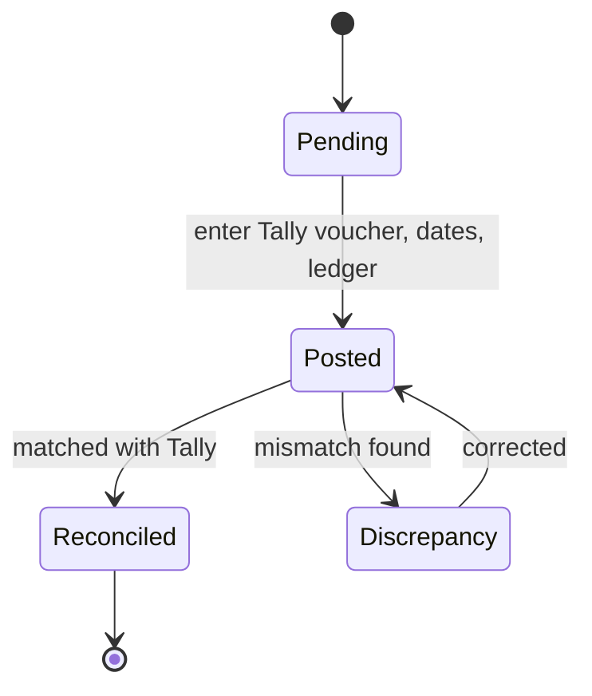

Canonical: [diagrams/accounting-flow.md](./diagrams/accounting-flow.md)

---

## 10. Authentication & Authorization (BRD §18)

**Auth flow:** [diagrams/auth-flow.md](./diagrams/auth-flow.md) · **Authorization (record rules + maker-checker):** [diagrams/authorization-flow.md](./diagrams/authorization-flow.md). Diagrams are in [SecurityArchitecture.md](./SecurityArchitecture.md) §2–§3 and the canonical files.

---

## 11. Notifications (BRD §17)

**Triggers:** rejected request, pending approval, pending closing, pending deposit, accounting pending. Delivered in-app via Odoo activities/chatter (bus); role/scope-targeted. **Requirements:** FR-NOTIF-01…06.

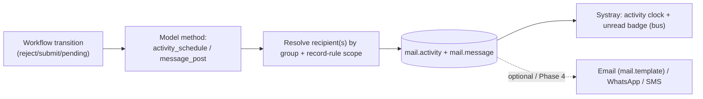

Canonical: [diagrams/notification-flow.md](./diagrams/notification-flow.md)

---

## 12. File Storage (documents, slips, acknowledgements)

**Rules:** BR-13 (versioning), file-upload security (SecurityArchitecture §9).

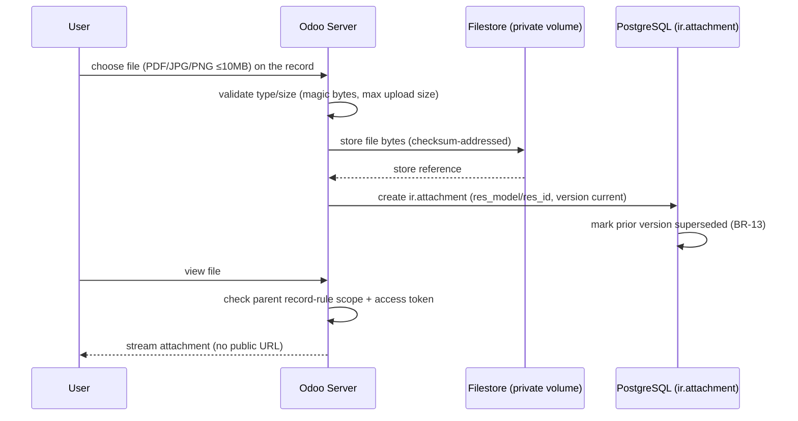

Canonical: [diagrams/file-storage-flow.md](./diagrams/file-storage-flow.md)

---

## 13. Exception, Escalation & Error Flows

### 13.1 Exception handling (operational exceptions)

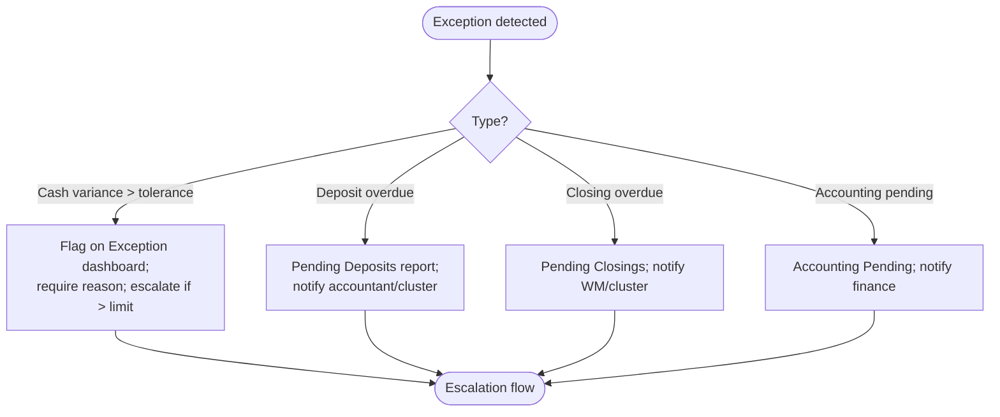

### 13.2 Escalation flow (thresholds — R-02, recommended)

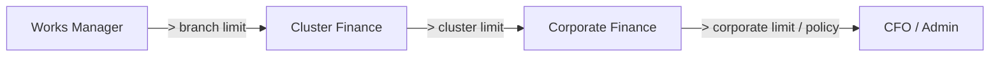

### 13.3 Error flow (system/technical errors)

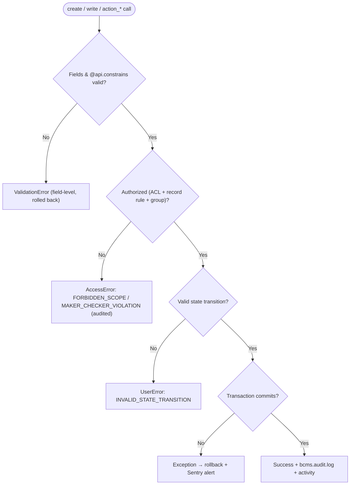

Canonical: [diagrams/exception-handling-flow.md](./diagrams/exception-handling-flow.md), [diagrams/escalation-flow.md](./diagrams/escalation-flow.md), [diagrams/error-flow.md](./diagrams/error-flow.md)

---

## 14. Data Flow Diagram (system-wide)

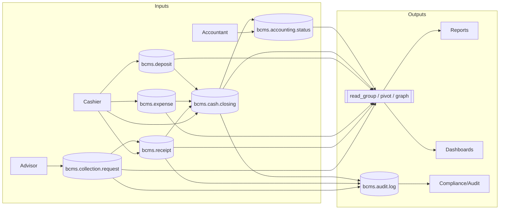

Canonical: [diagrams/data-flow-diagram.md](./diagrams/data-flow-diagram.md)

---

## 15. User Journey Maps

### 15.1 Cashier — a working day

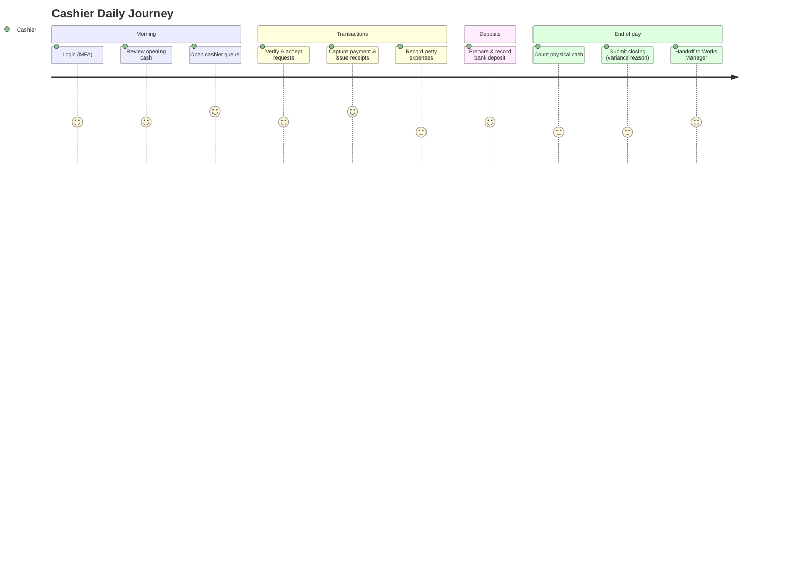

### 15.2 Advisor — raising a collection

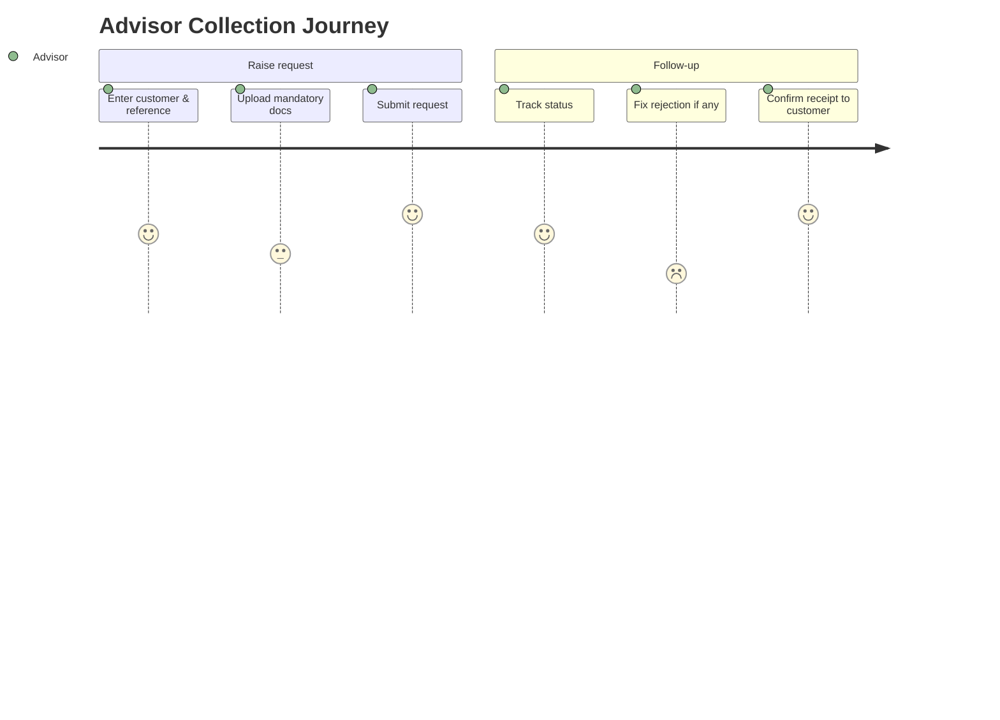

Canonical: [diagrams/user-journey-cashier.md](./diagrams/user-journey-cashier.md), [diagrams/user-journey-advisor.md](./diagrams/user-journey-advisor.md)

---

## 16. Workflow ↔ Requirement Coverage

| Workflow | Section | Requirement IDs | Diagram file |
|----------|---------|-----------------|--------------|
| End-to-end | §1 | BRD §6, all FR | e2e-flowchart, e2e-swimlane |
| Collection Request | §2 | FR-CR-01…08 | collection-request-flow, request-state-diagram |
| Cashier Verification | §3 | FR-CV-01…08 | cashier-verification-flow, payment-decision-tree |
| Receipt | §4 | FR-RCPT-01…05 | receipt-sequence |
| Cash Closing | §5 | FR-CLS-01…11 | cash-closing-activity, closing-state-diagram |
| Approval | §6 | FR-CLS-12…14, FR-AUTH-05 | approval-workflow |
| Expense | §7 | FR-EXP-01…07 | expense-flow |
| Deposit | §8 | FR-DEP-01…06 | deposit-flow, deposit-state-diagram |
| Accounting | §9 | FR-ACC-01…06 | accounting-flow |
| Auth/Authz | §10 | FR-AUTH-01…03 | auth-flow, authorization-flow |
| Notifications | §11 | FR-NOTIF-01…06 | notification-flow |
| File storage | §12 | BR-13, FR-CR-05 | file-storage-flow |
| Exception/Escalation/Error | §13 | FR-DASH-05, R-02 | exception-handling-flow, escalation-flow, error-flow |
| Data flow | §14 | all | data-flow-diagram |
| User journeys | §15 | UX | user-journey-cashier, user-journey-advisor |

**Every module in the BRD has at least one workflow diagram.**

---

*End of Workflows.md*
