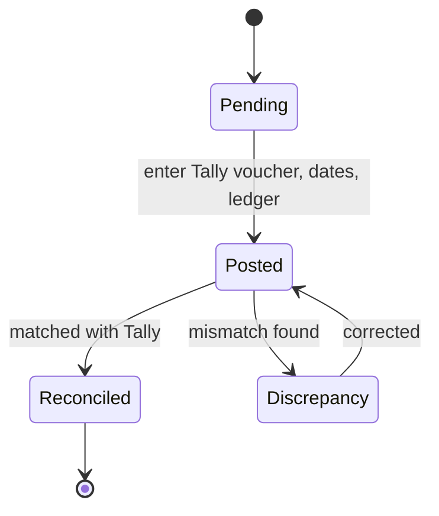
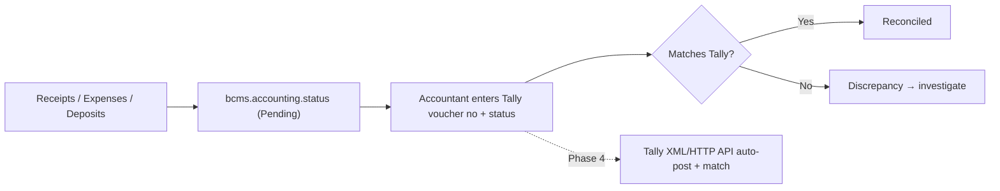

# Accounting Update State Diagram

**Type:** State diagram · **Module:** Accounting · **Ref:** [Workflows.md](../Workflows.md) §9 · BRD §14 · BR-11

## Reconciliation data flow (v1 manual, Phase 4 API)

