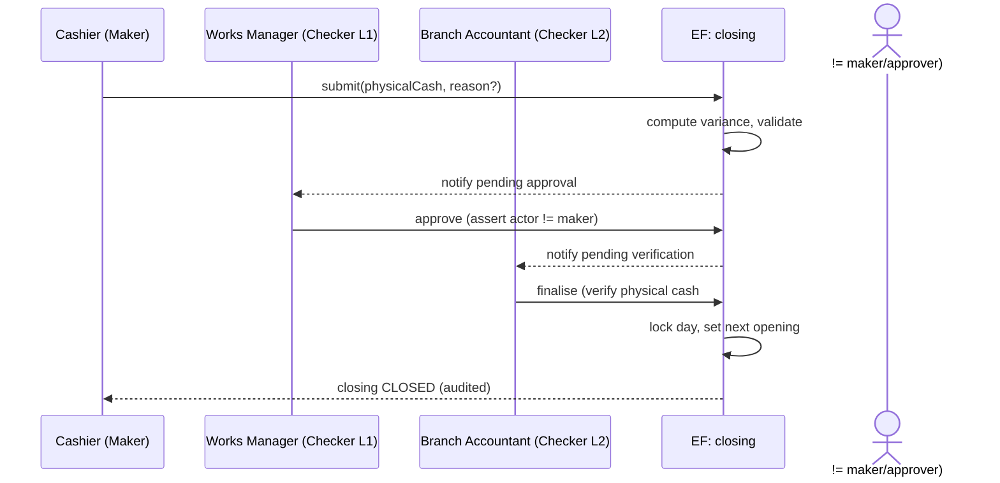

# Closing Approval Workflow (Sequence)

**Type:** Sequence / approval workflow · **Module:** Approval · **Ref:** [Workflows.md](../Workflows.md) §6 · BRD §11 · BR-02, BR-03

```mermaid
sequenceDiagram
    participant Ca as Cashier (Maker)
    participant WM as Works Manager (Checker L1)
    participant BA as Branch Accountant (Checker L2)
    participant EF as EF: closing
    Ca->>EF: submit(physicalCash, reason?)
    EF->>EF: compute variance, validate
    EF-->>WM: notify pending approval
    WM->>EF: approve (assert actor != maker)
    EF-->>BA: notify pending verification
    BA->>EF: finalise (verify physical cash; actor != maker/approver)
    EF->>EF: lock day, set next opening
    EF-->>Ca: closing CLOSED (audited)
```
