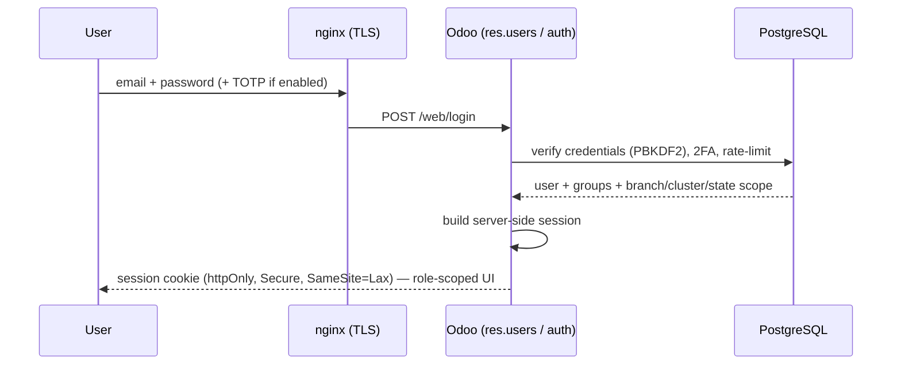

# Authentication Flow

**Type:** Sequence diagram · **Module:** Auth · **Ref:** [SecurityArchitecture.md](../SecurityArchitecture.md) §2 · FR-AUTH-01

```mermaid
sequenceDiagram
    participant U as User
    participant NG as nginx (TLS)
    participant OD as Odoo (res.users / auth)
    participant DB as PostgreSQL
    U->>NG: email + password (+ TOTP if enabled)
    NG->>OD: POST /web/login
    OD->>DB: verify credentials (PBKDF2), 2FA, rate-limit
    DB-->>OD: user + groups + branch/cluster/state scope
    OD->>OD: build server-side session
    OD-->>U: session cookie (httpOnly, Secure, SameSite=Lax) — role-scoped UI
```
