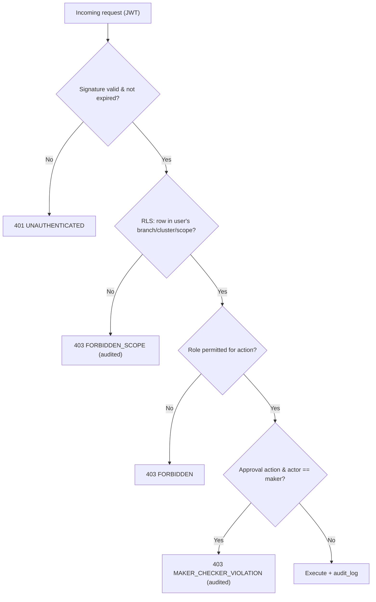

# Authorization Flow (RLS + Maker-Checker)

**Type:** Flowchart · **Module:** Auth/Access · **Ref:** [SecurityArchitecture.md](../SecurityArchitecture.md) §3 · FR-AUTH-02/03/05, BR-03

```mermaid
flowchart TD
    Req["Incoming request (JWT)"] --> Sig{"Signature valid & not expired?"}
    Sig -->|No| E401["401 UNAUTHENTICATED"]
    Sig -->|Yes| RLS{"RLS: row in user's branch/cluster/scope?"}
    RLS -->|No| E403a["403 FORBIDDEN_SCOPE (audited)"]
    RLS -->|Yes| Role{"Role permitted for action?"}
    Role -->|No| E403b["403 FORBIDDEN"]
    Role -->|Yes| MC{"Approval action & actor == maker?"}
    MC -->|Yes| E403c["403 MAKER_CHECKER_VIOLATION (audited)"]
    MC -->|No| OK["Execute + audit_log"]
```
