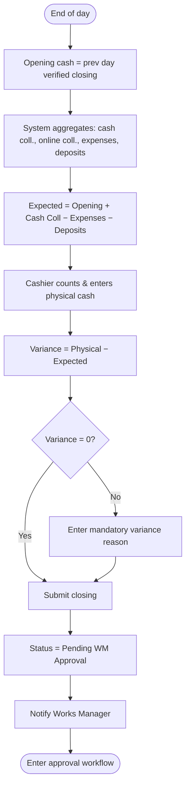

# Cash Closing Activity Diagram

**Type:** Activity diagram · **Module:** Cash Closing · **Ref:** [Workflows.md](../Workflows.md) §5 · BRD §10 · BR-04, BR-10

```mermaid
flowchart TD
    S([End of day]) --> O["Opening cash = prev day verified closing"]
    O --> AGG["System aggregates: cash coll., online coll., expenses, deposits"]
    AGG --> EXP["Expected = Opening + Cash Coll − Expenses − Deposits"]
    EXP --> PC["Cashier counts & enters physical cash"]
    PC --> VAR["Variance = Physical − Expected"]
    VAR --> Z{"Variance = 0?"}
    Z -->|No| RSN["Enter mandatory variance reason"]
    Z -->|Yes| SUBMIT
    RSN --> SUBMIT["Submit closing"]
    SUBMIT --> ST["Status = Pending WM Approval"]
    ST --> N["Notify Works Manager"]
    N --> E([Enter approval workflow])
```
