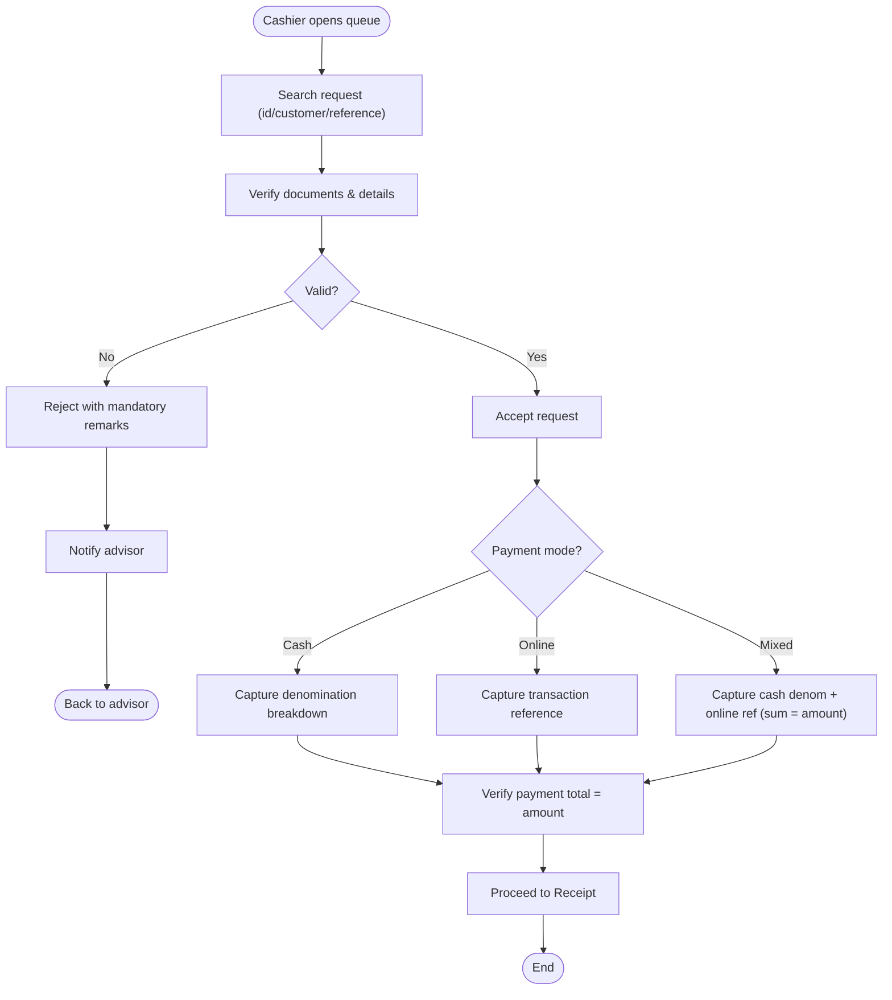

# Cashier Verification Flowchart

**Type:** Flowchart · **Module:** Cashier Verification · **Ref:** [Workflows.md](../Workflows.md) §3 · BRD §9 · FR-CV-01…08

```mermaid
flowchart TD
    S([Cashier opens queue]) --> SR["Search request (id/customer/reference)"]
    SR --> VD["Verify documents & details"]
    VD --> D{"Valid?"}
    D -->|No| RJ["Reject with mandatory remarks"] --> N1["Notify advisor"] --> BACK([Back to advisor])
    D -->|Yes| AC["Accept request"]
    AC --> M{"Payment mode?"}
    M -->|Cash| CD["Capture denomination breakdown"]
    M -->|Online| OR["Capture transaction reference"]
    M -->|Mixed| BOTH["Capture cash denom + online ref (sum = amount)"]
    CD --> VF["Verify payment total = amount"]
    OR --> VF
    BOTH --> VF
    VF --> RCPT["Proceed to Receipt"]
    RCPT --> E([End])
```
