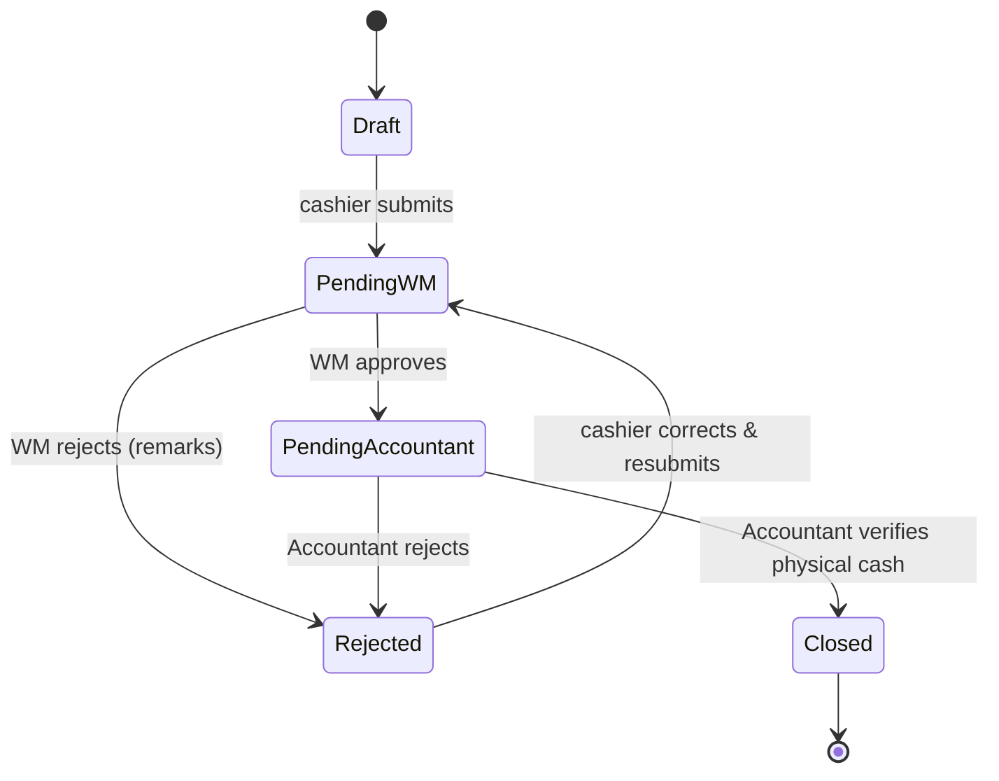

# Cash Closing State Diagram

**Type:** State diagram · **Module:** Cash Closing / Approval · **Ref:** [Workflows.md](../Workflows.md) §6 · BR-02

```mermaid
stateDiagram-v2
    [*] --> Draft
    Draft --> PendingWM: cashier submits
    PendingWM --> Rejected: WM rejects (remarks)
    PendingWM --> PendingAccountant: WM approves
    PendingAccountant --> Rejected: Accountant rejects
    PendingAccountant --> Closed: Accountant verifies physical cash
    Rejected --> PendingWM: cashier corrects & resubmits
    Closed --> [*]
```
