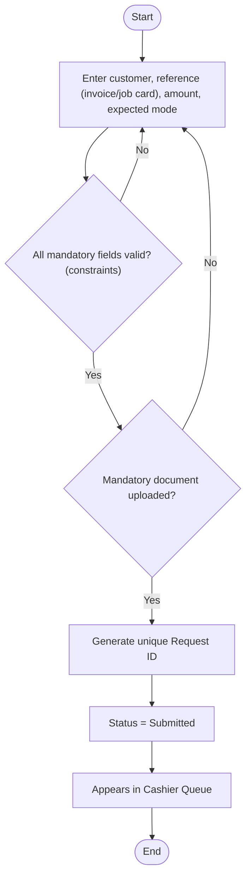

# Collection Request Flowchart

**Type:** Flowchart · **Module:** Collection Request · **Ref:** [Workflows.md](../Workflows.md) §2 · BRD §8 · FR-CR-01…08

```mermaid
flowchart TD
    S([Start]) --> F["Enter customer, reference (invoice/job card), amount, expected mode"]
    F --> V{"All mandatory fields valid? (constraints)"}
    V -->|No| F
    V -->|Yes| U{"Mandatory document uploaded?"}
    U -->|No| F
    U -->|Yes| G["Generate unique Request ID"]
    G --> SUB["Status = Submitted"]
    SUB --> Q["Appears in Cashier Queue"]
    Q --> E([End])
```
