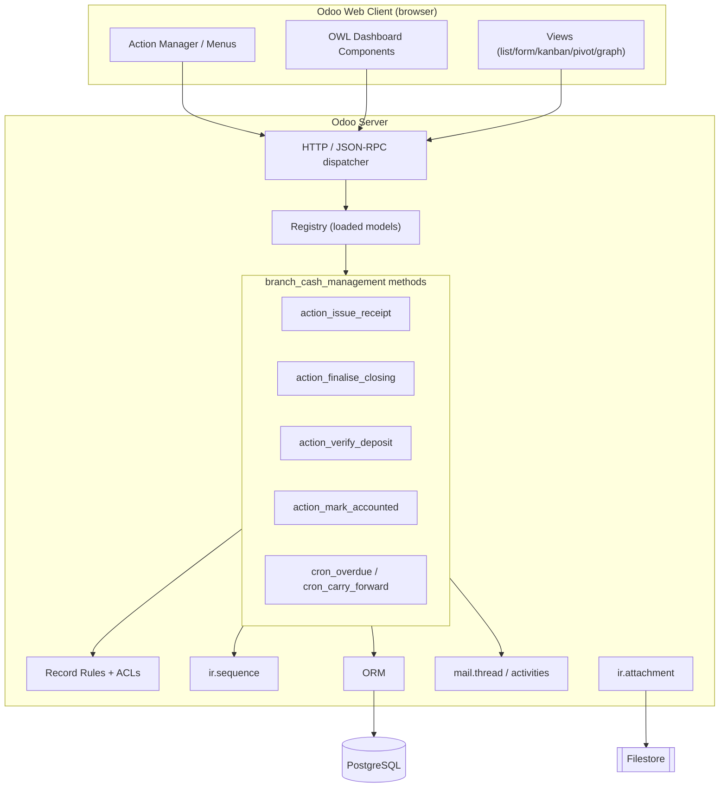

# Component Diagram

**Type:** Runtime component diagram · **Ref:** [TechnicalArchitecture.md](../TechnicalArchitecture.md) §6

```mermaid
graph TB
    subgraph FE["Odoo Web Client (browser)"]
        RG["Action Manager / Menus"]
        VW["Views (list/form/kanban/pivot/graph)"]
        OWL["OWL Dashboard Components"]
    end
    subgraph BE["Odoo Server"]
        HTTP["HTTP / JSON-RPC dispatcher"]
        REG["Registry (loaded models)"]
        subgraph LOGIC["branch_cash_management methods"]
            L1["action_issue_receipt"]
            L2["action_finalise_closing"]
            L3["action_verify_deposit"]
            L4["action_mark_accounted"]
            L5["cron_overdue / cron_carry_forward"]
        end
        SECR["Record Rules + ACLs"]
        SEQ["ir.sequence"]
        ATT["ir.attachment"]
        MAILT["mail.thread / activities"]
        ORM["ORM"]
    end
    DB[("PostgreSQL")]
    FS[["Filestore"]]
    RG --> HTTP --> REG --> LOGIC
    LOGIC --> SECR
    LOGIC --> SEQ
    LOGIC --> MAILT
    LOGIC --> ORM --> DB
    ATT --> FS
    OWL --> HTTP
    VW --> HTTP
```
