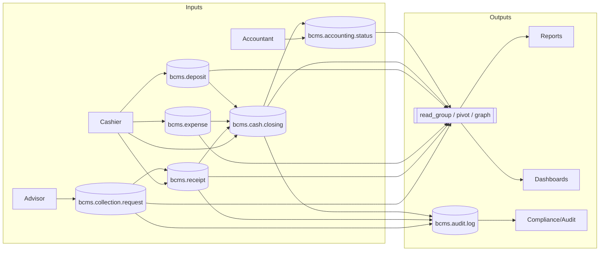

# System Data Flow Diagram

**Type:** Data flow diagram (DFD) · **Module:** All · **Ref:** [Workflows.md](../Workflows.md) §14

```mermaid
flowchart LR
    subgraph Inputs
        ADV[Advisor] --> CR[(bcms.collection.request)]
        CASH[Cashier] --> RCPT[(bcms.receipt)]
        CASH --> EXP[(bcms.expense)]
        CASH --> DEP[(bcms.deposit)]
        CASH --> CLS[(bcms.cash.closing)]
        BA[Accountant] --> ACC[(bcms.accounting.status)]
    end
    CR --> RCPT
    RCPT --> CLS
    EXP --> CLS
    DEP --> CLS
    CLS --> ACC
    subgraph Outputs
        VIEWS[[read_group / pivot / graph]] --> RPT[Reports]
        VIEWS --> DASH[Dashboards]
        AUDIT[(bcms.audit.log)] --> COMP[Compliance/Audit]
    end
    CR --> VIEWS
    RCPT --> VIEWS
    EXP --> VIEWS
    DEP --> VIEWS
    CLS --> VIEWS
    ACC --> VIEWS
    CR --> AUDIT
    RCPT --> AUDIT
    CLS --> AUDIT
```
