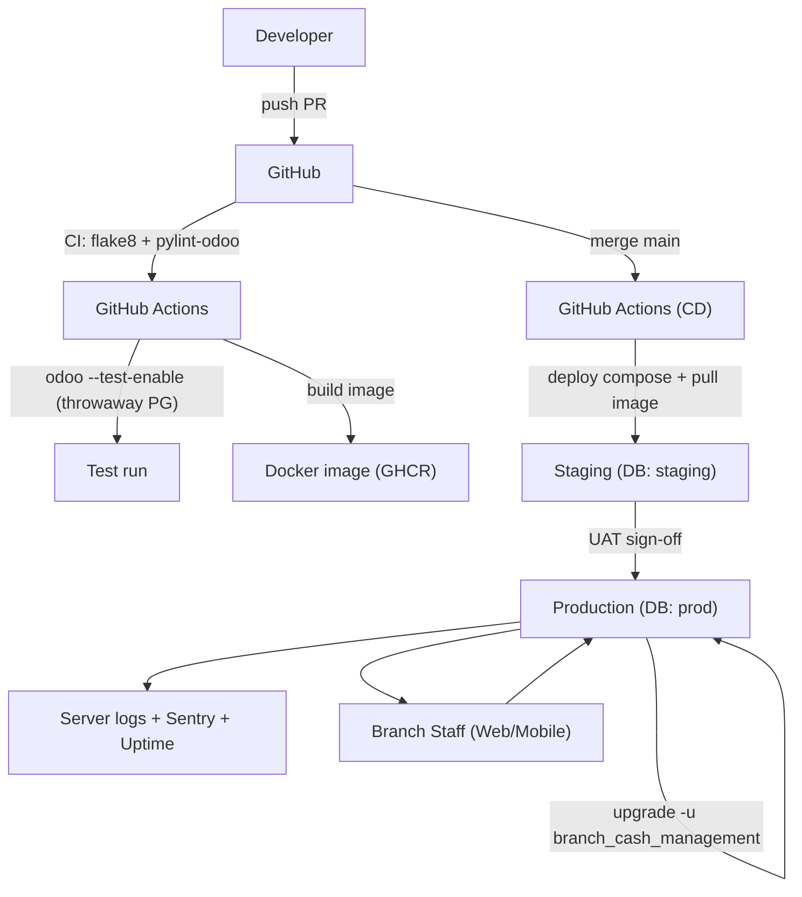
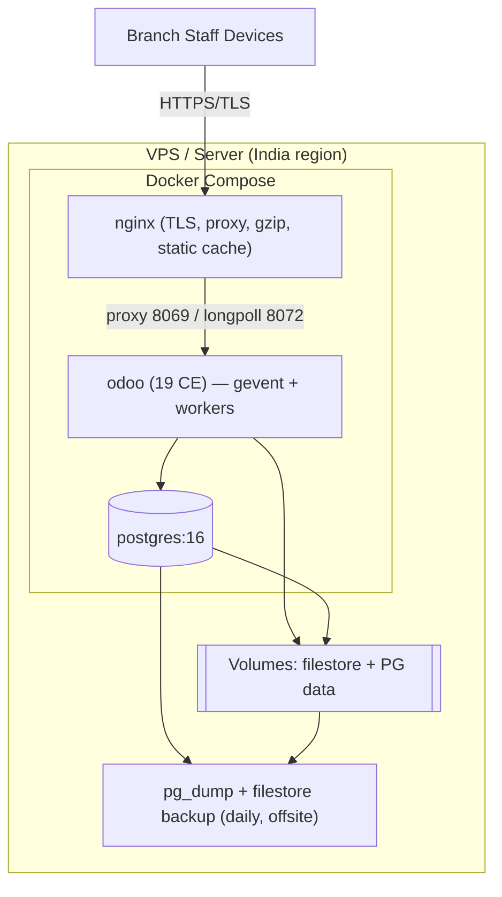

# Deployment Architecture Diagram

**Type:** Deployment / CI-CD diagram · **Ref:** [TechnicalArchitecture.md](../TechnicalArchitecture.md) §10

```mermaid
graph TB
    Dev["Developer"] -->|push PR| GH["GitHub"]
    GH -->|"CI: flake8 + pylint-odoo"| CI["GitHub Actions"]
    CI -->|"odoo --test-enable (throwaway PG)"| T["Test run"]
    CI -->|build image| IMG["Docker image (GHCR)"]
    GH -->|merge main| CD["GitHub Actions (CD)"]
    CD -->|deploy compose + pull image| STG["Staging (DB: staging)"]
    STG -->|UAT sign-off| PROD["Production (DB: prod)"]
    PROD -->|"upgrade -u branch_cash_management"| PROD
    PROD --> Mon["Server logs + Sentry + Uptime"]
    PROD --> Users["Branch Staff (Web/Mobile)"]
    Users --> PROD
```

## Physical topology

```mermaid
graph TB
    User["Branch Staff Devices"]
    subgraph Host["VPS / Server (India region)"]
        subgraph Docker["Docker Compose"]
            NG["nginx (TLS, proxy, gzip, static cache)"]
            ODOO["odoo (19 CE) — gevent + workers"]
            PGC[("postgres:16")]
        end
        VOL[["Volumes: filestore + PG data"]]
        BKP["pg_dump + filestore backup (daily, offsite)"]
    end
    User -->|HTTPS/TLS| NG
    NG -->|"proxy 8069 / longpoll 8072"| ODOO
    ODOO --> PGC
    ODOO --> VOL
    PGC --> VOL
    PGC --> BKP
    VOL --> BKP
```
