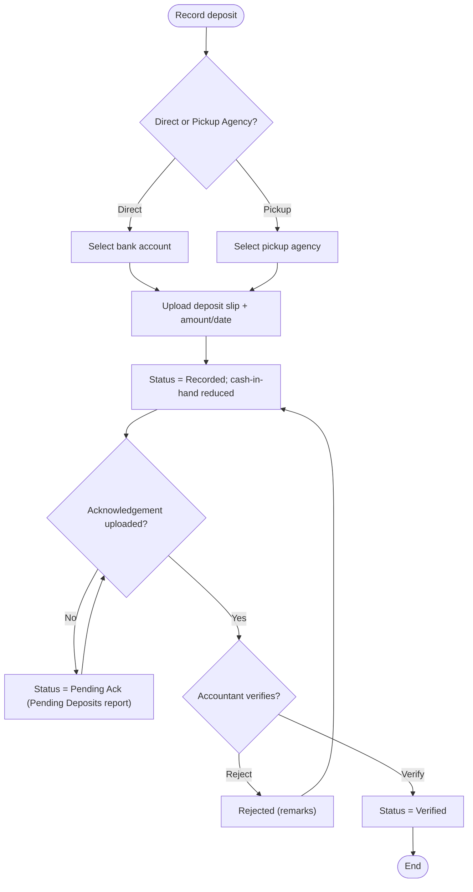

# Bank Deposit Flowchart

**Type:** Flowchart · **Module:** Bank Deposit · **Ref:** [Workflows.md](../Workflows.md) §8 · BRD §13 · BR-07

```mermaid
flowchart TD
    S([Record deposit]) --> TYPE{"Direct or Pickup Agency?"}
    TYPE -->|Direct| BANK["Select bank account"]
    TYPE -->|Pickup| AG["Select pickup agency"]
    BANK --> SLIP["Upload deposit slip + amount/date"]
    AG --> SLIP
    SLIP --> REC["Status = Recorded; cash-in-hand reduced"]
    REC --> ACK{"Acknowledgement uploaded?"}
    ACK -->|No| PEND["Status = Pending Ack (Pending Deposits report)"]
    PEND --> ACK
    ACK -->|Yes| VER{"Accountant verifies?"}
    VER -->|Reject| REJ["Rejected (remarks)"] --> REC
    VER -->|Verify| OK["Status = Verified"]
    OK --> E([End])
```
