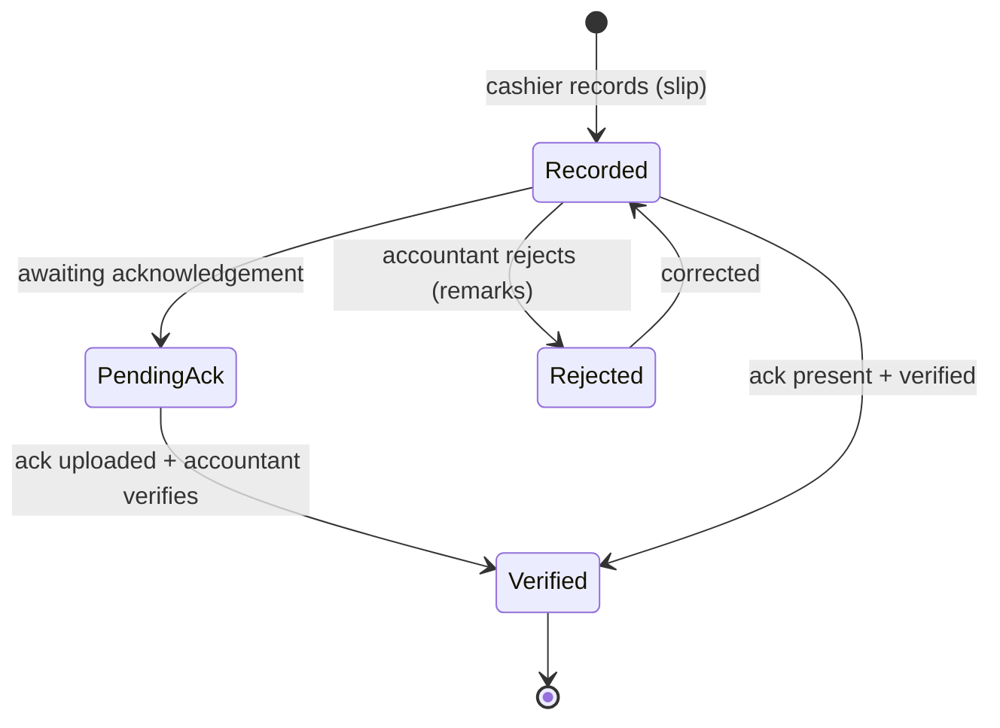

# Bank Deposit State Diagram

**Type:** State diagram · **Module:** Bank Deposit · **Ref:** [Workflows.md](../Workflows.md) §8 · BR-07

```mermaid
stateDiagram-v2
    [*] --> Recorded: cashier records (slip)
    Recorded --> PendingAck: awaiting acknowledgement
    PendingAck --> Verified: ack uploaded + accountant verifies
    Recorded --> Verified: ack present + verified
    Recorded --> Rejected: accountant rejects (remarks)
    Rejected --> Recorded: corrected
    Verified --> [*]
```
