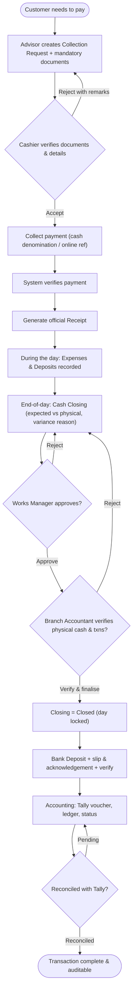

# End-to-End Process Flowchart

**Type:** Flowchart · **Module:** All · **Ref:** [Workflows.md](../Workflows.md) §1 · BRD §6

```mermaid
flowchart TD
    Start([Customer needs to pay]) --> A["Advisor creates Collection Request + mandatory documents"]
    A --> B{"Cashier verifies documents & details"}
    B -->|Reject with remarks| A
    B -->|Accept| C["Collect payment (cash denomination / online ref)"]
    C --> D["System verifies payment"]
    D --> E["Generate official Receipt"]
    E --> F["During the day: Expenses & Deposits recorded"]
    F --> G["End-of-day: Cash Closing (expected vs physical, variance reason)"]
    G --> H{"Works Manager approves?"}
    H -->|Reject| G
    H -->|Approve| I{"Branch Accountant verifies physical cash & txns?"}
    I -->|Reject| G
    I -->|Verify & finalise| J["Closing = Closed (day locked)"]
    J --> K["Bank Deposit + slip & acknowledgement + verify"]
    K --> L["Accounting: Tally voucher, ledger, status"]
    L --> M{"Reconciled with Tally?"}
    M -->|Pending| L
    M -->|Reconciled| End([Transaction complete & auditable])
```
