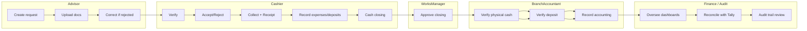

# End-to-End Swimlane Diagram

**Type:** Swimlane (role responsibilities) · **Module:** All · **Ref:** [Workflows.md](../Workflows.md) §1

```mermaid
flowchart LR
    subgraph Advisor
        A1[Create request] --> A2[Upload docs] --> A3[Correct if rejected]
    end
    subgraph Cashier
        C1[Verify] --> C2[Accept/Reject] --> C3[Collect + Receipt] --> C4[Record expenses/deposits] --> C5[Cash closing]
    end
    subgraph WorksManager
        W1[Approve closing]
    end
    subgraph BranchAccountant
        B1[Verify physical cash] --> B2[Verify deposit] --> B3[Record accounting]
    end
    subgraph FinanceAudit["Finance / Audit"]
        F1[Oversee dashboards] --> F2[Reconcile with Tally] --> F3[Audit trail review]
    end
    A3 --> C1
    C5 --> W1 --> B1 --> B2 --> B3 --> F1
```
