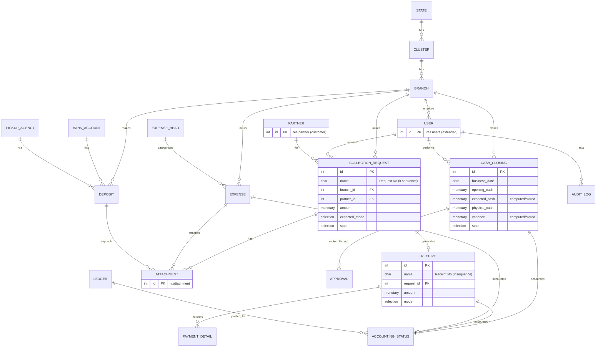

# Entity-Relationship Diagram

**Type:** ER diagram (domain) · **Ref:** [DatabaseDesign.md](../DatabaseDesign.md) §2

*Customers reuse `res.partner`; staff reuse `res.users`; documents reuse `ir.attachment`. See [DatabaseDesign.md](../DatabaseDesign.md) for the full Odoo model definitions.*
