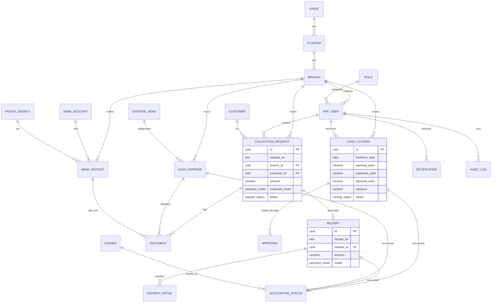

# Entity-Relationship Diagram

**Type:** ER diagram · **Ref:** [DatabaseDesign.md](../DatabaseDesign.md) §2

```mermaid
erDiagram
    STATE ||--o{ CLUSTER : has
    CLUSTER ||--o{ BRANCH : has
    BRANCH ||--o{ APP_USER : employs
    ROLE ||--o{ APP_USER : assigned
    BRANCH ||--o{ COLLECTION_REQUEST : raises
    APP_USER ||--o{ COLLECTION_REQUEST : creates
    CUSTOMER ||--o{ COLLECTION_REQUEST : for
    COLLECTION_REQUEST ||--o| RECEIPT : generates
    COLLECTION_REQUEST ||--o{ DOCUMENT : has
    RECEIPT ||--o{ PAYMENT_DETAIL : includes
    BRANCH ||--o{ CASH_EXPENSE : incurs
    EXPENSE_HEAD ||--o{ CASH_EXPENSE : categorises
    CASH_EXPENSE ||--o{ DOCUMENT : attaches
    BRANCH ||--o{ BANK_DEPOSIT : makes
    BANK_ACCOUNT ||--o{ BANK_DEPOSIT : into
    PICKUP_AGENCY ||--o{ BANK_DEPOSIT : via
    BANK_DEPOSIT ||--o{ DOCUMENT : slip_ack
    BRANCH ||--o{ CASH_CLOSING : closes
    APP_USER ||--o{ CASH_CLOSING : performs
    CASH_CLOSING ||--o{ APPROVAL : routed_through
    CASH_CLOSING ||--o| ACCOUNTING_STATUS : accounted
    RECEIPT ||--o| ACCOUNTING_STATUS : accounted
    CASH_EXPENSE ||--o| ACCOUNTING_STATUS : accounted
    LEDGER ||--o{ ACCOUNTING_STATUS : posted_to
    APP_USER ||--o{ NOTIFICATION : receives
    APP_USER ||--o{ AUDIT_LOG : acts

    COLLECTION_REQUEST {
      uuid id PK
      text request_no
      uuid branch_id FK
      uuid customer_id FK
      numeric amount
      payment_mode expected_mode
      request_status status
    }
    RECEIPT {
      uuid id PK
      text receipt_no
      uuid request_id FK
      numeric amount
      payment_mode mode
    }
    CASH_CLOSING {
      uuid id PK
      date business_date
      numeric opening_cash
      numeric expected_cash
      numeric physical_cash
      numeric variance
      closing_status status
    }
```
