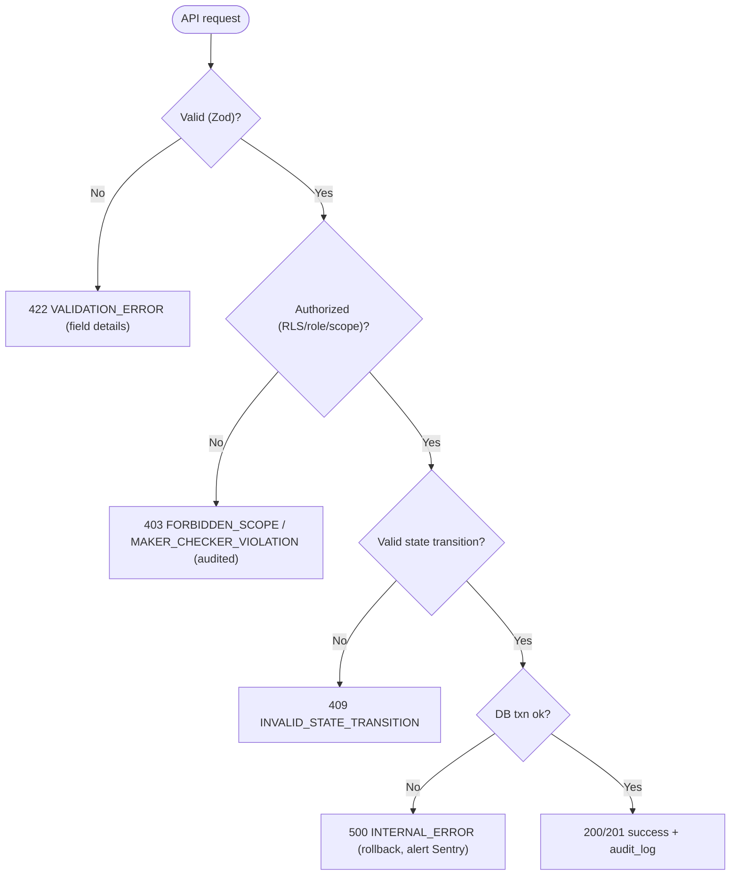

# Error Handling Flow

**Type:** Flowchart (technical error handling) · **Module:** Platform · **Ref:** [Workflows.md](../Workflows.md) §13.3 · [APIDesign.md](../APIDesign.md) §6

```mermaid
flowchart TD
    R([API request]) --> V{"Valid (Zod)?"}
    V -->|No| E422["422 VALIDATION_ERROR (field details)"]
    V -->|Yes| AZ{"Authorized (RLS/role/scope)?"}
    AZ -->|No| E403["403 FORBIDDEN_SCOPE / MAKER_CHECKER_VIOLATION (audited)"]
    AZ -->|Yes| ST{"Valid state transition?"}
    ST -->|No| E409["409 INVALID_STATE_TRANSITION"]
    ST -->|Yes| TX{"DB txn ok?"}
    TX -->|No| E500["500 INTERNAL_ERROR (rollback, alert Sentry)"]
    TX -->|Yes| OK["200/201 success + audit_log"]
```
