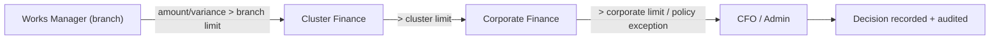

# Escalation Flow

**Type:** Flowchart (escalation) · **Module:** Governance · **Ref:** [Workflows.md](../Workflows.md) §13.2 · R-02 (recommended)

> Thresholds are configurable (recommended feature R-02). All escalations are logged to the audit trail with actor, level, and reason.
