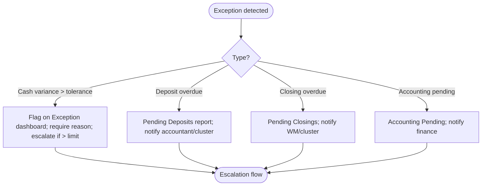

# Exception Handling Flow

**Type:** Flowchart (exception handling) · **Module:** Dashboards/Exceptions · **Ref:** [Workflows.md](../Workflows.md) §13.1 · FR-DASH-05

```mermaid
flowchart TD
    E([Exception detected]) --> T{"Type?"}
    T -->|Cash variance > tolerance| V["Flag on Exception dashboard; require reason; escalate if > limit"]
    T -->|Deposit overdue| D["Pending Deposits report; notify accountant/cluster"]
    T -->|Closing overdue| C["Pending Closings; notify WM/cluster"]
    T -->|Accounting pending| A["Accounting Pending; notify finance"]
    V --> ESC([Escalation flow])
    D --> ESC
    C --> ESC
    A --> ESC
```
