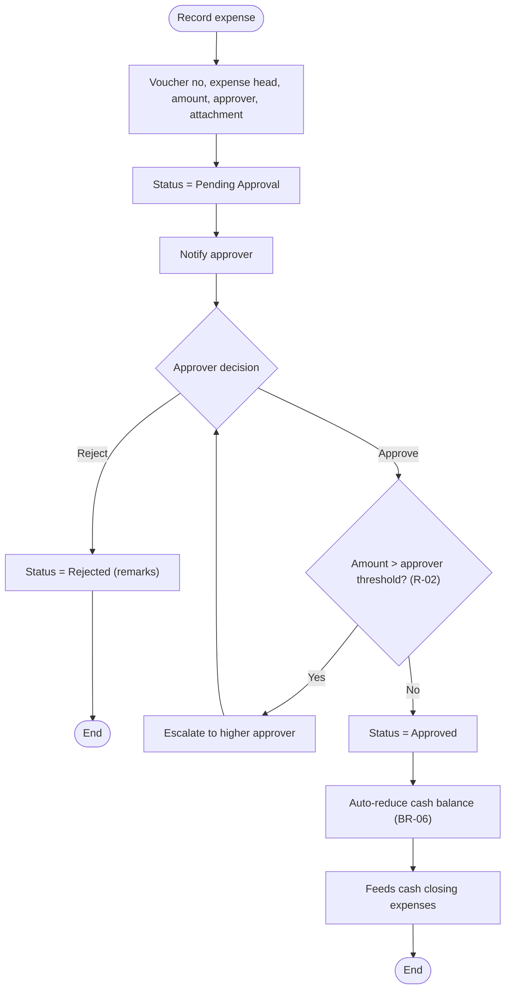

# Cash Expense Flowchart

**Type:** Flowchart · **Module:** Cash Expense · **Ref:** [Workflows.md](../Workflows.md) §7 · BRD §12 · BR-03, BR-06

```mermaid
flowchart TD
    S([Record expense]) --> F["Voucher no, expense head, amount, approver, attachment"]
    F --> SUB["Status = Pending Approval"] --> N["Notify approver"]
    N --> D{"Approver decision"}
    D -->|Reject| RJ["Status = Rejected (remarks)"] --> E1([End])
    D -->|Approve| T{"Amount > approver threshold? (R-02)"}
    T -->|Yes| ESC["Escalate to higher approver"] --> D
    T -->|No| AP["Status = Approved"]
    AP --> RED["Auto-reduce cash balance (BR-06)"]
    RED --> CLS["Feeds cash closing expenses"]
    CLS --> E([End])
```
