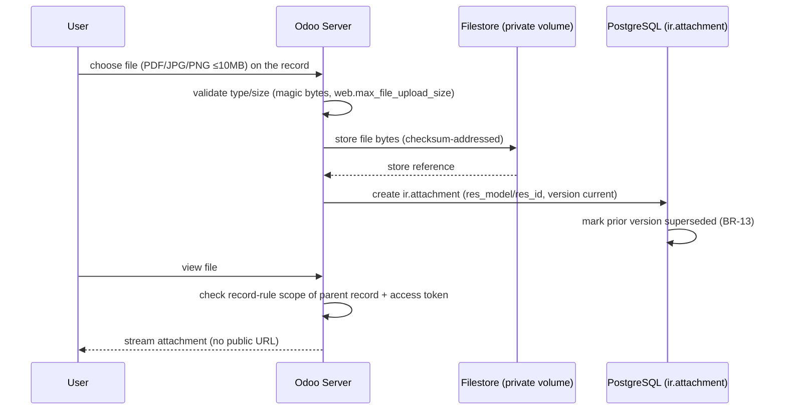

# File Storage Flow

**Type:** Sequence diagram · **Module:** Documents · **Ref:** [Workflows.md](../Workflows.md) §12 · BR-13 · SecurityArchitecture §9

```mermaid
sequenceDiagram
    participant U as User
    participant OD as Odoo Server
    participant FS as Filestore (private volume)
    participant DB as PostgreSQL (ir.attachment)
    U->>OD: choose file (PDF/JPG/PNG ≤10MB) on the record
    OD->>OD: validate type/size (magic bytes, web.max_file_upload_size)
    OD->>FS: store file bytes (checksum-addressed)
    FS-->>OD: store reference
    OD->>DB: create ir.attachment (res_model/res_id, version current)
    DB->>DB: mark prior version superseded (BR-13)
    U->>OD: view file
    OD->>OD: check record-rule scope of parent record + access token
    OD-->>U: stream attachment (no public URL)
```
