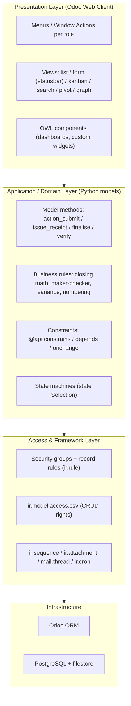

# Logical Architecture Diagram

**Type:** Layered logical architecture · **Ref:** [TechnicalArchitecture.md](../TechnicalArchitecture.md) §4

```mermaid
graph TD
    subgraph Presentation["Presentation Layer (Odoo Web Client)"]
        P1["Menus / Window Actions per role"]
        P2["Views: list / form (statusbar) / kanban / search / pivot / graph"]
        P3["OWL components (dashboards, custom widgets)"]
    end
    subgraph Application["Application / Domain Layer (Python models)"]
        A1["Model methods: action_submit / issue_receipt / finalise / verify"]
        A2["Business rules: closing math, maker-checker, variance, numbering"]
        A3["Constraints: @api.constrains / depends / onchange"]
        A4["State machines (state Selection)"]
    end
    subgraph Access["Access & Framework Layer"]
        AC1["Security groups + record rules (ir.rule)"]
        AC2["ir.model.access.csv (CRUD rights)"]
        AC3["ir.sequence / ir.attachment / mail.thread / ir.cron"]
    end
    subgraph Infra["Infrastructure"]
        I1["Odoo ORM"]
        I2["PostgreSQL + filestore"]
    end
    Presentation --> Application --> Access --> Infra
```
