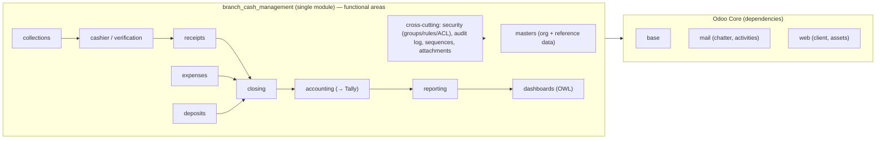

# Module Diagram

**Type:** Module dependency diagram · **Ref:** [TechnicalArchitecture.md](../TechnicalArchitecture.md) §5

*All areas above are packaged in one addon; cross-cutting concerns reuse Odoo core (auth/session, chatter/activities for audit & notifications, `ir.attachment` for files) rather than bespoke shared modules.*
