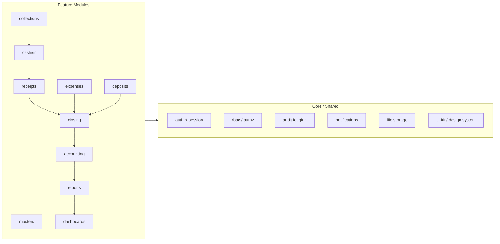

# Module Diagram

**Type:** Module dependency diagram · **Ref:** [TechnicalArchitecture.md](../TechnicalArchitecture.md) §5

```mermaid
graph LR
    subgraph Core["Core / Shared"]
        Auth["auth & session"]
        RBAC["rbac / authz"]
        Audit["audit logging"]
        Notify["notifications"]
        Files["file storage"]
        UI["ui-kit / design system"]
    end
    subgraph Features["Feature Modules"]
        M1["masters"]
        M2["collections"]
        M3["cashier"]
        M4["receipts"]
        M5["closing"]
        M6["expenses"]
        M7["deposits"]
        M8["accounting"]
        M9["reports"]
        M10["dashboards"]
    end
    M2 --> M3 --> M4 --> M5
    M6 --> M5
    M7 --> M5
    M5 --> M8
    M8 --> M9
    M9 --> M10
    Features --> Core
```
