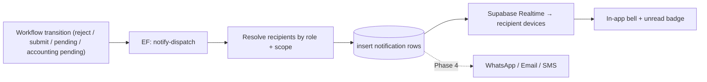

# Notification Flow

**Type:** Flowchart · **Module:** Notifications · **Ref:** [Workflows.md](../Workflows.md) §11 · BRD §17 · FR-NOTIF-01…06

```mermaid
flowchart LR
    T["Workflow transition (reject / submit / pending / accounting pending)"] --> EF["EF: notify-dispatch"]
    EF --> RES["Resolve recipients by role + scope"]
    RES --> INS[("insert notification rows")]
    INS --> RT["Supabase Realtime → recipient devices"]
    RT --> UI["In-app bell + unread badge"]
    INS -.->|Phase 4| EXT["WhatsApp / Email / SMS"]
```
