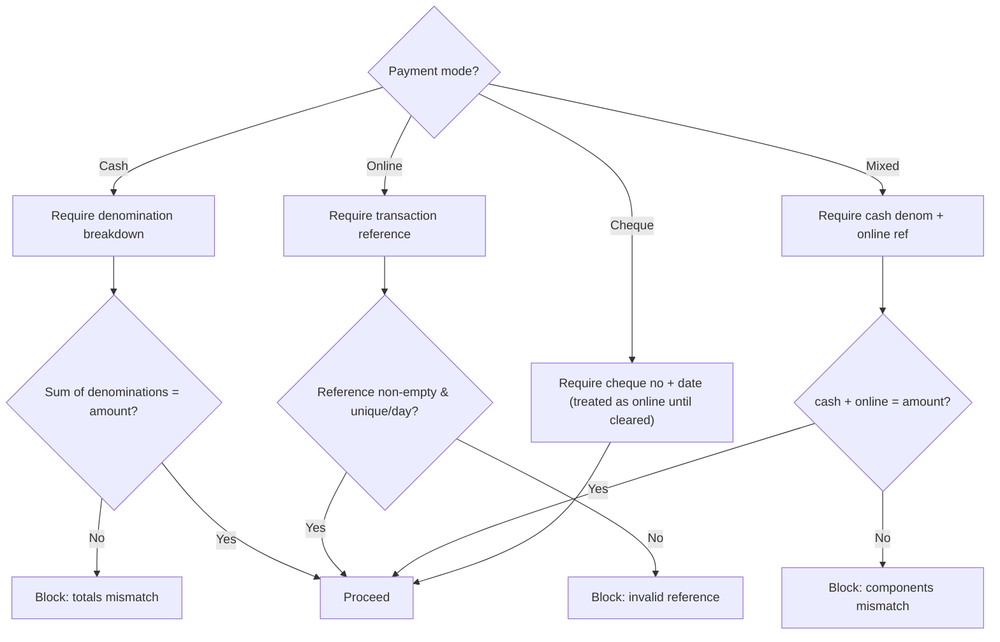

# Payment Mode Decision Tree

**Type:** Decision tree · **Module:** Cashier Verification · **Ref:** [Workflows.md](../Workflows.md) §3 · AS-01, AS-11

```mermaid
flowchart TD
    A{"Payment mode?"}
    A -->|Cash| B["Require denomination breakdown"]
    B --> B1{"Sum of denominations = amount?"}
    B1 -->|No| BX["Block: totals mismatch"]
    B1 -->|Yes| OK["Proceed"]
    A -->|Online| C["Require transaction reference"]
    C --> C1{"Reference non-empty & unique/day?"}
    C1 -->|No| CX["Block: invalid reference"]
    C1 -->|Yes| OK
    A -->|Mixed| D["Require cash denom + online ref"]
    D --> D1{"cash + online = amount?"}
    D1 -->|No| DX["Block: components mismatch"]
    D1 -->|Yes| OK
    A -->|Cheque| E["Require cheque no + date (treated as online until cleared)"]
    E --> OK
```
