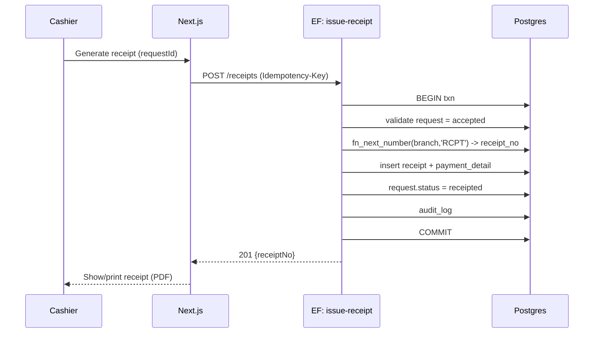

# Receipt Generation Sequence Diagram

**Type:** Sequence diagram · **Module:** Receipt · **Ref:** [Workflows.md](../Workflows.md) §4 · BR-08 · FR-RCPT-01…03

```mermaid
sequenceDiagram
    participant C as Cashier
    participant N as Next.js
    participant EF as EF: issue-receipt
    participant DB as Postgres
    C->>N: Generate receipt (requestId)
    N->>EF: POST /receipts (Idempotency-Key)
    EF->>DB: BEGIN txn
    EF->>DB: validate request = accepted
    EF->>DB: fn_next_number(branch,'RCPT') -> receipt_no
    EF->>DB: insert receipt + payment_detail
    EF->>DB: request.status = receipted
    EF->>DB: audit_log
    EF->>DB: COMMIT
    EF-->>N: 201 {receiptNo}
    N-->>C: Show/print receipt (PDF)
```
