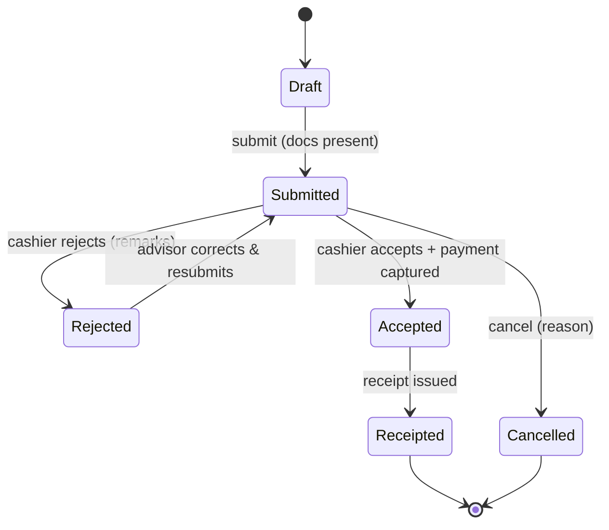

# Collection Request State Diagram

**Type:** State diagram · **Module:** Collection Request · **Ref:** [Workflows.md](../Workflows.md) §2 · BR-09

```mermaid
stateDiagram-v2
    [*] --> Draft
    Draft --> Submitted: submit (docs present)
    Submitted --> Rejected: cashier rejects (remarks)
    Rejected --> Submitted: advisor corrects & resubmits
    Submitted --> Accepted: cashier accepts + payment captured
    Accepted --> Receipted: receipt issued
    Submitted --> Cancelled: cancel (reason)
    Receipted --> [*]
    Cancelled --> [*]
```
