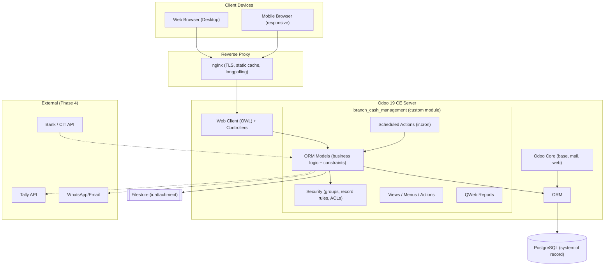

# System Architecture Diagram

**Type:** System context / container diagram · **Ref:** [TechnicalArchitecture.md](../TechnicalArchitecture.md) §3

```mermaid
graph TB
    subgraph Clients["Client Devices"]
        Web["Web Browser (Desktop)"]
        Mobile["Mobile Browser (responsive)"]
    end
    subgraph Edge["Reverse Proxy"]
        NGINX["nginx (TLS, static cache, longpolling)"]
    end
    subgraph Server["Odoo 19 CE Server"]
        WEB["Web Client (OWL) + Controllers"]
        subgraph MOD["branch_cash_management (custom module)"]
            MODELS["ORM Models (business logic + constraints)"]
            SEC["Security (groups, record rules, ACLs)"]
            VIEWS["Views / Menus / Actions"]
            REPORT["QWeb Reports"]
            CRON["Scheduled Actions (ir.cron)"]
        end
        CORE["Odoo Core (base, mail, web)"]
        ORM["ORM"]
    end
    PG[("PostgreSQL (system of record)")]
    FS[["Filestore (ir.attachment)"]]
    subgraph External["External (Phase 4)"]
        Tally["Tally API"]
        BankAPI["Bank / CIT API"]
        Notify["WhatsApp/Email"]
    end
    Web --> NGINX
    Mobile --> NGINX
    NGINX --> WEB
    WEB --> MODELS
    MODELS --> SEC
    MODELS --> ORM
    CORE --> ORM
    ORM --> PG
    MODELS --> FS
    CRON --> MODELS
    MODELS -.-> Tally
    BankAPI -.-> MODELS
    MODELS -.-> Notify
```
