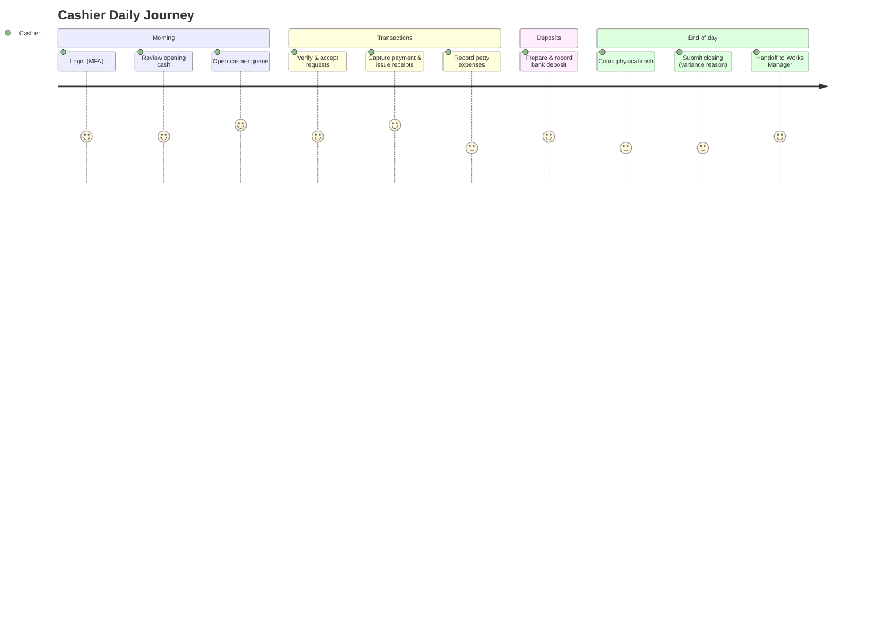

# User Journey — Cashier

**Type:** User journey map · **Module:** UX · **Ref:** [Workflows.md](../Workflows.md) §15.1

```mermaid
journey
    title Cashier Daily Journey
    section Morning
      Login (MFA): 4: Cashier
      Review opening cash: 4: Cashier
      Open cashier queue: 5: Cashier
    section Transactions
      Verify & accept requests: 4: Cashier
      Capture payment & issue receipts: 5: Cashier
      Record petty expenses: 3: Cashier
    section Deposits
      Prepare & record bank deposit: 4: Cashier
    section End of day
      Count physical cash: 3: Cashier
      Submit closing (variance reason): 3: Cashier
      Handoff to Works Manager: 4: Cashier
```
